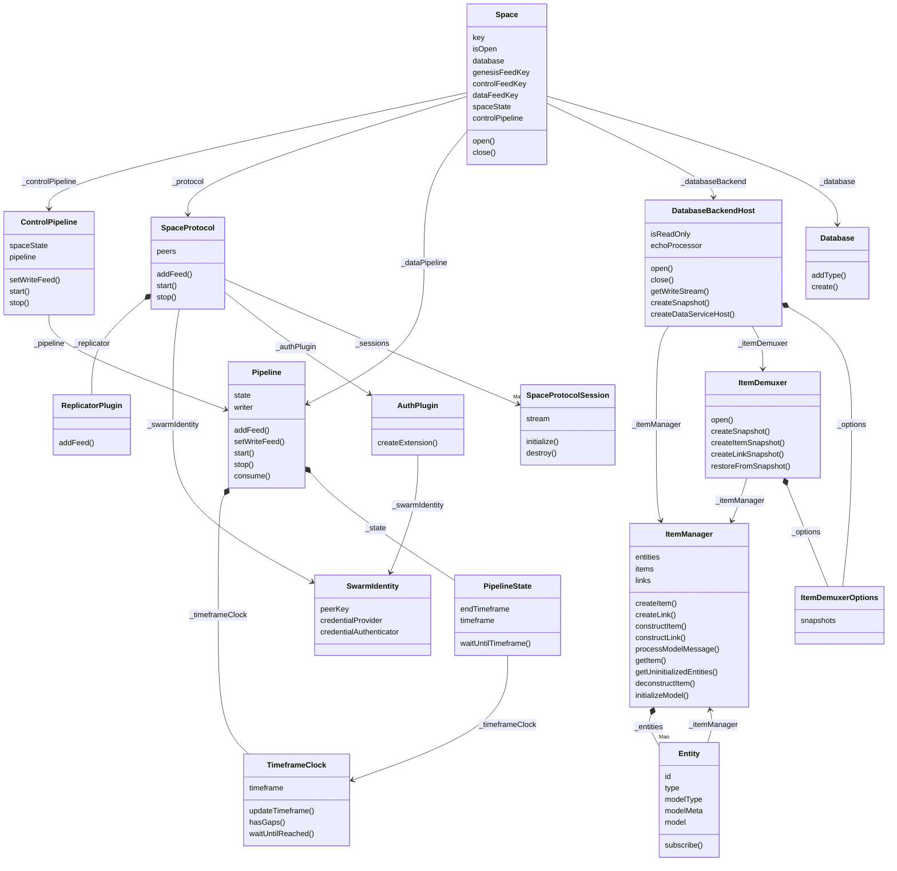
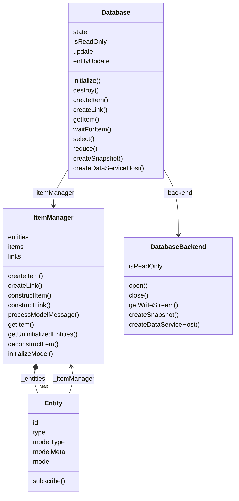
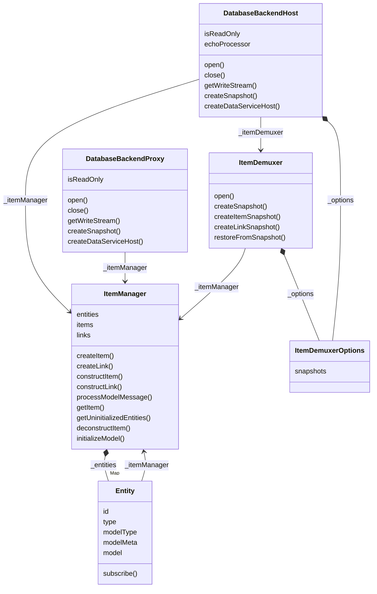
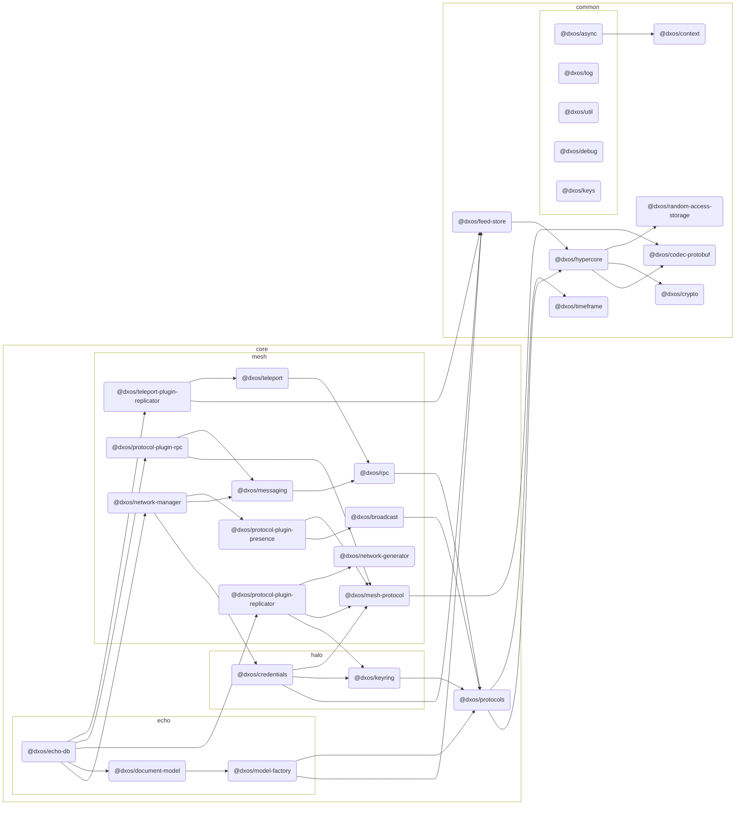

# @dxos/echo-db

ECHO database.

## Class Diagrams

## Dependency Graph

## Dependencies

| Module | Direct |
|---|---|
| [`@dxos/async`](../../../../common/async/docs/README.md) | &check; |
| [`@dxos/broadcast`](../../../mesh/broadcast/docs/README.md) |  |
| [`@dxos/codec-protobuf`](../../../../common/codec-protobuf/docs/README.md) | &check; |
| [`@dxos/context`](../../../../common/context/docs/README.md) |  |
| [`@dxos/credentials`](../../../halo/credentials/docs/README.md) | &check; |
| [`@dxos/crypto`](../../../../common/crypto/docs/README.md) | &check; |
| [`@dxos/debug`](../../../../common/debug/docs/README.md) | &check; |
| [`@dxos/feed-store`](../../../../common/feed-store/docs/README.md) | &check; |
| [`@dxos/hypercore`](../../../../common/hypercore/docs/README.md) | &check; |
| [`@dxos/keyring`](../../../halo/keyring/docs/README.md) | &check; |
| [`@dxos/keys`](../../../../common/keys/docs/README.md) | &check; |
| [`@dxos/log`](../../../../common/log/docs/README.md) | &check; |
| [`@dxos/mesh-protocol`](../../../mesh/mesh-protocol/docs/README.md) | &check; |
| [`@dxos/messaging`](../../../mesh/messaging/docs/README.md) | &check; |
| [`@dxos/model-factory`](../../model-factory/docs/README.md) | &check; |
| [`@dxos/network-generator`](../../../mesh/network-generator/docs/README.md) |  |
| [`@dxos/network-manager`](../../../mesh/network-manager/docs/README.md) | &check; |
| [`@dxos/document-model`](../../document-model/docs/README.md) | &check; |
| [`@dxos/protocol-plugin-presence`](../../../mesh/protocol-plugin-presence/docs/README.md) | &check; |
| [`@dxos/protocol-plugin-replicator`](../../../mesh/protocol-plugin-replicator/docs/README.md) | &check; |
| [`@dxos/protocol-plugin-rpc`](../../../mesh/protocol-plugin-rpc/docs/README.md) | &check; |
| [`@dxos/protocols`](../../../protocols/docs/README.md) | &check; |
| [`@dxos/random-access-storage`](../../../../common/random-access-storage/docs/README.md) | &check; |
| [`@dxos/rpc`](../../../mesh/rpc/docs/README.md) | &check; |
| [`@dxos/teleport`](../../../mesh/teleport/docs/README.md) | &check; |
| [`@dxos/teleport-plugin-replicator`](../../../mesh/teleport-plugin-replicator/docs/README.md) | &check; |
| [`@dxos/timeframe`](../../../../common/timeframe/docs/README.md) | &check; |
| [`@dxos/util`](../../../../common/util/docs/README.md) | &check; |
