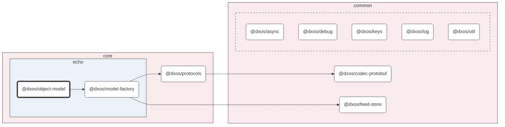

# @dxos/object-model

ECHO object model.

## Dependency Graph

## Dependencies

| Module | Direct |
|---|---|
| [`@dxos/async`](../../../../common/async/docs/README.md) | &check; |
| [`@dxos/codec-protobuf`](../../../../common/codec-protobuf/docs/README.md) | &check; |
| [`@dxos/debug`](../../../../common/debug/docs/README.md) |  |
| [`@dxos/feed-store`](../../../../common/feed-store/docs/README.md) |  |
| [`@dxos/keys`](../../../../common/keys/docs/README.md) |  |
| [`@dxos/log`](../../../../common/log/docs/README.md) |  |
| [`@dxos/model-factory`](../../model-factory/docs/README.md) | &check; |
| [`@dxos/protocols`](../../../protocols/docs/README.md) | &check; |
| [`@dxos/util`](../../../../common/util/docs/README.md) | &check; |
