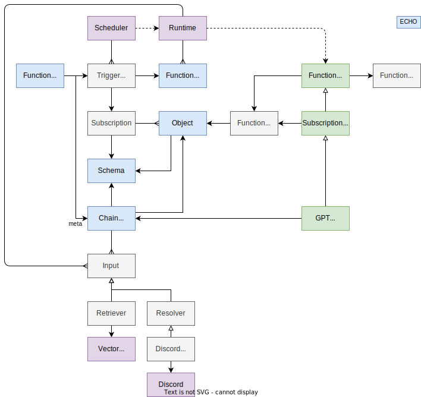

# Functions Design

## Summary

- Simple short-lived Lambda-style functions.
- Triggered by various event types (Timer, Webhooks, Web socket APIs, ECHO queries, etc).
- Access to Space to query and create objects.
- Can be chained together to create complex workflows.

## Data Model

- Functions are defined by the `FunctionDef` ECHO Schema, which can be synchronized between the Function runtime (Agent) and other peers.
- Rules define how functions are triggered.
- The `FuncitonTrigger` data structure contains metadata about the various trigger types, and other metdata that is passed to the function handler. 
  - Timers define a cron schedule.
  - Webhooks define an HTTP endpoint (and method) that can be invoked.
  - Web sockets define a socket endpoint that can be called with an initial message object to initiate a data subscription.
  - Subscription triggers define define an ECHO query.

 

 

## Lifecycle

- The Runtime loads a Manifest file that defines a set of static functions.
- These `FunctionDef` objects are synchronized with other peers.
- The Scheduler subscribes to a query of `Rule` objects that are synchronized between peers.
  - ISSUE: Assume a single Scheduler exists within each swarm, and is bound to a single Runtime.
- Peers create and modify `FunctionDef` objects, which cause the Scheduler to re-configure.
- When a function is triggered the associate function handler is passed:
  - A context object that provides access to function runtime APIs (e.g., storage).
  - An event object that contains data from the trigger event merged with any static trigger meta data.

## Examples

### Chess Function

- Triggered by an ECHO query.
- Receives a set of Game objects representing the current game state, plus static metadata about the AI (e.g., skill level).
- Updates the game state.

### Email Function

- Triggered by a message from a Web socket endpoint.
- Receives a message object that contains the the associated email account and a set of messages.
- Synchronizes messages with objects in the current ECHO space.

### GPT Function

- Triggered by an ECHO query (e.g., Game or Message objects).
- Receives a set of ECHO objects plus metadata that includes a Prompt and value bindings.
- Constructs a prompt and generates a response after calling the GPT.
- Creates or updates ECHO objects based on the response; for example:
  - Outputs a Game hint to the current message thread.
  - Creates a draft response in a specified field of an email object.
  - Constructs a FAQ based on questions from a set of emails.

