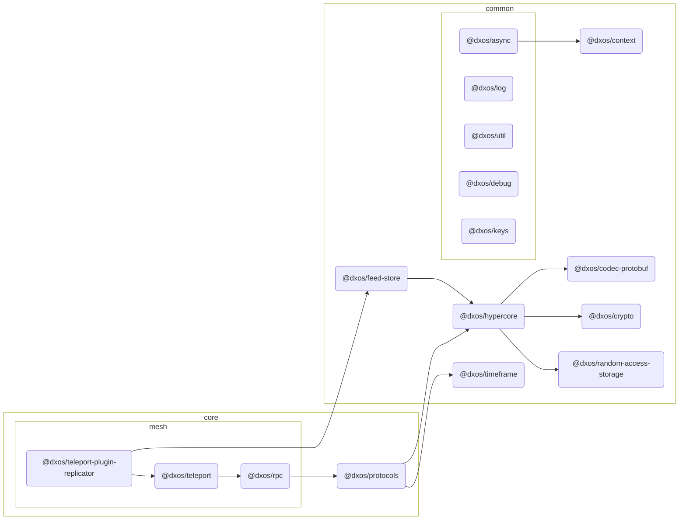

# @dxos/teleport-plugin-replicator

Replicator plugin for teleport.

## Dependency Graph

## Dependencies

| Module | Direct |
|---|---|
| [`@dxos/async`](../../../../common/async/docs/README.md) | &check; |
| [`@dxos/codec-protobuf`](../../../../common/codec-protobuf/docs/README.md) |  |
| [`@dxos/context`](../../../../common/context/docs/README.md) | &check; |
| [`@dxos/crypto`](../../../../common/crypto/docs/README.md) |  |
| [`@dxos/debug`](../../../../common/debug/docs/README.md) | &check; |
| [`@dxos/feed-store`](../../../../common/feed-store/docs/README.md) | &check; |
| [`@dxos/hypercore`](../../../../common/hypercore/docs/README.md) |  |
| [`@dxos/keys`](../../../../common/keys/docs/README.md) | &check; |
| [`@dxos/log`](../../../../common/log/docs/README.md) | &check; |
| [`@dxos/protocols`](../../../protocols/docs/README.md) | &check; |
| [`@dxos/random-access-storage`](../../../../common/random-access-storage/docs/README.md) |  |
| [`@dxos/rpc`](../../rpc/docs/README.md) | &check; |
| [`@dxos/teleport`](../../teleport/docs/README.md) | &check; |
| [`@dxos/timeframe`](../../../../common/timeframe/docs/README.md) |  |
| [`@dxos/util`](../../../../common/util/docs/README.md) | &check; |
