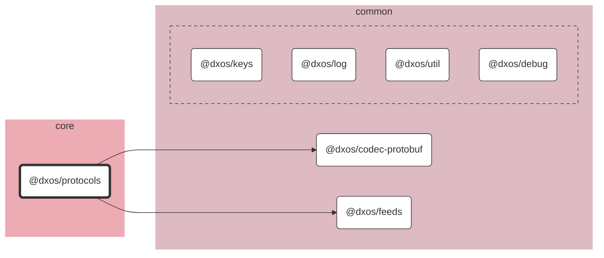

# @dxos/protocols

Protobuf definitions for DXOS protocols.

## Dependency Graph

## Dependencies

| Module | Direct |
|---|---|
| [`@dxos/codec-protobuf`](../../../common/codec-protobuf/docs/README.md) | &check; |
| [`@dxos/debug`](../../../common/debug/docs/README.md) |  |
| [`@dxos/feeds`](../../../common/feeds/docs/README.md) | &check; |
| [`@dxos/keys`](../../../common/keys/docs/README.md) | &check; |
| [`@dxos/log`](../../../common/log/docs/README.md) |  |
| [`@dxos/util`](../../../common/util/docs/README.md) |  |
