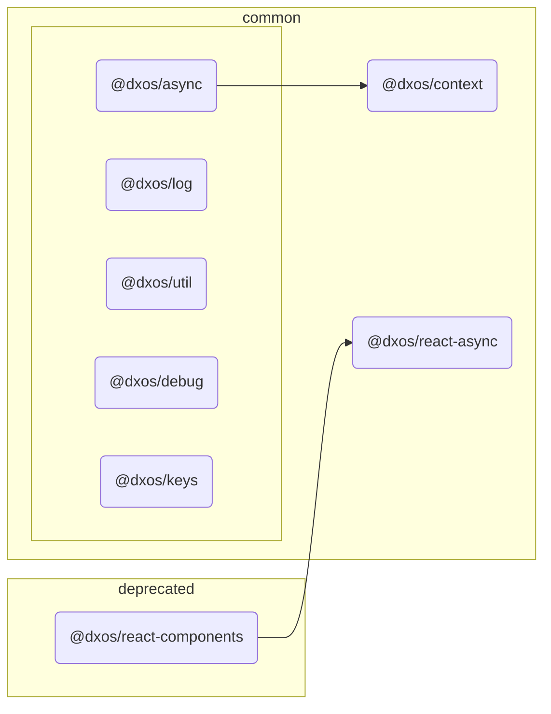

# @dxos/react-components

Low-level material components.

## Dependency Graph

## Dependencies

| Module | Direct |
|---|---|
| [`@dxos/async`](../../../common/async/docs/README.md) | &check; |
| [`@dxos/context`](../../../common/context/docs/README.md) |  |
| [`@dxos/debug`](../../../common/debug/docs/README.md) | &check; |
| [`@dxos/keys`](../../../common/keys/docs/README.md) | &check; |
| [`@dxos/log`](../../../common/log/docs/README.md) |  |
| [`@dxos/react-async`](../../../common/react-async/docs/README.md) | &check; |
| [`@dxos/util`](../../../common/util/docs/README.md) | &check; |
