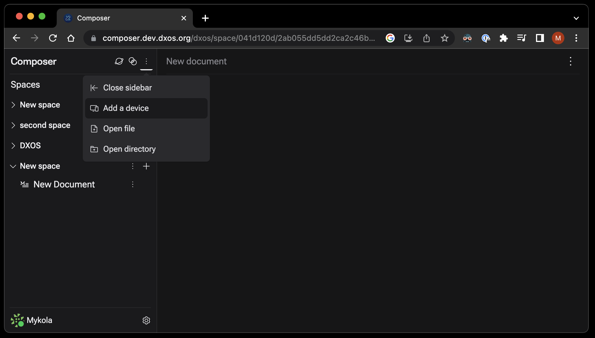
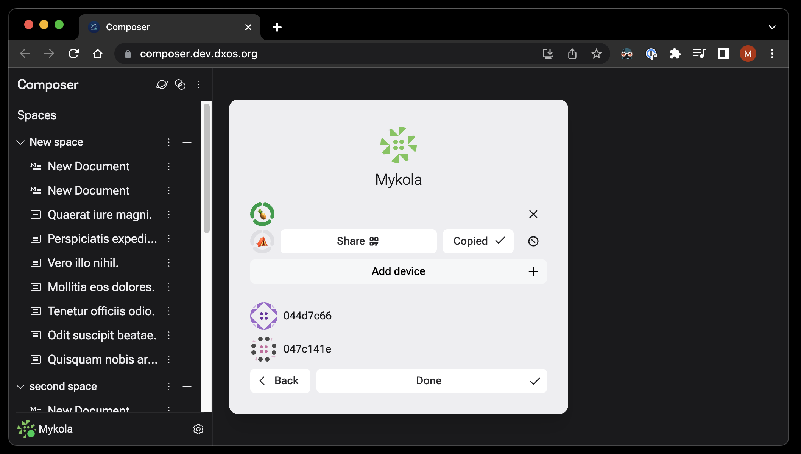
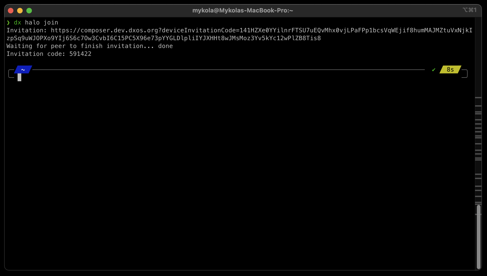

# DX CLI

DXOS command line interface.

<!-- toc -->
* [DX CLI](#dx-cli)
* [Installation](#installation)
* [Running an Agent](#running-an-agent)
* [Development](#development)
* [Usage](usage/)
<!-- tocstop -->

# Installation
```terminal
npm install -g @dxos/cli@main
```

# Agent
See main docs at [Agents](https://docs.dxos.org/guide/cli/agent.html)

## Running an agent as a system service
### Start an agent as a system daemon via CLI command

Agent could be started as a system daemon via cli command:

```terminal
dx agent start --system
```

This command will run an agent as `launchd` service (macOS users) or as a `systemd` service (Linux users).

Other useful commands:

```terminal
dx agent list --system
dx agent restart --system
dx agent stop --system
```

Alternatively, manual setup could be used (see below).

### Install agent as a `launchd` service (macOS users) - manual setup
1. Install DXOS CLI with steps in [Installation](#Installation) section.
2. Replace `??NODE_PATH??` in "./init-templates/org.dxos.agent.plist" with output of command `dirname $(which node)`
3. Replace `??DX_PATH??` in "./init-templates/org.dxos.agent.plist" with output of command `which dx`
4. Copy `./init-templates/org.dxos.agent.plist` -> `~/Library/LaunchAgents/org.dxos.agent.plist`
5. Run `launchctl load -w ~/Library/LaunchAgents/org.dxos.agent.plist`

### Stop agent started by `launchd`
1. Run `launchctl unload -w ~/Library/LaunchAgents/org.dxos.agent.plist`
2. Remove `~/Library/LaunchAgents/org.dxos.agent.plist`

## Install agent as a `systemd` service (Linux users) - manual setup
1. Install DXOS CLI with steps in [Installation](#Installation) section.
1. Copy `./init-templates/dxos-agent.service` and `./init-templates/pre-dxos-agent.service` -> `~/.config/systemd/user/`
1. Run `systemctl --user daemon-reload` to make the systemd daemon aware of the service
1. Run `systemctl --user enable dxos-agent` to enable the service to start automatically
1. Optionally, run `sudo loginctl enable-linger {USERNAME}` to enable the service to start without user login (replace `{USERNAME}` with the name of the user that will run the service)
1. Run `systemctl --user start dxos-agent` to start the service

## Start agent with CLI
Agent is automatically started by each command that requires Client (to avoid this behavior use `--no-agent` flag). You can use `--profile` flag (default value is `default`) to run agent in an isolated profile, and `--foreground` to run agent in attached process.
```terminal
dx agent start
```
see: [dx agent start](#dx-agent-start)

## Adding Agent to your Composer Identity 
1. Go to [Composer](https://composer.dev.dxos.org). And create a device invitation.



2. Run halo join command in your terminal.


3. Proceed with invitation

## Troubleshooting
1. Make sure you are running the latest version of the shared worker in the browser. Go to the shared workers tab chrome://inspect/#workers, kill `dxos-vault` worker, then reload the Composer tab.
2. Restart your agent with [```dx agent restart```](#dx-agent-restart). Also useful command[ ```dx agent stop --all```](#dx-agent-stop)
#### Danger Zone
3. Reset Storage. Warning: Agent will lose its storage, and config file will be deleted [```dx reset --force```](#dx-reset)
---


# Development

### Multiple Profile configuration
Both the CLI and agents can be configured to use a given profile using either the `--profile` flag or `DX_PROFILE` environment variable.
The CLI will automatically connect to the agent using the given profile.

### Local development
The CLI can be invoked out of the Git monorepo using the `bin/dev` command.

Source the following script to set an alias for `dx` that can be called from any directory:

```bash
cd packages/devtools/cli
. ../../devtools/cli/scripts/dev.sh
```

Example:

```bash
DX_PROFILE=test dx agent start  --ws=4567
```

NOTE: The `agent` will need to be recompiled after any changes.

### Building
To build the CLI:

```bash
nx run cli:build --watch=true
```

### Devtools
The agent can be configured to expose a Websocket port using the `--ws` flag that can be connected to using DXOS Devtools:

To connect devtools, set the `target` query parameter to the agent's websocket URL, e.g.,

`https://devtools.dxos.org?target=ws://localhost:4567`

### Debugging

To enable logging, set `LOG_FILTER`:

```bash
LOG_FILTER=info,agent:debug dx agent start -f
```

If the agent is run in background mode, log files will be created in `/tmp/dx/run/profile/<profile name>/logs`

To enable the node debugger, set `NODE_OPTIONS` then open in VSCode (CMD-SHIFT-P "Attach to Node process").

```bash
NODE_OPTIONS="--inspect-brk"
```

## Reporting errors

Run the following command to create a gist of the debug stats.

```bash
dx debug stats --json --no-agent | gh gist create
```
