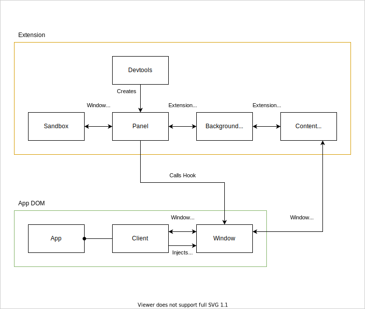

# DXOS DevTools browser extension

The DevTools extension provides debugging information about all aspects of the currently loaded DXOS app.

[](https://github.com/dxos/dxos/pull/2193#issue-1512878065)

Demo https://github.com/dxos/dxos/pull/2193#issue-1512878065

## Installation

The Devtools zip file is created during the [Publish](https://github.com/dxos/dxos/blob/main/.github/workflows/publish.yaml) CI action.

1. Go to: https://github.com/dxos/dxos/actions/workflows/publish.yaml
1. Click on the latest successful workflow run (look for the green check mark).
1. Click on `Artifacts`, then download and uncompress the zip file.
1. Go to `chrome://extensions`, then click `Load unpacked` and select the folder (make sure developer mode is enabled).

## Development

### General

1. Clone this repo then install dependencies
2. Then to build the extension:

```
pnpm -w nx bundle devtools-extension
```
### Manifest
We use Vite to bundle extension, you can find manifest setup inside `vite.config.ts`

### Chromium

4. Open the __extensions__ manager in your browser: 

- [brave://extensions](brave://extensions)
- [chrome://extensions](chrome://extensions)
- Edge (Not Supported Yet)

5. Make sure you have the `developer` toggle __on__ and click on `Load Unpacked Extension` button.
6. Search for the extension __dist__ folder (`<repo-root>/packages/devtools-extension/dist`) and select it.

### Firefox

4. Run `pnpm -w nx pack:webext devtools-extension`.
5. Navigate to [This Firefox](about:debugging#/runtime/this-firefox) tab of the `about:debugging` page.
6. Click `Load Temporary Add-on...` and select the zip file in `web-ext-artifacts`.

An alternative method is to run `rushx start:firefox` which will run a temporary firefox instance with the extension installed. Running this way allows for integration with watch tools and reloading the extension by pressing `r` in the terminal.

### Safari

- Not yet supported.

## Troubleshooting

- Remove all tabs that contain the extension then remove the extension and reload it.

## Design



The injected script attempts to detect the an object exposed by the SDK's client (`window.__DXOS__`).
A channel is then setup to forward messages between the devtools panel and app client following the client RPC interface.
The panel and the content script communicate through the background script using the webextension API as they [do not have direct access to each other](https://developer.chrome.com/docs/extensions/mv3/devtools/#content-script-to-devtools).
The injected script sends messages through the content script via window events as it [does not have access to the webextension APIs](https://developer.chrome.com/docs/extensions/mv3/devtools/#evaluated-scripts-to-devtools).

### Extension startup sequence

1. SDK sets `window.__DXOS__` hook.
1. Content script is injected into the page automatically by browser.
    1. Allows messaging with the page.
1. Devtools page is created.
    1. Creates devtools panel.
1. Devtools panel is loaded.
    1. Waits for `window.__DXOS__` hook to appear.
    1. Renders the devtools application.
    1. Client API connects via the `window.__DXOS__` hook.
1. Devtools panel is ready.

## References

- Anatomy of an extension: https://developer.mozilla.org/en-US/docs/Mozilla/Add-ons/WebExtensions/Anatomy_of_a_WebExtension#Background_pages
- This package is loosely based on the [Apollo DevTools](https://github.com/apollographql/apollo-client-devtools).
