# @dxos/devtools

## Dependency Graph

```mermaid
flowchart LR;

style dxos/devtools fill:#fff,stroke-width:4px;

click dxos/async "https:/github.com/dxos/dxos/tree/main/packages/common/async/docs";
click dxos/debug "https:/github.com/dxos/dxos/tree/main/packages/common/debug/docs";
click dxos/client "https:/github.com/dxos/dxos/tree/main/packages/sdk/client/docs";
click dxos/codec-protobuf "https:/github.com/dxos/dxos/tree/main/packages/common/codec-protobuf/docs";
click dxos/config "https:/github.com/dxos/dxos/tree/main/packages/sdk/config/docs";
click dxos/echo-db "https:/github.com/dxos/dxos/tree/main/packages/echo/echo-db/docs";
click dxos/model-factory "https:/github.com/dxos/dxos/tree/main/packages/echo/model-factory/docs";
click dxos/protocols "https:/github.com/dxos/dxos/tree/main/packages/common/protocols/docs";
click dxos/rpc "https:/github.com/dxos/dxos/tree/main/packages/common/rpc/docs";
click dxos/rpc-tunnel "https:/github.com/dxos/dxos/tree/main/packages/common/rpc-tunnel/docs";
click dxos/messaging "https:/github.com/dxos/dxos/tree/main/packages/mesh/messaging/docs";
click dxos/util "https:/github.com/dxos/dxos/tree/main/packages/common/util/docs";
click dxos/credentials "https:/github.com/dxos/dxos/tree/main/packages/halo/credentials/docs";
click dxos/crypto "https:/github.com/dxos/dxos/tree/main/packages/common/crypto/docs";
click dxos/feed-store "https:/github.com/dxos/dxos/tree/main/packages/echo/feed-store/docs";
click dxos/mesh-protocol "https:/github.com/dxos/dxos/tree/main/packages/mesh/mesh-protocol/docs";
click dxos/devtools-mesh "https:/github.com/dxos/dxos/tree/main/packages/devtools/devtools-mesh/docs";
click dxos/gem-core "https:/github.com/dxos/dxos/tree/main/packages/gem/gem-core/docs";
click dxos/gem-spore "https:/github.com/dxos/dxos/tree/main/packages/gem/gem-spore/docs";
click dxos/network-manager "https:/github.com/dxos/dxos/tree/main/packages/mesh/network-manager/docs";
click dxos/protocol-plugin-presence "https:/github.com/dxos/dxos/tree/main/packages/mesh/protocol-plugin-presence/docs";
click dxos/react-components "https:/github.com/dxos/dxos/tree/main/packages/sdk/react-components/docs";
click dxos/react-toolkit "https:/github.com/dxos/dxos/tree/main/packages/sdk/react-toolkit/docs";
click dxos/echo-protocol "https:/github.com/dxos/dxos/tree/main/packages/echo/echo-protocol/docs";
click dxos/messenger-model "https:/github.com/dxos/dxos/tree/main/packages/echo/messenger-model/docs";
click dxos/log "https:/github.com/dxos/dxos/tree/main/packages/common/log/docs";
click dxos/object-model "https:/github.com/dxos/dxos/tree/main/packages/echo/object-model/docs";
click dxos/react-async "https:/github.com/dxos/dxos/tree/main/packages/common/react-async/docs";
click dxos/react-client "https:/github.com/dxos/dxos/tree/main/packages/sdk/react-client/docs";
click dxos/bot-factory-client "https:/github.com/dxos/dxos/tree/main/packages/bot/bot-factory-client/docs";
click dxos/react-registry-client "https:/github.com/dxos/dxos/tree/main/packages/sdk/react-registry-client/docs";
click dxos/registry-client "https:/github.com/dxos/dxos/tree/main/packages/sdk/registry-client/docs";
click dxos/text-model "https:/github.com/dxos/dxos/tree/main/packages/echo/text-model/docs";

subgraph devtools
  style devtools fill:#d6f2f5,stroke:#fff;
  dxos/devtools("@dxos/devtools");
  dxos/devtools-mesh("@dxos/devtools-mesh");
end

subgraph common
  style common fill:#f5d6dd,stroke:#fff;
  dxos/async("@dxos/async");
  dxos/debug("@dxos/debug");
  dxos/codec-protobuf("@dxos/codec-protobuf");
  dxos/protocols("@dxos/protocols");
  dxos/util("@dxos/util");
  dxos/log("@dxos/log");
  dxos/crypto("@dxos/crypto");
  dxos/rpc("@dxos/rpc");
  dxos/random-access-storage("@dxos/random-access-storage");
  dxos/rpc-tunnel("@dxos/rpc-tunnel");
  dxos/react-async("@dxos/react-async");
end

subgraph sdk
  style sdk fill:#f4f5d6,stroke:#fff;
  dxos/client("@dxos/client");
  dxos/config("@dxos/config");
  dxos/react-components("@dxos/react-components");
  dxos/react-toolkit("@dxos/react-toolkit");
  dxos/react-registry-client("@dxos/react-registry-client");
  dxos/registry-client("@dxos/registry-client");
  dxos/react-client("@dxos/react-client");
end

subgraph echo
  style echo fill:#d6e4f5,stroke:#fff;
  dxos/echo-db("@dxos/echo-db");
  dxos/feed-store("@dxos/feed-store");
  dxos/echo-protocol("@dxos/echo-protocol");
  dxos/model-factory("@dxos/model-factory");
  dxos/object-model("@dxos/object-model");
  dxos/messenger-model("@dxos/messenger-model");
  dxos/text-model("@dxos/text-model");
end

subgraph halo
  style halo fill:#e3d6f5,stroke:#fff;
  dxos/credentials("@dxos/credentials");
end

subgraph mesh
  style mesh fill:#d6f5de,stroke:#fff;
  dxos/mesh-protocol("@dxos/mesh-protocol");
  dxos/messaging("@dxos/messaging");
  dxos/network-manager("@dxos/network-manager");
  dxos/protocol-plugin-presence("@dxos/protocol-plugin-presence");
  dxos/broadcast("@dxos/broadcast");
  dxos/protocol-plugin-replicator("@dxos/protocol-plugin-replicator");
  dxos/protocol-plugin-rpc("@dxos/protocol-plugin-rpc");
end

subgraph gem
  style gem fill:#d6e2f5,stroke:#fff;
  dxos/gem-core("@dxos/gem-core");
  dxos/gem-spore("@dxos/gem-spore");
end

subgraph bot
  style bot fill:#dfd6f5,stroke:#fff;
  dxos/bot-factory-client("@dxos/bot-factory-client");
end

dxos/async --> dxos/debug;
dxos/client --> dxos/config;
dxos/protocols --> dxos/codec-protobuf;
dxos/config --> dxos/util;
dxos/util --> dxos/debug;
dxos/util --> dxos/protocols;
dxos/client --> dxos/echo-db;
dxos/credentials --> dxos/crypto;
dxos/crypto --> dxos/protocols;
dxos/credentials --> dxos/feed-store;
dxos/feed-store --> dxos/async;
dxos/feed-store --> dxos/util;
dxos/credentials --> dxos/mesh-protocol;
dxos/mesh-protocol --> dxos/async;
dxos/mesh-protocol --> dxos/util;
dxos/echo-protocol --> dxos/credentials;
dxos/messaging --> dxos/log;
dxos/messaging --> dxos/rpc;
dxos/rpc --> dxos/async;
dxos/rpc --> dxos/util;
dxos/model-factory --> dxos/async;
dxos/model-factory --> dxos/util;
dxos/echo-db --> dxos/network-manager;
dxos/network-manager --> dxos/credentials;
dxos/network-manager --> dxos/messaging;
dxos/network-manager --> dxos/protocol-plugin-presence;
dxos/protocol-plugin-presence --> dxos/broadcast;
dxos/broadcast --> dxos/async;
dxos/broadcast --> dxos/crypto;
dxos/protocol-plugin-presence --> dxos/mesh-protocol;
dxos/echo-db --> dxos/object-model;
dxos/object-model --> dxos/echo-protocol;
dxos/object-model --> dxos/model-factory;
dxos/echo-db --> dxos/protocol-plugin-replicator;
dxos/protocol-plugin-replicator --> dxos/mesh-protocol;
dxos/echo-db --> dxos/random-access-storage;
dxos/random-access-storage --> dxos/log;
dxos/client --> dxos/rpc-tunnel;
dxos/rpc-tunnel --> dxos/rpc;
dxos/devtools --> dxos/devtools-mesh;
dxos/devtools-mesh --> dxos/gem-spore;
dxos/gem-spore --> dxos/gem-core;
dxos/devtools-mesh --> dxos/network-manager;
dxos/devtools-mesh --> dxos/react-components;
dxos/react-components --> dxos/async;
dxos/react-components --> dxos/react-async;
dxos/react-components --> dxos/util;
dxos/devtools-mesh --> dxos/react-toolkit;
dxos/react-toolkit --> dxos/react-async;
dxos/react-toolkit --> dxos/react-registry-client;
dxos/react-registry-client --> dxos/registry-client;
dxos/registry-client --> dxos/config;
dxos/devtools --> dxos/messenger-model;
dxos/messenger-model --> dxos/echo-protocol;
dxos/messenger-model --> dxos/model-factory;
dxos/devtools --> dxos/react-client;
dxos/react-client --> dxos/bot-factory-client;
dxos/bot-factory-client --> dxos/protocol-plugin-rpc;
dxos/protocol-plugin-rpc --> dxos/messaging;
dxos/protocol-plugin-rpc --> dxos/mesh-protocol;
dxos/react-client --> dxos/client;
dxos/react-client --> dxos/react-async;
dxos/devtools --> dxos/text-model;
dxos/text-model --> dxos/echo-db;
```

## Dependencies

| Module | Direct |
|---|---|
| [`@dxos/async`](../../../common/async/docs/README.md) | &check; |
| [`@dxos/bot-factory-client`](../../../bot/bot-factory-client/docs/README.md) |  |
| [`@dxos/client`](../../../sdk/client/docs/README.md) | &check; |
| [`@dxos/codec-protobuf`](../../../common/codec-protobuf/docs/README.md) | &check; |
| [`@dxos/config`](../../../sdk/config/docs/README.md) |  |
| [`@dxos/credentials`](../../../halo/credentials/docs/README.md) | &check; |
| [`@dxos/crypto`](../../../common/crypto/docs/README.md) |  |
| [`@dxos/debug`](../../../common/debug/docs/README.md) | &check; |
| [`@dxos/devtools-mesh`](../../devtools-mesh/docs/README.md) | &check; |
| [`@dxos/echo-db`](../../../echo/echo-db/docs/README.md) |  |
| [`@dxos/echo-protocol`](../../../echo/echo-protocol/docs/README.md) | &check; |
| [`@dxos/feed-store`](../../../echo/feed-store/docs/README.md) |  |
| [`@dxos/gem-core`](../../../gem/gem-core/docs/README.md) |  |
| [`@dxos/gem-spore`](../../../gem/gem-spore/docs/README.md) |  |
| [`@dxos/log`](../../../common/log/docs/README.md) |  |
| [`@dxos/mesh-protocol`](../../../mesh/mesh-protocol/docs/README.md) |  |
| [`@dxos/messaging`](../../../mesh/messaging/docs/README.md) | &check; |
| [`@dxos/messenger-model`](../../../echo/messenger-model/docs/README.md) | &check; |
| [`@dxos/model-factory`](../../../echo/model-factory/docs/README.md) | &check; |
| [`@dxos/network-manager`](../../../mesh/network-manager/docs/README.md) | &check; |
| [`@dxos/object-model`](../../../echo/object-model/docs/README.md) | &check; |
| [`@dxos/protocol-plugin-presence`](../../../mesh/protocol-plugin-presence/docs/README.md) |  |
| [`@dxos/protocols`](../../../common/protocols/docs/README.md) | &check; |
| [`@dxos/react-async`](../../../common/react-async/docs/README.md) | &check; |
| [`@dxos/react-client`](../../../sdk/react-client/docs/README.md) | &check; |
| [`@dxos/react-components`](../../../sdk/react-components/docs/README.md) | &check; |
| [`@dxos/react-registry-client`](../../../sdk/react-registry-client/docs/README.md) | &check; |
| [`@dxos/react-toolkit`](../../../sdk/react-toolkit/docs/README.md) | &check; |
| [`@dxos/registry-client`](../../../sdk/registry-client/docs/README.md) | &check; |
| [`@dxos/rpc`](../../../common/rpc/docs/README.md) | &check; |
| [`@dxos/rpc-tunnel`](../../../common/rpc-tunnel/docs/README.md) |  |
| [`@dxos/text-model`](../../../echo/text-model/docs/README.md) | &check; |
| [`@dxos/util`](../../../common/util/docs/README.md) |  |
