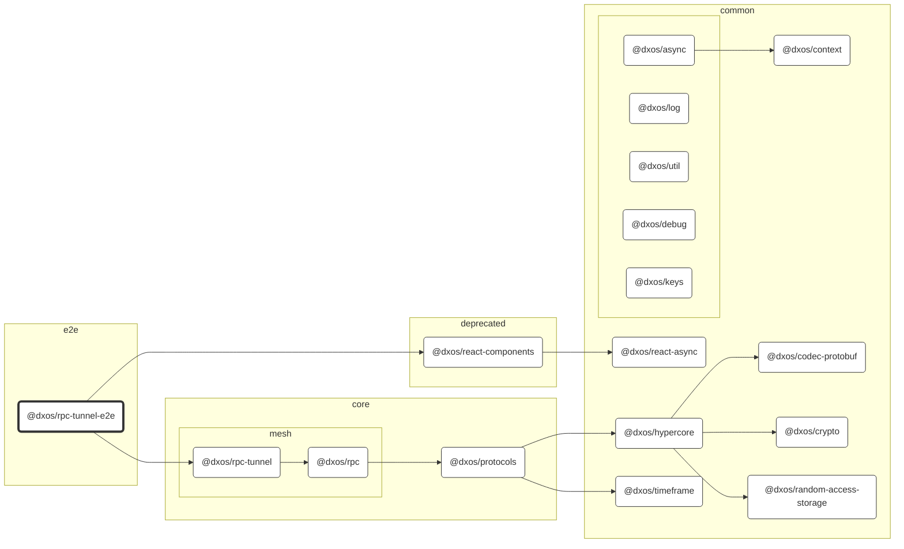

# @dxos/rpc-tunnel-e2e

## Dependency Graph

## Dependencies

| Module | Direct |
|---|---|
| [`@dxos/async`](../../../common/async/docs/README.md) | &check; |
| [`@dxos/codec-protobuf`](../../../common/codec-protobuf/docs/README.md) | &check; |
| [`@dxos/context`](../../../common/context/docs/README.md) |  |
| [`@dxos/crypto`](../../../common/crypto/docs/README.md) |  |
| [`@dxos/debug`](../../../common/debug/docs/README.md) |  |
| [`@dxos/hypercore`](../../../common/hypercore/docs/README.md) |  |
| [`@dxos/keys`](../../../common/keys/docs/README.md) |  |
| [`@dxos/log`](../../../common/log/docs/README.md) | &check; |
| [`@dxos/protocols`](../../../core/protocols/docs/README.md) | &check; |
| [`@dxos/random-access-storage`](../../../common/random-access-storage/docs/README.md) |  |
| [`@dxos/react-async`](../../../common/react-async/docs/README.md) | &check; |
| [`@dxos/react-components`](../../../deprecated/react-components/docs/README.md) | &check; |
| [`@dxos/rpc`](../../../core/mesh/rpc/docs/README.md) | &check; |
| [`@dxos/rpc-tunnel`](../../../core/mesh/rpc-tunnel/docs/README.md) | &check; |
| [`@dxos/timeframe`](../../../common/timeframe/docs/README.md) |  |
| [`@dxos/util`](../../../common/util/docs/README.md) |  |
