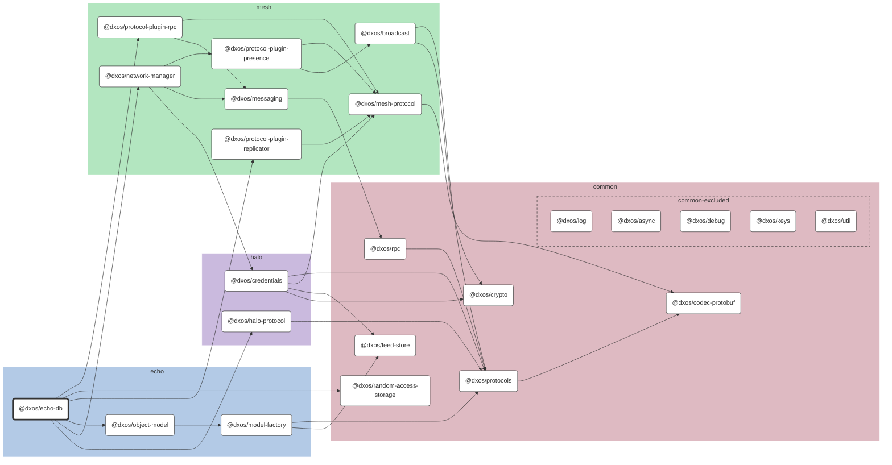

# @dxos/echo-db

ECHO database.

## Dependency Graph

## Dependencies

| Module | Direct |
|---|---|
| [`@dxos/async`](../../../common/async/docs/README.md) | &check; |
| [`@dxos/broadcast`](../../../mesh/broadcast/docs/README.md) |  |
| [`@dxos/codec-protobuf`](../../../common/codec-protobuf/docs/README.md) | &check; |
| [`@dxos/credentials`](../../../halo/credentials/docs/README.md) | &check; |
| [`@dxos/crypto`](../../../common/crypto/docs/README.md) | &check; |
| [`@dxos/debug`](../../../common/debug/docs/README.md) | &check; |
| [`@dxos/feed-store`](../../../common/feed-store/docs/README.md) | &check; |
| [`@dxos/halo-protocol`](../../../halo/halo-protocol/docs/README.md) | &check; |
| [`@dxos/keys`](../../../common/keys/docs/README.md) | &check; |
| [`@dxos/log`](../../../common/log/docs/README.md) | &check; |
| [`@dxos/mesh-protocol`](../../../mesh/mesh-protocol/docs/README.md) | &check; |
| [`@dxos/messaging`](../../../mesh/messaging/docs/README.md) | &check; |
| [`@dxos/model-factory`](../../model-factory/docs/README.md) | &check; |
| [`@dxos/network-manager`](../../../mesh/network-manager/docs/README.md) | &check; |
| [`@dxos/object-model`](../../object-model/docs/README.md) | &check; |
| [`@dxos/protocol-plugin-presence`](../../../mesh/protocol-plugin-presence/docs/README.md) | &check; |
| [`@dxos/protocol-plugin-replicator`](../../../mesh/protocol-plugin-replicator/docs/README.md) | &check; |
| [`@dxos/protocol-plugin-rpc`](../../../mesh/protocol-plugin-rpc/docs/README.md) | &check; |
| [`@dxos/protocols`](../../../common/protocols/docs/README.md) | &check; |
| [`@dxos/random-access-storage`](../../../common/random-access-storage/docs/README.md) | &check; |
| [`@dxos/rpc`](../../../common/rpc/docs/README.md) | &check; |
| [`@dxos/util`](../../../common/util/docs/README.md) | &check; |
