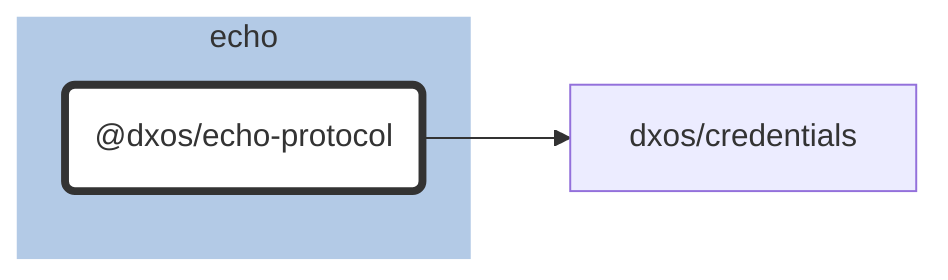

# @dxos/echo-protocol

ECHO protocol definitions and utilities.

## Dependency Graph

## Dependencies

| Module | Direct |
|---|---|
| [`@dxos/async`](../../../common/async/docs/README.md) | &check; |
| [`@dxos/codec-protobuf`](../../../common/codec-protobuf/docs/README.md) | &check; |
| [`@dxos/credentials`](../../../halo/credentials/docs/README.md) | &check; |
| [`@dxos/crypto`](../../../common/crypto/docs/README.md) | &check; |
| [`@dxos/debug`](../../../common/debug/docs/README.md) |  |
| [`@dxos/feed-store`](../../feed-store/docs/README.md) | &check; |
| [`@dxos/mesh-protocol`](../../../mesh/mesh-protocol/docs/README.md) |  |
| [`@dxos/protocols`](../../../common/protocols/docs/README.md) | &check; |
| [`@dxos/util`](../../../common/util/docs/README.md) | &check; |
