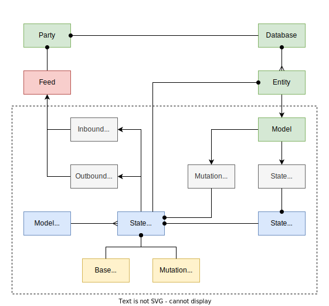

# @dxos/model-factory

- Factory for models and state machines.
- Handles model registration.
- `StateManager` manages the state-machine and the model:
 - Snapshots.
 - Optimistic mutations.
 - Late-registration of models.

