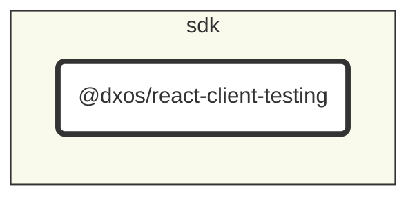

# @dxos/react-client-testing

Tools for react testing.

## Dependency Graph

```mermaid
%%{ init: {'flowchart':{'curve':'basis'}} }%%

flowchart LR

%% Classes
classDef def fill:#fff,stroke:#333,stroke-width:1px
classDef root fill:#fff,stroke:#333,stroke-width:4px

%% Nodes

subgraph sdk [sdk]
  style sdk fill:#f9faeb,stroke:#333
  dxos/react-client-testing("@dxos/react-client-testing"):::root
  click dxos/react-client-testing "dxos/dxos/tree/main/packages/sdk/react-client-testing/docs"
end

%% Links
linkStyle default stroke:#333,stroke-width:1px
```

## Dependencies

| Module | Direct |
|---|---|
