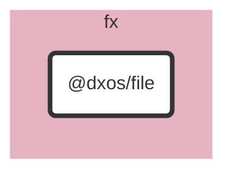

# @dxos/file

## Dependency Graph

```mermaid
%%{ init: {'flowchart':{'curve':'basis'}} }%%

flowchart LR

%% Classes
classDef default fill:#fff,stroke:#333,stroke-width:1px
classDef root fill:#fff,stroke:#333,stroke-width:4px

%% Nodes

subgraph fx [fx]
  style fx fill:#e6b3c3,stroke:#fff
  dxos/file("@dxos/file"):::root
  click dxos/file "dxos/dxos/tree/main/packages/fx/file/docs"
end

%% Links
linkStyle default stroke:#333,stroke-width:1px
```

## Dependencies

| Module | Direct |
|---|---|
