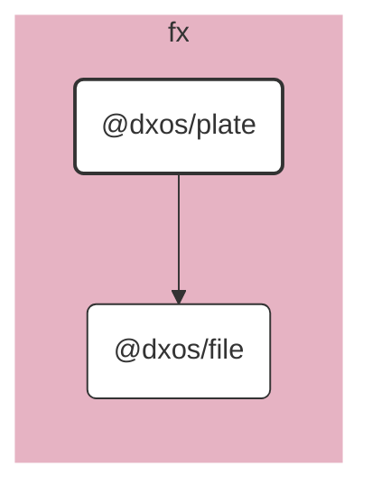

# @dxos/plate

## Dependency Graph

```mermaid
%%{ init: {'flowchart':{'curve':'basis'}} }%%

flowchart LR

%% Links
dxos/plate --> dxos/file;

%% Sections
subgraph fx
  style fx fill:#e6b3c3,stroke:#fff;

  dxos/file("@dxos/file")
  dxos/plate("@dxos/plate")
end


%% Hyperlinks
click dxos/file "dxos/dxos/tree/main/packages/fx/file/docs";

%% Styles
classDef rootNode fill:#fff,stroke:#333,stroke-width:2px
classDef defaultNode fill:#fff,stroke:#333,stroke-width:1px
linkStyle default stroke:#333,stroke-width:1px

dxos/plate:::rootNode

dxos/file:::defaultNode
```

## Dependencies

| Module | Direct |
|---|---|
| [`@dxos/file`](../../file/docs/README.md) | &check; |
