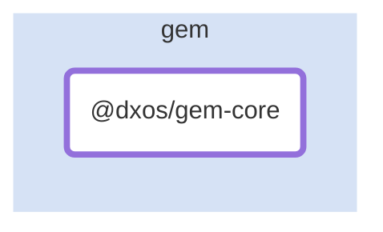

# @dxos/gem-core

Gem core components and utils.

## Dependency Graph

```mermaid
flowchart LR;

style dxos/gem-core fill:#fff,stroke-width:4px;


subgraph gem
  style gem fill:#d6e2f5,stroke:#fff;
  dxos/gem-core("@dxos/gem-core");
end

```

## Dependencies

| Module | Direct |
|---|---|
