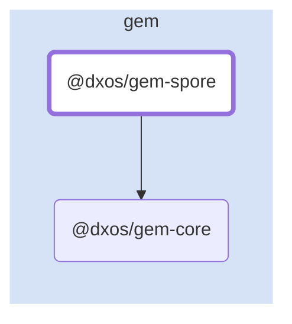

# @dxos/gem-spore

Gem spore.

## Dependency Graph

```mermaid
flowchart LR;

style dxos/gem-spore fill:#fff,stroke-width:4px;

click dxos/gem-core "https:/github.com/dxos/dxos/tree/main/packages/gem/gem-core/docs";

subgraph gem
  style gem fill:#d6e2f5,stroke:#fff;
  dxos/gem-spore("@dxos/gem-spore");
  dxos/gem-core("@dxos/gem-core");
end

dxos/gem-spore --> dxos/gem-core;
```

## Dependencies

| Module | Direct |
|---|---|
| [`@dxos/gem-core`](../../gem-core/docs/README.md) | &check; |
