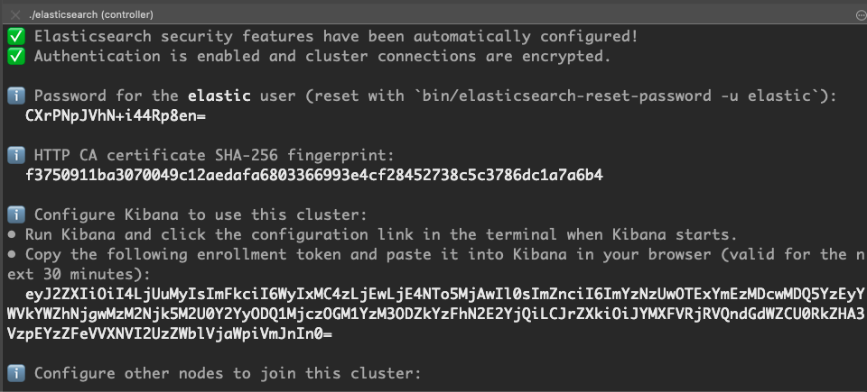
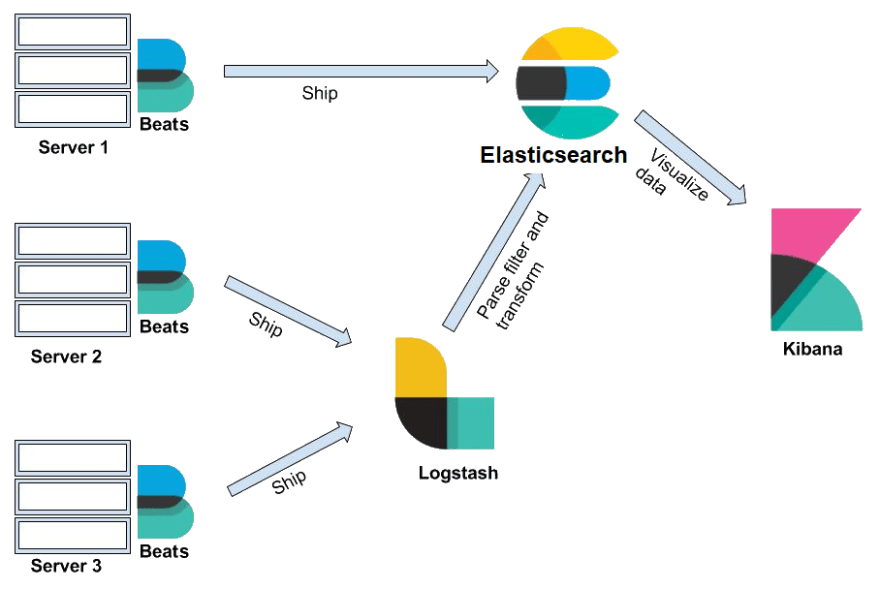
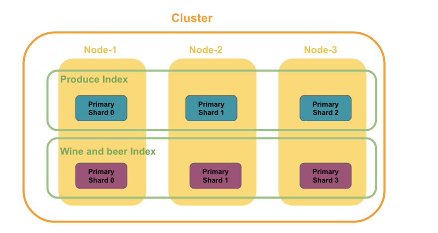
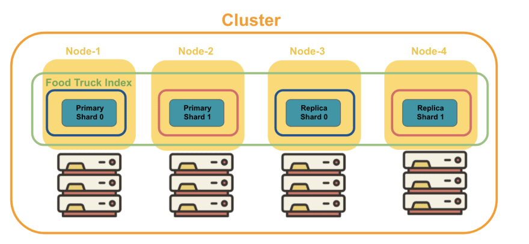

# Gravity Analytics

## Introduction
Gravity Analytics is responsible for analyzing and monitoring performance of the entire __dxos__ stack. The main tasks performed by _gravity analytics_ are:
  * Log analysis
  * Performance metrics

## Software stack
_Gravity Analytics_ uses __Elasticsearch Stack__: Elasticsearch and Kibana

## Required Software
### Local Installation
#### Elasticsearch
Download Elasticsearch from this location: [Elasticsearch Download](https://www.elastic.co/downloads/elasticsearch)
__Note__: Please choose the appropriate platform for your system

At the time of this writing we use Elasticsearch _v8.5.3_

Assuming you have your elastic...tar.gz landed in ~/Downloads directory, move to ~/opt/elasticsearch/8.5.3

```bash
cd
mkdir -p opt/elasticsearch/8.5.3
tar xfv ~/Downloads/elasticsearch-8.5.3-<your platform>.tar.gz -C ~/opt/elasticsearch/8.5.3
cd opt/elasticsearch/8.5.3
```

__Start Elasticsearch__ (You are in ~/opt/elasticsearch/8.5.3)
```bash
bin/elasticsearch
```
Upon successful start of your instance of _Elasticsearch_ you should see:



__Warning__ Do not close the window upon your initial start. Search for your __elastic__ password:


ℹ️  Password for the elastic user (reset with `bin/elasticsearch-reset-password -u elastic`):
  CXrPNpJVhN+i44Rp8en=

ℹ️  HTTP CA certificate SHA-256 fingerprint:
  f3750911ba3070049c12aedafa6803366993e4cf28452738c5c3786dc1a7a6b4

ℹ️  Configure Kibana to use this cluster:
• Run Kibana and click the configuration link in the terminal when Kibana starts.
• Copy the following enrollment token and paste it into Kibana in your browser (valid for the next 30 minutes):
  eyJ2ZXIiOiI4LjUuMyIsImFkciI6WyIxMC4zLjEwLjE4NTo5MjAwIl0sImZnciI6ImYzNzUwOTExYmEzMDcwMDQ5YzEyYWVkYWZhNjgwMzM2Njk5M2U0Y2YyODQ1MjczOGM1YzM3ODZkYzFhN2E2YjQiLCJrZXkiOiJYMXFVRjRVQndGdWZCU0RkZHA3VzpEYzZFeVVXNVI2UzZWblVjaWpiVmJnIn0=

You need to store this information in a secure location and be ready to use this information in the future. We still have to install and configure __Kibana__, remember?

Btw, this is valid for 30 min. So, hurry up, as they say.

#### Kibana
Download Kibana from here: [Kibana Download](https://www.elastic.co/downloads/kibana)

__macOS Gatekeeper warnings__
Apple’s rollout of stricter notarization requirements affected the notarization of the 8.5.3 Kibana artifacts. If macOS Catalina displays a dialog when you first run Kibana that interrupts it, you will need to take an action to allow it to run.

To prevent Gatekeeper checks on the Kibana files, run the following command on the downloaded .tar.gz archive or the directory to which was extracted:
```bash
xattr -d -r com.apple.quarantine <archive-or-directory>
```

When both _elasticsearch_ and _kibana_ have been installed, you need to enroll kibana into elasticsearch cluster. Visit the _url_ printed in your __kibana__ terminal
```code
Kibana has not been configured.

Go to http://localhost:5601/?code=467554 to get started.
```
You will need to visit this _url_ and past your _elasticsearch_ enrollment token. 

You will need another set of credentials: kibana_system
You need to generate a password for this user:
```bash
bin/elasticsearch-reset-password -u kibana_system
```

Password for the [kibana_system] user successfully reset.
New value: YMeOYE_geVOxJJip3QPI

At this point your local __Kibana__ setup is complete and you can access your instance at:
http://localhost:5601/app/home#/

When you log into this site, please use your __elastic__:<password> credentials

If you forget your password, you can regenerate it with:
```bash
bin/elasticsearch-reset-password -u elastic
```

### Elasticsearch Background
In Elasticsearch, data is stored as documents. A document is a JSON object that stores whatever data you want to store in Elasticsearch. Each document has a unique ID.

Documents that are logically related to each other are grouped into an index. For example, documents of carrots and clementines would be grouped under the produce index. Documents of Malbec and IPAs would be grouped under the wine and beer index.

#### Data -> Elasticsearch
__Beats__ and __Logstash__ are the parts of the Elasticsearch Stack.
Both are responsible for sending the data to Elasticsearch. We are interested in collecting the performance and the vital signs of __dxos__. We rely on beats and logstash to send the collected performance and vital sign data to elasticsearch that we later on analyze with _kibana_.




__Beats__ is a collection of _data shippers_. When installed on our analytics server, it collects and ships data to either __Logstash__ or __Elasticsearch__.

__Logstash__ is a _data processing pipeline_. Data that logstash receives (telemetry, performance heartbeats, vitals, CPU, RAM) are handled as events. These events are parsed, filtered, and transformed and are sent off to Elasticsearch where the data will be stored.

In __Elasticsearch__, data is stored as _documents_, a unit of info that is stored in __JSON__ object. We use __Winston-elasticsearch__ in our __@dxos/log__ package to make our logging consumable by __Kibana__.

__Kibana__ provides a web interface to the data stored in __Elasticsearch__. It allows us to send queries to Elasticsearch using the same REST API. These queries can provide answers to questions such as "How much CPU utilization does Kube incur when running 10, 100, 1000 concurrent request?" or "What are the vitals of KUBE while running under stress?"

### Checking Elasticsearch Health

Open Elasitcsearch _console_ http://localhost:5601/app/dev_tools#/console

```code
GET _cluster/health

{
  "cluster_name": "elasticsearch",
  "status": "green",
  "timed_out": false,
  "number_of_nodes": 1,
  "number_of_data_nodes": 1,
  "active_primary_shards": 11,
  "active_shards": 11,
  "relocating_shards": 0,
  "initializing_shards": 0,
  "unassigned_shards": 0,
  "delayed_unassigned_shards": 0,
  "number_of_pending_tasks": 0,
  "number_of_in_flight_fetch": 0,
  "task_max_waiting_in_queue_millis": 0,
  "active_shards_percent_as_number": 100
}
```

### Elasticsearch Cluster
We run __Elasticsearch__ in a cluster with sharding

A common setup looks as shown below:



### Replication
__Replication__ creates copies of shards and keeps the copies in different nodes. If a node goes down, the copies stored in other nodes would step up to the plate and serve requests like nothing happened.

Elasticsearch _automatically replicates shards_ without us having to configure anything. It creates a copy(replica shard) of each shard within the index.




