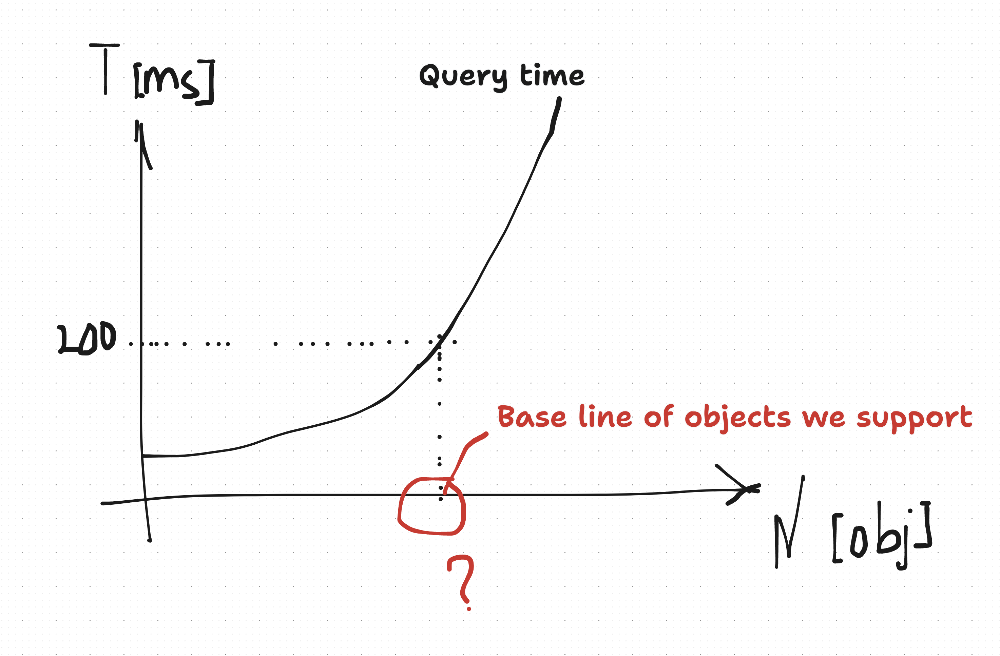
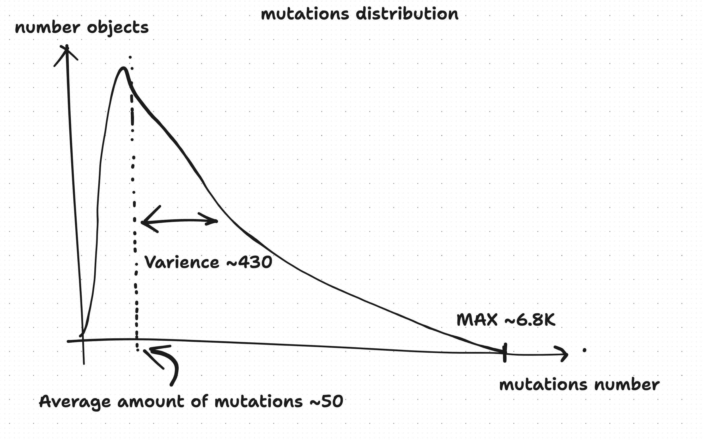
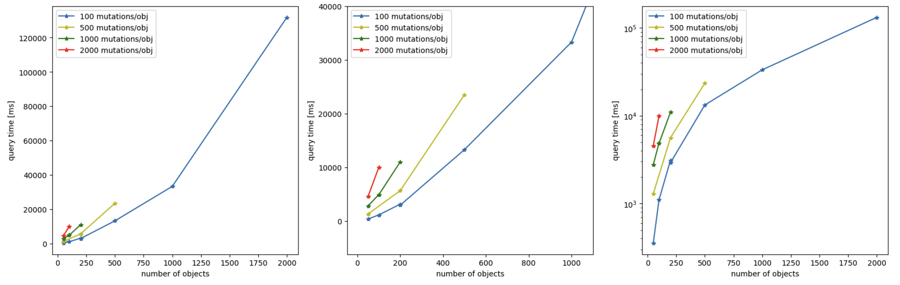
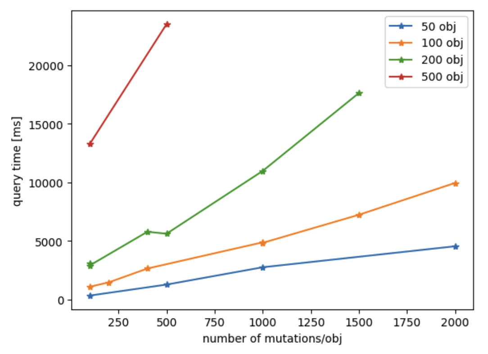

# ECHO performance
 > - updated 22 may 2024

## Query performance tests
We want to determine a baseline of ECHO performance, the first set of tests would focus on query speeds depending on the number of objects and the number of mutations in those objects. 

All applications in real life tend to load some amount of data on the start-up, so we will measure how much time it takes to load an arbitrary amount of objects from a freshly stated echo instance. That metric determines how "snappy" applications of our adopters will load. For that we will use `@dxos/blade-runner` (*see [ECHO test spec](../src/spec/echo.ts)*). 

### Test plan
1) Create ECHO peer.
2) Create N ECHO objects with M mutations in each.
3) Flush everything to disk.
4) Reload ECHO peer to drop cache.
5) Query all N objects using index on disk.
6) Measure how much time it took to query all objects from disk  (`query time`).

## What do we expect

*Expected `Query time` dependency on amount of objects.*

We expect to see query time increase with amount of objects inside query. Also we want to come to our users with numbers on what performance they should expect from ECHO, and what amount of object they can store in ECHO to have nice experience.

## Real life parameters
The biggest app currently using ECHO is Composer, it is the app developed by DXOS to motivate further development and scaling of ECHO and other parts of DXOS framework.

The biggest space we created inside Composer for collaboration has such stats:

*Approximate distribution of mutations inside large production space*
| metric                       | value |
| ---------------------------- | ----- |
| amount of objects            | 649   |
| maximum amount of mutations  | 6827  |
| mean amount of mutations     | 46.3  |
| variance of mutations amount | 429.9 |

So we are aiming in our tests to simulate queries with amount of objects beyond 700 and measure performance for them.

## Test results
[Github gist with analyses of test runs](https://gist.github.com/mykola-vrmchk/5c6e2b3d622231eb77d14c984b5f8627)

*Measured query time against the number of queried objects with fixed amount of mutations per object. (left) - performance metrics for different queries, for higher amounts of mutation and objects test crashed because of memory overflow; (center) - enlarged portion of the plot on the (left); (right) - log scale for performance metrics for different queries;*

*Measured query time against the number of mutations per object with fixed amount of objects per query*

## Results discussion
1. We tested query speed with different parameters, it has power law dependency on amount of objects queried and linearly depends on amount of mutations inside each object.
2. We found a hard limit around automerge WASM implementation, it can only support 4GB of data, that is why we experienced test crashes. 
3. Let's evaluate upper limit that ECHO supports because of this wasm 4GB memory limit: 

 > memory ~= numberOjObjects * numberOfMutations * mutationSize\
 > numberOjObjects = 4 GB / 1000 / 100 = 5K\
 Around this amount ECHO will crash with WASM memory overflow error.
