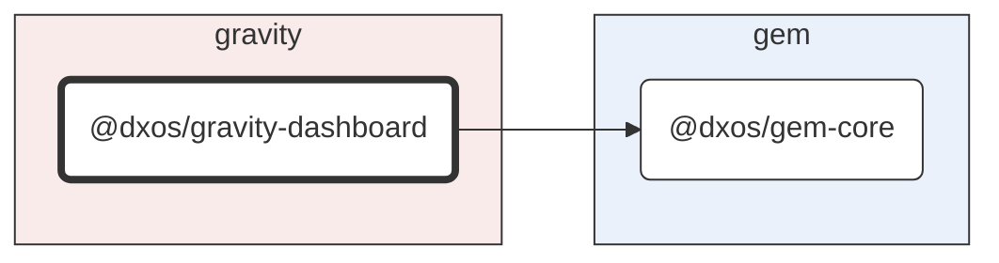

# @dxos/gravity-dashboard

Gravity dashboard.

## Dependency Graph

```mermaid
%%{ init: {'flowchart':{'curve':'basis'}} }%%

flowchart LR

%% Classes
classDef def fill:#fff,stroke:#333,stroke-width:1px
classDef root fill:#fff,stroke:#333,stroke-width:4px

%% Nodes

subgraph gravity [gravity]
  style gravity fill:#faebeb,stroke:#333
  dxos/gravity-dashboard("@dxos/gravity-dashboard"):::root
  click dxos/gravity-dashboard "dxos/dxos/tree/main/packages/gravity/gravity-dashboard/docs"
end

subgraph gem [gem]
  style gem fill:#ebf1fa,stroke:#333
  dxos/gem-core("@dxos/gem-core"):::def
  click dxos/gem-core "dxos/dxos/tree/main/packages/gem/gem-core/docs"
end

%% Links
linkStyle default stroke:#333,stroke-width:1px
dxos/gravity-dashboard --> dxos/gem-core
```

## Dependencies

| Module | Direct |
|---|---|
| [`@dxos/gem-core`](../../../gem/gem-core/docs/README.md) | &check; |
