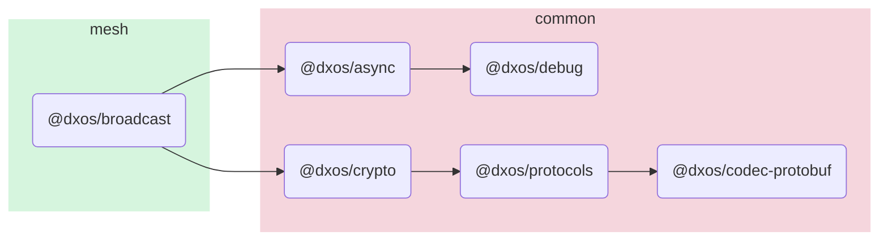

# @dxos/broadcast

Abstract module to send broadcast messages.
## Dependency Graph

## Dependencies
| Module | Direct |
|---|---|
| [`@dxos/async`](../../../common/async/docs/README.md) | &check; |
| [`@dxos/codec-protobuf`](../../../common/codec-protobuf/docs/README.md) | &check; |
| [`@dxos/crypto`](../../../common/crypto/docs/README.md) | &check; |
| [`@dxos/debug`](../../../common/debug/docs/README.md) |  |
| [`@dxos/protocols`](../../../common/protocols/docs/README.md) | &check; |
