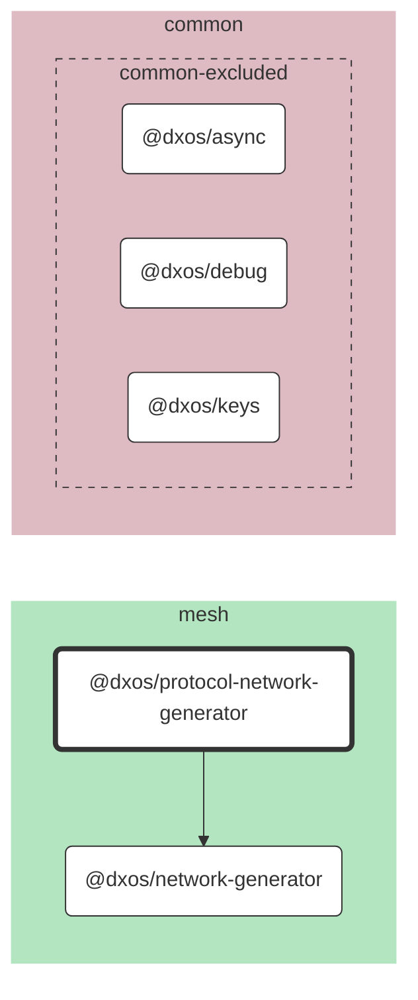

# @dxos/protocol-network-generator

Protocol network generator.

## Dependency Graph

## Dependencies

| Module | Direct |
|---|---|
| [`@dxos/async`](../../../common/async/docs/README.md) |  |
| [`@dxos/debug`](../../../common/debug/docs/README.md) |  |
| [`@dxos/keys`](../../../common/keys/docs/README.md) |  |
| [`@dxos/network-generator`](../../network-generator/docs/README.md) | &check; |
