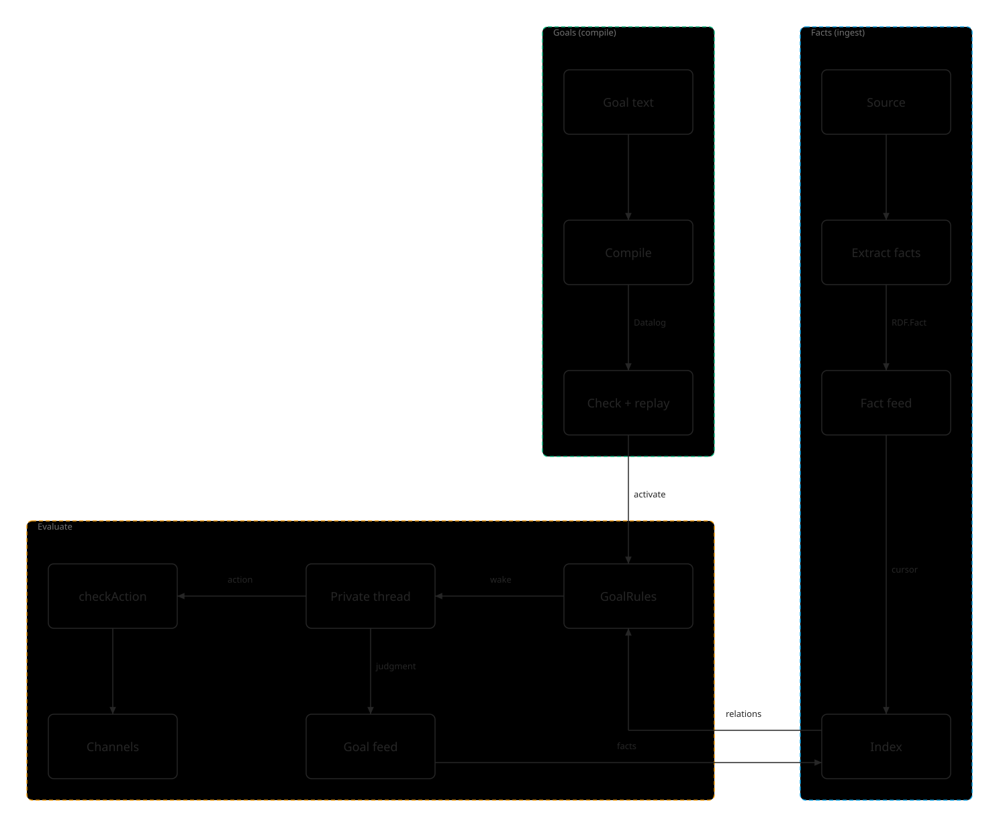

# Agent Brain — design

Status: draft 2 (2026-10-07). The design is settled except private threads (M0, see
[THREADS.md](./THREADS.md)); the M1 spike is done and `@dxos/datalog` and `@dxos/brain` are built.
Builds on [ONTOLOGY.md](./ONTOLOGY.md) (draft 3) and [DESIGN.md](./DESIGN.md), which describe the agent
as built in PR #13590.

## Summary

The brain is what an agent knows (facts) and what it is trying to achieve (goals), and the machinery
that re-evaluates the second whenever the first changes. It lets an agent hold standing directives
from people — "keep me informed about X", "get Dima to help with this", "complete my taxes" — across
every conversation and runtime, and act on them when circumstances change rather than only when
asked.

- **One brain per agent, authoritative on EDGE** as a Durable Object, with an in-process copy in the
  browser; every layer runs unchanged in the browser, on Workers and in Node.
- **Facts are pipeline-rdf `RDF.Fact`s stored as they are in ECHO feeds** — one feed per source,
  append-only, with no second fact shape; the feeds are the record and the brain's index
  (pipeline-rdf's SQLite schema) is derived and rebuildable.
- **Goals are directives, not tasks:** plain-text outcomes or conditions, owned by an `Actor` (user,
  group or agent), hierarchical (steps are sub-goals), carrying priority, a budget and optional
  instructions; a goal creates a concrete `Task` only for substantive, assignable work.
- **Goals compile to Datalog** — `achieved`/`holds`, conditions, `wake` and `blocks` rules — over a
  canonical predicate vocabulary; a compilation goes active only after independent test facts replay
  correctly. The text is the authority. SPARQL stays for judgment-time retrieval.
- **Datalog, not SPARQL or N3, runs the rules** (M1): all three parse and conform equally well, but only a small
  pure-TypeScript engine is portable, incremental and fast enough per fact.
- **Two packages:** `@dxos/datalog` (the generic engine) and `@dxos/brain` (facts, vocabulary,
  built-ins, compiler, `GoalRules`, the example scenarios as tests); both public.
- **Evaluation is two-stage:** incremental rule-driven wakes, then model judgment; drivers (fact, time,
  action) are the only part hardcoded, and a goal-pattern document teaches the judgment.
- **State on the goal, history in its feed:** status and a one-line situation on the object; actions
  and judgments recorded as tuples that other goals can match.
- **Judgment runs in private threads** — recommended as a child feed per thread (THREADS.md, M0):
  session goals under the session, durable goals under a background session per owning actor.

## The brain stack

Five layers, from extracted propositions up to goals and the threads that judge them. Each layer's
types are defined once and the layers above reuse them.



Source: [diagrams/brain-flows.dx](./diagrams/brain-flows.dx), rendered with plugin-illustrator.

| Layer          | Package                        | Types                                                                                                                                                                                            |
| -------------- | ------------------------------ | ------------------------------------------------------------------------------------------------------------------------------------------------------------------------------------------------ |
| 1. Facts       | `@dxos/pipeline-rdf`           | `RDF.Fact` = `Assertion` (subject/object `Term`, predicate, validity, quote) + `Factuality` + `Illocution` + `Attribution`; `RDF.Entity`                                                         |
| 2. RDF form    | `@dxos/pipeline-rdf`           | The vocabulary (`sx:` = `https://dxos.org/semantic#`, `prov:`, entity and fact IRIs) and the `Fact` ↔ triples mapping; `FactStore` (SQLite: `triples`, `entities`, per-source `cursors`; SPARQL) |
| 3. Feed record | plugin-agent                   | `RDF.Fact` unchanged (its `Term` is tagged, so ECHO stores it), in an ECHO feed item, one feed per source                                                                                        |
| 4. Rules       | `@dxos/datalog`, `@dxos/brain` | Relations `fact(F, S, P, O)` + metadata keyed by `F`; canonical `Vocabulary`; built-ins `about`, `concerns`, `elapsed`, …; compiled programs                                                     |
| 5. Goals       | `@dxos/brain`, plugin-agent    | `Goal` directive (text, owner `Actor`, status, priority, budget, situation, drivers, compiled rules) with its own fact feed; sub-goals; `Task`s for concrete work                                |

**Facts flow (ingest).**

1. A source — a chat turn, a document, a web page — is read by pipeline-rdf's extraction stages into
   `RDF.Fact`s, attributed to the speaker, message and time; predicates are normalized
   (`RDF.Predicate.normalize`).
2. The `Fact`s are appended to the source's fact feed as they are — the record, append-only;
   corrections are new facts.
3. The brain follows each feed from its cursor, writes the facts to its index (pipeline-rdf's SQLite
   schema: triples, entities for `concerns`, full-text for `about`) and encodes them as Datalog
   relations (`Encoding`), mapping surface predicates onto the canonical `Vocabulary`.

**Goals flow (compile).**

1. A user states a goal in text; the agent proposes priority, budget and instructions.
2. A Sonnet-class model compiles the text (`CompilePrompt`) into Datalog: `achieved` or `holds`,
   conditions, `wake` rules, and `blocks` for constraints. `Compiler` checks it against the vocabulary
   and built-ins.
3. Independent test facts are replayed through `GoalRules`; only a passing program goes active. The
   text stays the authority.

**Evaluation flow (wake → judge → act).**

1. On every new fact (and every clock tick), `GoalRules` evaluates incrementally and reports wakes —
   a new binding of a `wake` rule, `achieved` first becoming true, or a sub-goal changing status —
   with the facts behind each.
2. A woken goal is judged by the model in its **private thread**: given the goal, its instructions,
   situation, the triggering facts and the context, it decides to do nothing, act, mark the goal
   achieved, or ask its owner.
3. Actions go out through the agent's skills and channel backends; before each, `checkAction`
   evaluates the owner's constraint goals (`blocks`).
4. The judgment, the action and the new status are appended to the goal's own feed as `RDF.Fact`s
   and the situation is rewritten — so they are facts other goals can match, and the loop continues.

**Threads.** A private thread is a child feed of a session ([THREADS.md](./THREADS.md)): the session's
history merged by feed position with the thread's own, hidden from every reader of the chat by
construction. A session goal's thread lives under the session; a durable goal's thread lives under the
background session of its owning actor, which the EDGE Durable Object maintains. Promoting a goal
re-parents its thread feed.

**Where it runs.** One brain per agent, authoritative in an EDGE Durable Object (feeds, index, rules,
alarms for time drivers, background sessions); an in-process copy in the browser for tests, stories
and offline work. Every layer runs unchanged in the browser, on Workers and in Node.

## Runtime

### One brain per agent, authoritative on EDGE

Each agent has one brain, hosted on EDGE as a Durable Object. Every runtime that runs the agent's
sessions — the browser, EDGE workers, a CLI — is a client of it. This closes the gap in the current
build, where watches live in one runtime's memory: a watch set from a chat in the browser cannot see
turns of a chat served on EDGE, and every watch is lost on restart. The Durable Object's alarms give
time-driven evaluation a durable home. An in-process stand-in with the same interface runs in the
browser for tests, stories and offline work.

**Portability is a hard requirement:** everything the brain runs — the rule engine, the fact index,
the compiler's replay gate — must run in the browser, on Cloudflare Workers (workerd, inside the
Durable Object) and in Node for tests. That rules out engines that need Node built-ins, threads,
runtime `eval`, or a bundle beyond Workers' script size limit — which is what decided the rule engine
(see "M1 findings").

## Facts

### Feeds are the record; the index is derived

ECHO feeds are the record of what the agent believes. The Durable Object follows them and keeps a
derived index it can rebuild from scratch at any time. People can read, correct and delete facts in
Composer, and any runtime can append them, including offline. The cost is that evaluation lags an
append by roughly one sync round.

Each source the agent reads (a chat, a thread, a document, a web page) has its own fact feed, keyed by
the source as today (`org.dxos.agent.annotations` foreign key), and each feed item is one fact.

### pipeline-rdf is the common type

`@dxos/pipeline-rdf` defines the fact model every layer reuses, as Effect Schemas under the `RDF`
namespace:

| Type          | Fields                                                                                                          |
| ------------- | --------------------------------------------------------------------------------------------------------------- |
| `Fact`        | `id`, `assertion`, `factuality`, `illocution?`, `attribution`, `recordedAt`, `extractor`, `sourceHash`, `pass?` |
| `Assertion`   | `subject: Term`, `predicate`, `object: Term`, `validFrom?`, `validTo?`, `quote?`                                |
| `Term`        | `{ kind: 'entity', entity, label? }` or `{ kind: 'literal', literal }`                                          |
| `Factuality`  | `value` (FactBank: `CT+ CT- PR+ PR- PS+ PS- CTu Uu`), `polarity` (`+ - ?`), `confidence?`, `nature?`            |
| `Illocution`  | `force` (`assertive`, `directive`, `commissive`, `expressive`), `mood?`, `addressee?`                           |
| `Attribution` | `agent?` (speaker), `source` (message DXN), `generatedAtTime`, `wasDerivedFrom?`, `span?`                       |
| `Entity`      | `id`, `kind` (`person org place event concept thing`), `label`, `aliases`, `ref?` (an ECHO object)              |

Its RDF form — the `sx:` (`https://dxos.org/semantic#`) and `prov:` vocabulary, entity and fact IRIs,
and the `Fact` ↔ triples reification — is the one RDF definition: the brain reuses it for any RDF or N3
output rather than inventing its own namespace. `FactStore` persists that form in SQLite (`triples`
indexed by subject–predicate–object and predicate–object, `entities`, per-source `cursors`) and answers
SPARQL. They are public as `RDF.Vocab` (namespaces and IRI helpers), `RDF.Mapping` (`factToTriples`,
`triplesToFacts`) and `RDF.Predicate` (`normalize`). The mapping serializes `illocution` (`sx:force`,
`sx:mood`, `sx:addressee`), which it previously dropped — a fact read back from `FactStore` had lost
its speech act; round-trip tests cover both stores.

### The feed item is `RDF.Fact`

A feed stores `RDF.Fact` itself — no flattened copy and no mapping. Two changes to pipeline-rdf made
that possible:

- **`Term` is tagged by `kind`** (`'entity'` or `'literal'`). ECHO stores a union only when every member
  carries one shared literal discriminator; the untagged `{ entity, label? } | { literal }` was not
  storable, which is why a flattened copy existed. The RDF triple form is unchanged — an entity IRI or a
  string literal already tells the two apart — so stored triples read back as before.
- **`pass?`** (top level) is the extraction pass id, grouping the facts one run produced so they can be
  replayed or retracted together. It is not part of `extractor`, which names the program rather than
  the run. It serializes as an optional `sx:pass` triple.

Corrections and retractions are further facts (`attribution.wasDerivedFrom` lists what a correction
supersedes; polarity `-`); the feed is append-only. A fact without an `illocution` is `assertive`.

An ECHO object's `id` must be an ECHO object id, while a fact's `id` is a deterministic
`source#hash#index` that RDF reification and `wasDerivedFrom` refer to. So a fact is stored inside an
ECHO object rather than as one: today plugin-agent's `FactEntry` (`org.dxos.type.agent.factEntry`
0.2.0), one feed item per extraction pass, holding `facts: RDF.Fact[]`.

### Encoding and vocabulary

Storage in the rule engine is generic — `fact(F, S, P, O)` plus metadata relations keyed by `F`
(`speaker`, `force`, `polarity`, `mood`, `factuality`, `saidAt`, `source`, `surface`, …), lossless
with `RDF.Fact` and its triples. The extractor's predicates are unstable (`working-on`, `will-work-on`,
`works_on`), so surface predicates are normalized with pipeline-rdf's `RDF.Predicate.normalize` and mapped
onto a small **canonical vocabulary**, keeping the original as `surface(F, "will-work-on")`. Rules may
use shorthand for canonical predicates — `helps_with(dima, X)` expands to
`fact(_, dima, helps_with, X)`, and `helps_with(F, dima, X)` exposes the id — and shorthand on a
non-canonical or misspelled predicate is a compile error rather than a silent miss.

### Indexing

| Index                                  | Where                                                                 |
| -------------------------------------- | --------------------------------------------------------------------- |
| Rule joins (hash per bound-column set) | In memory, `@dxos/datalog`                                            |
| Facts, with a cursor per source        | SQLite (pipeline-rdf's schema), in the Durable Object and the browser |
| Entities and aliases (`concerns`)      | SQLite `entities`                                                     |
| Fact text (`about`)                    | SQLite FTS5; vectors later for meaning                                |

On start the Durable Object loads base facts from SQLite into the engine, then evaluates incrementally
as feeds advance; rebuilding means clearing the cursors and replaying the feeds.

## Goals

Goals are the centre of the design. The concept is distinct from ECHO's existing `Trigger` (a
scheduled or event-bound function invocation): a goal is not wired to an event, it is re-evaluated
against everything the agent knows.

### What a goal is

A goal is a **directive** — an order given to the agent. It defines a future outcome or state; it may
or may not say how to achieve it, and it may define conditions.

- **Plain text.** A user states a goal in natural language and it evolves through discussion with the
  agent.
- **Owned by an actor.** A goal belongs to an `Actor`: a user, a group, or an agent — and an agent is
  just a user, so the agent's own goals need no special case. The agent can enumerate an actor's goals
  ("what are you doing for me?"), and the owner can inspect, reprioritize, edit and cancel them.
- **Long-running.** A goal holds until it is achieved or cancelled. Some last only the session
  ("help me draft this reply"); others last months ("learn French").
- **Outcome, condition or constraint.** An **outcome** is a future state, achieved once ("complete my
  taxes"); a **condition** holds continuously and is maintained ("keep my inbox empty", "keep me
  informed about X"); a **constraint** limits the agent's actions ("never book meetings on Fridays").
  These are read from the text, not types in code.
- **Carries instructions.** A goal may include a prompt for how to act on it ("archive newsletters,
  flag anything from investors"), written by the user or proposed by the agent and confirmed.
- **Like a system prompt, but structured:** separate, addressable objects with an owner, status and
  history rather than one block of text.
- **The agent decides actionability.** Whether a goal calls for action now is judgment, not a rule.

plugin-agent's current `Goal` type becomes this directive.

### Representation

The runtime needs to know only _when_ to wake a goal; that must be cheap and deterministic. What the
goal means and what to do is judgment, which belongs to the model. So a goal is represented in three
layers, each with one job:

1. **Drivers — the only part hardcoded.** `fact`, `time` and `action`, because each maps to one
   runtime mechanism: an index subscription, a Durable Object alarm, a hook before every action the
   agent takes. A goal may have several.
2. **Goal patterns — a document the model reads.** A skill of goal patterns with worked examples (the
   table below) teaches the agent how to read a goal, propose its instructions, decide whether it is
   actionable and recognise achievement. It grows by adding examples, and the evals score against it.
3. **Compiled rules — never written by users.** The goal's text compiled to Datalog over the fact
   tuples: `achieved` / `holds`, conditions, `wake` rules, and `blocks` for constraints. The compiled
   rules sit beside the text so they can be inspected. The text is the authority: when the two
   disagree, the agent recompiles; it never rewrites the text to fit the rules.

**Rule language: Datalog for goals, SPARQL for retrieval.** Rules build on each other (`wake`,
`achieved` and `holds` reference one another), stratified negation gives `not achieved(goal)` a clear
meaning, recursion covers relations like "part of" and "blocked by", and incremental evaluation
re-derives only what a new fact affects, which suits a Durable Object following feeds. Built-ins
supply what plain Datalog lacks: `about` (text, later meaning; may bind the fact), `concerns` (an
entity, so "my taxes" means Rich's), `elapsed`, `every`, `due`, `weekday`, `hour`, and aggregates for
counting. SPARQL — shipped in pipeline-rdf — stays the tool for judgment-time retrieval ("everything
Dima said about the plugin this week").

Goal 3 below, compiled:

```prolog
dima(F)        :- speaker(F, dima), force(F, commissive), about(F, "agent plugin").
wake(reply)    :- dima(F), not achieved(goal).
wake(reply)    :- dima(F), achieved(goal).
wake(followup) :- elapsed(goal, 2d), not achieved(goal).
achieved(goal) :- dima(F), polarity(F, "+").
```

### Compilation

A Sonnet-class model compiles the goal (`CompilePrompt`, built from the canonical vocabulary so the
two cannot drift); `Compiler` expands shorthand and checks arity, safety, stratification and the
vocabulary. The compiler marks each goal's achievement as `rule` or `judgment`: rules are reliable for
single-event outcomes with a named person or event, constraints and checkable states (an empty
inbox); everything else is judged. **A compilation goes active only after replay:** 3–5 test facts,
including near misses, are replayed through `GoalRules`. Both the facts and their expected effects
come from an oracle independent of the compiler — a separate model call that sees only the goal text,
never the rules — because the compiler's own probes encode its own reading of the goal and caught none
of the wrong compilations in M1. A read-back of
the rules in plain English is shown to the user as an explanation, not used as a gate.

### Evaluation

Goals are evaluated whenever the facts change, in two stages:

1. **Wake (cheap, no model).** `GoalRules` evaluates each goal's rules incrementally on every new fact
   and clock tick. A goal wakes when a `wake` rule gains a new binding, when `achieved` first becomes
   true, or when a sub-goal changes status; each wake carries the facts behind it. Most facts wake no
   goal.
2. **Judgment (model call).** A woken goal is judged in its private thread (below), given the goal,
   its instructions and situation, the triggering facts and the context; it decides to do nothing, act,
   mark the goal achieved, or ask its owner (ambiguous, blocked, conflicting).

Time-driven goals ("taxes by April 15", "practise French daily") wake on Durable Object alarms.
Constraints are checked before every action (`checkAction`), not when facts arrive. Actions the agent
takes are recorded as facts, so goals depend on each other ("keep me informed" sees the relay that
"get Dima to help" sent).

### State

- **On the goal object — what the runtime and UI read directly.** `status` (`active` | `paused` |
  `achieved` | `cancelled`), priority, budget and spend, drivers, the compiled rules, and a
  **situation**: one or two sentences the agent rewrites after each judgment ("Asked Dima Monday; he
  deferred Tuesday; following up Thursday") — what a user sees when they ask what the agent is doing,
  and what the model reads first at the next judgment.
- **In the goal's own fact feed — the history.** A goal is a source like any chat, so its actions and
  judgments are tuples: `(goal, relayed, <message>)`, `(goal, awaiting, dima)`,
  `(goal, declined-by, dima)`, `(goal, judged, "remind him it's the priority")`. The history is
  append-only and auditable, and other goals' rules can match it.

Nothing on the goal is unjustified by its feed, and `not achieved(goal)` stays a field lookup.

Goal 3 over a week:

| When | Event                                                                                   | Status / situation                                   | Goal feed                            |
| ---- | --------------------------------------------------------------------------------------- | ---------------------------------------------------- | ------------------------------------ |
| Mon  | Rich: "get Dima to help me with the agent plugin"; created, compiled, judged actionable | active / "Asked Dima; waiting"                       | `relayed <msg>`, `awaiting dima`     |
| Tue  | Dima: "busy with the release this week"; `wake(reply)`; instructions say press priority | active / "Dima deferred; told him it's the priority" | `declined-by dima`, `relayed <msg2>` |
| Thu  | `wake(followup)` alarm after 2 days                                                     | active / "Followed up with Dima"                     | `followed-up dima`                   |
| Thu  | Dima: "OK, I'll start on it"; achieved; Rich's watch sees it                            | achieved / "Dima committed Thursday"                 | `achieved`, `committed dima`         |

### Priority and cost

- **Priority** — orders judgment when several goals wake at once, decides which goal wins a conflict
  (the judgment sees the priorities of the other goals in its session), and sets how promptly a woken
  goal is judged: an urgent goal on the fact that woke it; a low one may wait to be batched.
- **Budget** — what the goal may spend per window: judgment calls, model tokens, or both, and
  optionally the model tier. A sub-goal draws on its parent's budget unless given its own.
- **Spend** — what the goal has spent in the current window and in total, rolled up from its
  sub-goals, so an owner can see what each directive costs.

Near its budget the brain degrades rather than stops: it batches the facts that wake a goal into fewer
judgments, lowers its cadence, or judges with a cheaper model. When the budget is spent, the goal
pauses its wake rules and asks its owner whether to raise the budget or narrow the goal. Priority and
budget are set by the owner or proposed by the agent at creation, as instructions are.

### Goals, sub-goals and tasks

**Goals are hierarchical.** A goal's steps are sub-goals, parented to it in the ECHO parent tree, each
with its own text, rules, status, situation and feed. "Complete my taxes" is judged into "gather the
W-2s", "find last year's return" and "book the accountant". The machinery is optional per goal, so a
sub-goal costs nothing until judgment gives it drivers ("book the accountant" gains a follow-up rule
when the accountant does not reply). A sub-goal's change of status wakes its parent; closing a goal
closes its open sub-goals.

**Tasks are concrete, and a record of work.** A `@dxos/types` `Task` is a detailed action with a
history, assignee and status, and once done it is the record that the work happened; it is never
conditional. A goal creates a `Task` only when a step is substantive: long-lived, assignable to a
person, or worth keeping as a record ("book the accountant" may become a `Task` assigned to the user;
"check Dima's reply" never does). The `Task` links back to its goal, and its completion is a fact the
goal's rules match. The task carries the work; the goal carries the intent.

### Examples

| #   | Goal                                             | Kind                 | Drivers                      | What the agent does                                                    | Hard part                                                 |
| --- | ------------------------------------------------ | -------------------- | ---------------------------- | ---------------------------------------------------------------------- | --------------------------------------------------------- |
| 1   | "Keep me informed about what Dima is working on" | Condition            | fact                         | Writes an update from the conversation's context                       | Update vs noise; how often to send                        |
| 2   | "Let me know when the release ships"             | Outcome              | fact                         | Tells the user once, then closes the goal                              | Recognising "shipped" across wordings                     |
| 3   | "Get Dima to help me with the agent plugin"      | Outcome              | fact, time (2-day follow-up) | Relays the request; closes on "OK, I'll start"; escalates on a refusal | Acts now and also waits, with a timeout                   |
| 4   | "Keep my inbox empty"                            | Condition            | fact (each new email)        | Triages each email using the goal's instructions                       | Volume: cheap wake rules and batching                     |
| 5   | "Complete my taxes by April 15"                  | Outcome              | time (deadline), fact        | Breaks the goal into sub-goals, reminds, gathers documents             | Achievement depends on sub-goals created later            |
| 6   | "Learn French"                                   | Outcome (open-ended) | time (daily cadence)         | Starts a practice session on schedule                                  | Achievement is fuzzy; the user closes it                  |
| 7   | "Never book meetings on Fridays"                 | Constraint           | action                       | Blocks or rewrites the action                                          | Checked before every action, not on facts                 |
| 8   | "Help me draft this PR description"              | Outcome (session)    | fact (the conversation)      | Normal chat work                                                       | Whether a session goal is a goal or just the task at hand |

These eight are the test scenarios in `@dxos/brain/testing` (each a fact timeline with expected wakes
and achievement, plus reference and deliberately wrong compilations).

## Judgment and threads

The Durable Object never acts on its own; acting needs the agent's skills, channel backends,
`composeUpdate` and the constraint check, which live in agent sessions. Where a goal is judged
depends on how long it lives:

- **Session goals** are judged in a private thread of the current session: hidden from the
  conversation view, so background reasoning never interleaves with what the user is doing, yet with
  the session's full context. It ends with the session.
- **Durable goals** are judged in the brain's own background sessions, which the Durable Object
  maintains. A durable goal outlives the session that created it and assimilates what parallel and
  later sessions learn, since their facts reach it through the feeds. When it acts, the agent service
  routes the result to the owner's current session or channel.
- **One background session per owning actor, with one private thread per durable goal.** An actor's
  goals see each other's threads, so their conflicts and priorities are weighed together ("taxes"
  outranks "learn French" this week), while different actors' goals are separated by construction. A
  group's session follows that group's audience rule.
- **A session goal can be promoted to a durable one** ("keep watching this after we're done"); its
  thread moves with it.

How a private thread is represented is analysed in [THREADS.md](./THREADS.md). ECHO Feeds' existing
soft fork (per-item lineage) cannot carry threads as is; the recommendation is a **child feed per
thread**, whose history is the session feed merged with the thread feed by feed position. It hides
threads by construction, isolates their queue, alarms and rewind, is found through existing indexes
(the parent index and feed positions), and makes promotion a re-parent.

## Packages

- **`@dxos/datalog`** (`packages/common/datalog`) — a generic, dependency-free, synchronous Datalog
  engine. `Parser` (Soufflé-like syntax: facts, rules, `not`, comparisons, aggregates
  `count`/`min`/`max`/`sum`; errors with line and column), `Checker` (arity, safety with built-in
  binding modes, stratification), `Builtin` (registry with binding modes), `Engine` (incremental
  `update` returning only new or removed tuples, `query`, provenance). No probabilistic, answer-set or
  existential rules: every program terminates. Tested in Node and workerd.
- **`@dxos/brain`** (`packages/core/compute/brain`) — the agent layer: `Encoding` (of `RDF.Fact`),
  `Vocabulary`, `Builtins`, `Compiler`, `CompilePrompt`, `GoalRules` (`update` → wakes, `achieved`,
  `holds`; `checkAction`), and `testing` (the eight scenarios, reference and wrong compilations,
  `simulate`). Depends on `@dxos/datalog` and `@dxos/pipeline-rdf`. Used in-process by plugin-agent
  (M2) and by the EDGE Durable Object (M3).

Both are public. Stories: `stories-brain` GoalCompiler (goal text → compiled rules → replay).

## Implementation

| #   | Milestone                   | Status | Delivers                                                                                                                                                                                         | Demo                                                                                                                        |
| --- | --------------------------- | ------ | ------------------------------------------------------------------------------------------------------------------------------------------------------------------------------------------------ | --------------------------------------------------------------------------------------------------------------------------- |
| M0  | Private threads             | Design | A child feed per thread; a position-ordered merge with the session's history; `getSession(chat, { thread })` under its own process key (THREADS.md)                                              | A chat with a hidden thread the agent reasons in; the thread shows only in a debug view                                     |
| M1  | Goal compilation spike      | Done   | Compiled the eight goals to Datalog, SPARQL and N3; measured validity, correctness, replay vs read-back, portability ("M1 findings")                                                             | The results tables below                                                                                                    |
| —   | Engine and brain packages   | Built  | `@dxos/datalog`, `@dxos/brain` with the eight scenarios as tests; pipeline-rdf `RDF.Vocab` / `RDF.Mapping` / `RDF.Predicate` exported and illocution preserved; GoalCompiler story (in progress) | GoalCompiler story: goal text → rules → replay                                                                              |
| M2  | Facts and goals, in-process | Next   | `readSource` writes `RDF.Fact`s; `Goal` directives with feeds; the in-process brain on `@dxos/brain`; judgment in the session's private thread                                                   | AgentPlayground: "keep me informed" and "get Dima to help" (refusal, then commitment); goals and sub-goals in the Goals tab |
| M3  | Brain on EDGE               |        | A Durable Object per agent follows the feeds, keeps the SQLite index, evaluates rules, schedules alarms, runs background sessions per actor; the agent service routes results                    | Josiah sets a watch on Discord; Dima's update in Composer reaches him; a follow-up fires after a restart                    |
| M4  | Planning and constraints    |        | Judgment decomposes goals into sub-goals and tasks; action drivers enforce constraints; session → durable promotion                                                                              | "Complete my taxes" grows sub-goals; "never on Fridays" rewrites a proposed meeting                                         |
| M5  | Pattern library and evals   |        | The goal-pattern skill; eval personas over the eight goals; cost controls (batching, judgment limits)                                                                                            | An eval report with judgment-call counts                                                                                    |

### M1 findings (2026-10-07)

The spike compiled the eight example goals three times each, replayed each compilation against a
hand-written fact timeline, and tested read-back as a miscompile detector (~$4.19 in model calls;
spike code was throwaway, its scenarios now live in `@dxos/brain/testing`).

| Sonnet 5.5, 8 goals × 3 runs | Datalog          | SPARQL `ASK`       | N3 / EYE                                         |
| ---------------------------- | ---------------- | ------------------ | ------------------------------------------------ |
| Parses, conforms             | 24, 24           | 24, 24             | 24, 24                                           |
| Safe (extra wakes allowed)   | 18               | 18                 | 20 (gains come from built-ins, not the language) |
| Engine, gzipped              | 3.9 KB           | 398 KB             | 1.2–2.5 MB                                       |
| Runs in workerd              | yes, unmodified  | with 2 shims       | not as shipped; with 2 workarounds               |
| Browser, plain ESM           | yes              | needs a Node alias | yes, needs CSP `wasm-unsafe-eval`                |
| Per evaluation               | 0.02 ms per fact | ~15 ms per query   | 28–76 ms, a new Prolog VM per call               |
| Goal 3 at 5,000 facts        | 154 ms           | —                  | 3.9 s                                            |

- **Datalog runs the rules; N3 is at most an export format.** The languages parse and conform equally well;
  portability, speed and stratified negation decided it. EYE evaluates the whole graph per fact,
  starts a new VM per call, and never retracts a conclusion, so a wake guarded by `not achieved` fired
  after achievement; n3.js's reasoner has no negation.
- **Replay catches miscompiles; read-back does not.** Read-back flagged 57–83% of wrong compilations
  and 19–61% of correct ones, and approved the most dangerous miscompile (taxes closing only if Rich
  himself said so). Replay caught every one — but only with test facts independent of the compiler.
- **Compile with Sonnet-class models only.** Haiku (15–17 of 24 parsing, 8–11 correct) wrote Prolog
  disjunction, mis-keyed joins, and a rule under which a refusal achieves goal 3.
- **Failure modes, now settled in the runtime and vocabulary rather than the prompt:** `about(F, …)`
  with `F` unbound (so `about` may bind `F`); wake rules guarded by `not achieved` that never fire on
  the achieving fact (so the runtime wakes on first achievement); achievement tied to a speaker or
  speech act the goal never named; possessives keyword matching cannot scope (so `concerns`); no
  compilation woke on a sub-goal's status change (so the runtime does).

## Open questions

1. **Private threads** ([THREADS.md](./THREADS.md)): approve the child-feed design for M0, or extend
   Feeds' soft fork into real branches.
2. **plugin-brain:** whether its per-space fact store and the agent's brain merge, or the brain stays
   per agent and reads the same feeds (settle in M2).
3. **Directives in ONTOLOGY.md:** whether `Instruction` and `Preference` (§4) become constraint and
   condition goals, or stay separate types.
4. **Index loading:** in-memory relations loaded from SQLite on start (current plan) versus querying
   SQLite on demand, once an agent's facts outgrow a Durable Object's memory.
