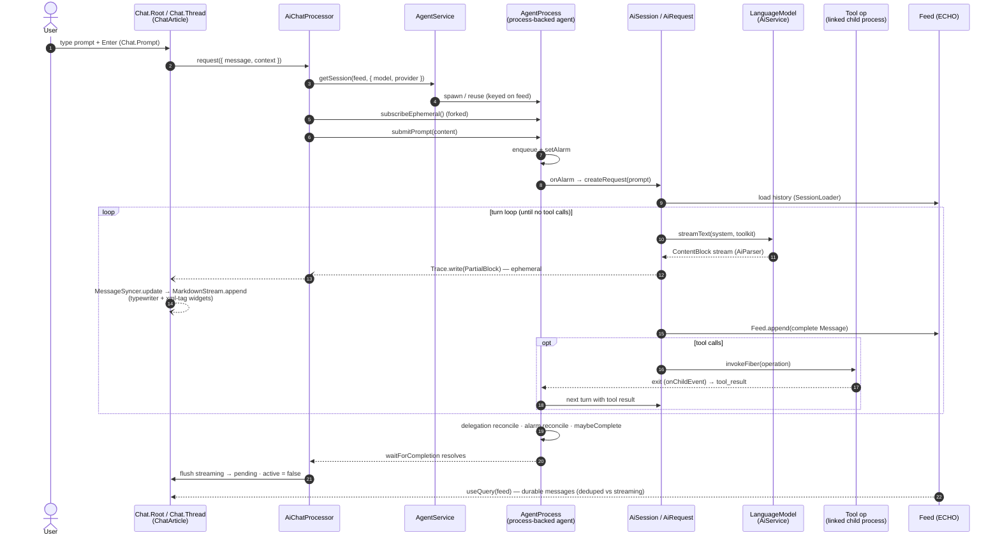

# plugin-assistant — architecture & testing design

Scope: the chat pipeline from a user prompt in `ChatArticle` through request construction
(`AiSession`), response streaming, document sync (`MarkdownStream`), and widget rendering
(xml-tags); an audit of the storybooks/tests at each level; and a plan for a deterministic
development and debugging workflow — including a headless harness for the delegation
(supervisor/sub-agent) scenario.

Related docs (not duplicated here):

- [`@dxos/ai` TESTING.md](../../core/compute/ai/TESTING.md) — the test-dimension taxonomy (A–H)
  and the memoization-retirement plan this document builds on.
- [`agent-service/README.md`](../../core/compute/agent-runtime/src/agent-service/README.md) —
  supervisor/delegation layering and lifecycle diagrams.
- [`ChatThread/DEBUG.md`](./src/components/ChatThread/DEBUG.md) — the AI→CodeMirror dataflow in
  detail.

## 1. Call stack: prompt → response → document → widgets

### 1.1 Layers

| #   | Layer               | Key symbols                                                           | Where                                                                                                                                               |
| --- | ------------------- | --------------------------------------------------------------------- | --------------------------------------------------------------------------------------------------------------------------------------------------- |
| 1   | Container / surface | `ChatArticle`, `useChatProcessor`, `useChatServices`                  | [`containers/ChatArticle`](./src/containers/ChatArticle/ChatArticle.tsx), [`hooks`](./src/hooks/useChatProcessor.ts)                                |
| 2   | Chat composite      | `Chat.Root/Toolbar/Thread/Prompt/Minimap/TaskList`, event bus         | [`components/Chat`](./src/components/Chat/Chat.tsx)                                                                                                 |
| 3   | Processor           | `AiChatProcessor` (atoms: `messages`, `streaming`, `active`, `error`) | [`processor`](./src/processor/processor.ts)                                                                                                         |
| 4   | Agent process       | `AgentService`, `AgentProcess` (input queue, alarms, delegation)      | [`@dxos/agent-runtime`](../../core/compute/agent-runtime/src/agent-service)                                                                         |
| 5   | Session / request   | `AiSession.Session`, `AiRequest.Request`, `AiContext.Binder`          | [`@dxos/assistant`](../../core/compute/assistant/src)                                                                                               |
| 6   | Model               | `AiService` → `LanguageModel.streamText` → `AiParser`                 | [`@dxos/ai`](../../core/compute/ai/src)                                                                                                             |
| 7   | Document sync       | `MessageSyncer`, `BlockRenderer` (`blockToMarkdown`)                  | [`components/ChatThread/sync.ts`](./src/components/ChatThread/sync.ts), [`registry.tsx`](./src/components/ChatThread/registry.tsx)                  |
| 8   | Editor / widgets    | `MarkdownStream`, `xmlTags`, `XmlWidgetRegistry`, widget classes      | [`@dxos/react-ui-markdown`](../../ui/react-ui-markdown/src/MarkdownStream), [`@dxos/ui-editor` xml](../../ui/ui-editor/src/extensions/language/xml) |

### 1.2 Sequence

One user turn, end to end. The left half is the durable/control path; the streaming path
(dashed) is ephemeral and exists only while the request is in flight.



### 1.3 Submit path (down)

1. **`ChatArticle`** resolves the space, the shared `ProcessManagerRuntime`
   (`useChatServices`), and builds an **`AiChatProcessor`** (`useChatProcessor`): it opens a
   client-side `AiSession.Session` over the chat's `Feed` (used only for context binding /
   system-prompt preview — the turn itself runs elsewhere, see 3) and a _space layer_
   (`ServiceResolver.provide(Database, Credentials, AiService, AgentService, Registry, OpaqueToolkitProvider)`)
   that every processor effect is provided with.

2. **`Chat.Prompt`** (CodeMirror editor) emits `{ type: 'submit', text }` on the `Chat.Root`
   event bus. `Chat.Root` awaits `onSubmit` (lets a transient chat persist its feed first),
   captures ephemeral context (`getContext` — e.g. companion-document selection), then calls
   `processor.request({ message, context })`.

3. **`AiChatProcessor.request`** → `AgentService.getSession(feed, { model, provider, instructions })`
   spawns (or reuses) a durable, process-backed **`AgentProcess`** keyed on the
   conversation feed; forks `session.subscribeEphemeral()`; `session.submitPrompt(...)` pushes
   the prompt onto the agent's persisted input queue; `session.waitForCompletion()` awaits the
   turn. In production the `AgentService` layer is contributed as an application-affinity
   `LayerSpec` ([`capabilities/agent-service.ts`](./src/capabilities/agent-service.ts)), wiring
   in the optional `DelegationStrategy` from `RoutineCapabilities.AgentDelegationStrategy`.

### 1.4 Agent turn (inside the agent process)

`AgentProcess.onAlarm` dequeues an event (`prompt` | `tool_result` | `alarm`) and runs one
**`AiSession.createRequest`**:

- `AiRequest.begin` — reify history from the feed (`SessionLoader`), summarize over the token
  threshold, append the user prompt.
- Turn loop — per iteration: `AiContext.sync()`, connect MCP servers, `createToolkit` from the
  bound skills, `formatSystemPrompt(system, skills, objects, instructions)`, then
  `runAgentTurn` → `LanguageModel.streamText` → `AiParser.parseResponse` → a stream of
  `ContentBlock`s:
  - `pending` blocks → `Trace.write(PartialBlock)` (**ephemeral** trace, not persisted);
  - complete blocks → a `Message` → `Trace.write(CompleteBlock)` + `onOutput` →
    **`Feed.append`** (durable).
- Tool calls → `runTools` → `callTool` → `ToolExecutionService` →
  `ProcessOperationInvoker.invokeFiber(operation)` — each tool call is a **linked child
  process**; its exit re-enters the turn via `onChildEvent` → `tool_result` queue entry.
- After the turn: the delegation strategy's `reconcile` (see §4), alarm reconcile,
  `maybeComplete` (end-request skill hooks may enqueue continuations).

### 1.5 Streaming path (up)

1. Ephemeral `PartialBlock` events cross the process boundary via
   `session.subscribeEphemeral(): Stream<Trace.Message>`.
2. `AiChatProcessor.#handleEphemeralMessage` upserts them into the `#streaming` atom; complete
   blocks move to `#pending`, deduped by message id against feed replication (the same message
   arrives via both channels).
3. `Chat.Root` merges the durable feed query (`useQuery(...Filter.type(Message)...from(feed))`)
   with `processor.messages` into one flat, deduped `Message[]`.
4. **`MessageSyncer.update(messages)`** walks the flat block list past its `_completed` cursor,
   invokes the **`BlockRenderer`** per block, and appends only the delta. Contract: a streaming
   block's rendered output must be a monotonic string extension of its previous render; blocks
   before the cursor are never re-rendered (preserves single-shot side effects). The syncer also
   maintains per-message document ranges (minimap markers, prompt navigation).
5. The renderer ([`registry.tsx`](./src/components/ChatThread/registry.tsx)) maps blocks to
   markdown-with-XML: user text → `<prompt>`, reasoning/status/summary → streaming XML tags,
   `toolCall` → self-closing `<toolCall id/>` plus a **side-channel**
   (`applyToolBlockToWidgetState` → `XmlWidgetStateManager.updateWidget`) that streams tool
   input/result into widget state; view filtering by `ChatView`
   (`summary`/`normal`/`thinking`/`debug`).
6. **`MarkdownStream`** (CodeMirror) applies the typewriter drip on `append` (bypassed for
   `setContent` on mount/thread-switch), parses registered tags as HTML blocks
   (`xmlBlockParsers`), and renders them through the `XmlWidgetRegistry`: DOM widget factories
   (`ReasoningWidget`, `StatusWidget`, …) or portaled React components (`ToolWidget`,
   `SurfaceWidget`, `SummaryWidget`). On a full reset, `rehydrateToolWidgetsFromMessages`
   replays tool blocks into widget state.

## 2. Audit: storybooks and tests by level

Legend: **det** = deterministic/offline; **memo** = memoized `*.conversations.json` (replay in
CI only when generated; most gated by `runMemoizedTests()`, off by default); **live** = real
AI service (manual only).

### 2.1 Editor / widgets (level 7–8)

- `ui-editor` `xml-tags.test.ts`, `extended-markdown.test.ts`, `xml-util.test.ts` — det unit
  tests of the tag parser/decoration layer.
- `react-ui-markdown` `stream.test.ts` + `MarkdownStream.stories.tsx` — det; typewriter/wire.
- plugin `MarkdownStream.stories.tsx` — det; drives the real `componentRegistry` from markdown
  fixtures (`testing/*.md`) through a simulated `textStream`, including tool-widget state.
- Widget stories (`ReasoningWidget`, `ToolWidget`, `Anchor`) — det.

**Verdict: strong.** This level is fully testable offline and is well covered.

### 2.2 Document sync (level 7)

- `sync.test.ts`, `tool-widget-state.test.ts` — det unit tests of `MessageSyncer` incl. the
  monotonic-append contract and widget rehydration.
- `ChatThread.stories.tsx` — det; a scripted **message generator**
  ([`testing/test-generator.ts`](./src/testing/test-generator.ts)) appends `Message`s to a real
  feed, including a remount harness for the reset/rehydrate path.

**Verdict: strong.** The `BlockRenderer` contract is the load-bearing invariant and has both
unit and story coverage.

### 2.3 Processor (level 3)

- `processor.node.test.ts` — constructs a processor and unit-tests `parseError`; the
  **streaming state machine (`#handleEphemeralMessage` dedupe/finalize/flush) has no direct
  test** and is only exercised via live stories.
- `Chat.stories.tsx` — det, but covers only the failure toast.

**Verdict: gap.** The ephemeral/durable dedupe race is subtle and untested headlessly.

### 2.4 Session / request / agent process (levels 4–6)

- `scripted-loop.test.ts` (agent-runtime) + `AiRequest.test.ts` — det; the **scripted model**
  (`ScriptedLanguageModel`) drives the real turn loop (dimension D). Clean-stop and
  tool-call→result→continue branches covered; tool-error/malformed-output deferred.
- `AiSession.test.ts`, `AiContext.test.ts`, `SessionLoader.test.ts`, `format.test.ts`,
  `tool-runtime/services.test.ts` — det unit tests.
- `AgentService.test.ts`, `agent-process.test.ts`, `session.test.ts`, `request.test.ts`,
  `xml-response.test.ts`, `functions.test.ts` — **memo**, gated off in PR CI; includes the
  delegation **stub-strategy** lifecycle test (reconcile → spawn → child exit → onComplete).
  Control-plane (alarms/enqueue) tests are det.
- Skill/operation unit tests (assistant-toolkit) — det (`delegate-task.test.ts`,
  `plan-reminder`, `run-instructions` — the latter two already scripted-model based).

**Verdict: good foundations, uneven.** The scripted tier exists but most conversation-level
coverage still rides the deprecated memoized path (62 KB–5 MB fixtures, `skipIf`-gated, some
skipped with stale fixtures — e.g. `skills/assistant/skill.node.test.ts`).

### 2.5 Full stack (levels 1–8)

- `ChatArticle.stories.tsx` — full plugin stack against **live** remote AI
  (`SERVICES_CONFIG.REMOTE`); the `WithProjectCommands` play test is det (completion popover
  only, no AI call).
- `stories-assistant` — the integration surface: modules (Chat, Context, Graph, Research,
  Tasks) composed over real plugins + **live** EDGE AI; `WithSubAgentsTest` is the only
  end-to-end delegation exercise and is `tags: ['!test']` (manual, 180 s timeout).
- `assistant-evals` — evalite-scored A/B/H evals, live model, out of band.

**Verdict: the development loop lives here — and it is the slowest, least deterministic
level.** There is no offline full-stack story: every UI-level iteration on chat behavior costs
a live model round-trip.

## 3. Improving the development & debugging experience

The theme of §2: every deterministic layer already has a fast harness; the pain is that the
_composition_ is only exercisable live. The fix is to make the scripted model reach the UI, not
to add more live tests.

1. **Scripted AI in storybook (highest leverage).** `ScriptedLanguageModel.scriptedAiService`
   is a plain `AiService` layer; `Assistant.Settings` already exposes an `aiServiceMiddleware`
   seam ([`types/index.ts`](./src/types/index.ts)). Add a `config.scripted(turns)` option to
   the `stories-assistant` decorators (next to `config.remote`) that injects the scripted
   service into the plugin stack. Then each scenario gets two variants:
   - `Foo` — live, `tags: ['!test']`, for model-behavior work;
   - `FooScripted` — same story + a play script, deterministic, runs in `test-storybook` CI.
     This turns the storybook from "manual demo against the network" into a regression suite for
     everything except comprehension/tool-selection (which belong to the evals tier anyway).
2. **Headless-first iteration at the `AgentService` seam.** The processor's entry point
   (`getSession` → `submitPrompt` → `subscribeEphemeral`/`waitForCompletion`) is exactly what
   `AssistantTestLayer` provides in node. For pipeline work (streaming, tool loop, delegation),
   prefer a vitest + scripted-model test at this seam and open storybook only for the visual
   layers. §4 supplies the missing harness pieces.
3. **Processor streaming harness.** Add a det unit test (and optionally a story) that feeds a
   scripted sequence of `PartialBlock`/`CompleteBlock` trace messages through a real
   `AiChatProcessor` (stub `AgentService.Session` whose `subscribeEphemeral` replays a fixture)
   and asserts the atom transitions — closing the §2.3 gap and giving a place to reproduce
   streaming/dedupe bugs without any backend.
4. **Record/replay fixtures from live sessions.** `stories-assistant/testing/snapshot.ts` and
   the `tracing: 'feed'` sink already capture durable state; add a "dump conversation" debug
   action (the `Chat` debug event exists) that exports feed messages + trace events as a
   fixture consumable by the `ChatThread` story generator and the processor harness. A bug seen
   live once becomes a deterministic repro.
5. **Continue the TESTING.md migration.** Convert the remaining memoized agent-runtime/G3
   fixtures to scripted-model tests and delete the fixtures; un-skip or delete stale memoized
   skill tests. Every conversion shrinks the "cumbersome" surface this document is about.

## 4. Delegation scenario: headless harness + storybook play

Target scenario: the assistant replies immediately, records delegated work via the
`DelegationSkill`'s `DelegateTask` tool, the supervisor (`AgentProcess` +
`makeDelegationStrategy`) spawns a sub-agent (`RunInstructions` child process) after the turn,
and on child exit folds the result back: plan task → `done`, notification message (with
artifact references) appended to the conversation feed.

### 4.1 What exists

| Piece                                        | Status                                                                                                                                                                                     |
| -------------------------------------------- | ------------------------------------------------------------------------------------------------------------------------------------------------------------------------------------------ |
| `AssistantTestLayer` (agent-runtime/testing) | Full stack in node: `AgentService` + `ProcessManager` + `ServiceResolver` + ECHO test DB; accepts `agent.delegationStrategy`, `aiService`, `operationHandlers`, `skills`, `extraServices`. |
| `ScriptedLanguageModel`                      | Deterministic model; sequential turn script; drives real tool execution.                                                                                                                   |
| `DelegateTask` op unit test                  | det (`delegate-task.test.ts`).                                                                                                                                                             |
| Delegation lifecycle test                    | Stub strategy only, **memo-gated** (`AgentService.test.ts`).                                                                                                                               |
| `makeDelegationStrategy`                     | **No direct test.**                                                                                                                                                                        |
| End-to-end                                   | Live-only storybook play (`WithSubAgentsTest`, `!test`).                                                                                                                                   |

So: the harness is **almost sufficient** — all the layers compose in node today, and
`run-instructions.test.ts` already drives the sub-agent side (`RunInstructions` +
`completeJob`) with a scripted model. What is missing is the ability to script **two
cooperating sessions** (supervisor and sub-agent) deterministically, plus a few assertion
helpers.

### 4.2 Gaps and design

**(a) Script routing.** `scriptedAiService` has one global cursor; the supervisor turn and the
sub-agent turn both call the same model, and while the happy path is sequential (the sub-agent
spawns only after the supervisor turn settles), interleaving becomes ambiguous with multiple
delegations or follow-up prompts. Extend `ScriptedLanguageModel` with routed scripts:

```ts
scriptedAiService([
  { match: promptIncludes('You delegate units of work'), turns: supervisorTurns },
  { match: promptIncludes('Complete the following task'), turns: subAgentTurns },
]);
```

`match` is a predicate over the encoded request (system prompt + messages); each route keeps
its own cursor; an unmatched call fails loudly (same philosophy as script exhaustion). This is
a small, backwards-compatible addition to
[`ScriptedLanguageModel.ts`](../../core/compute/ai/src/testing/ScriptedLanguageModel.ts)
(the existing single-list form stays as the single-route case).

**(b) Idle/completion semantics.** `waitForCompletion` resolves only when the agent has no
pending work — including live delegations — so for mid-flight assertions the test needs the
stub-test's `expect.poll` pattern. Provide a `TestAgent` helper in `agent-runtime/testing`:
`collectEphemeral(session)` (fork + buffer `PartialBlock`s for streaming assertions — the
headless equivalent of what the UI renders) and `waitForIdle(session)`.

**(c) Assertion helpers.** Reuse/extend `@dxos/assistant-evals` assertions (`findObject`,
`toolInvocations`) for: plan task state (`delegated`, `status`), feed messages (the immediate
reply, then the fold-back "sub-agent completed" message + `reference` blocks), and spawned
process keys (via the `feed` trace sink).

### 4.3 The headless test (shape)

`packages/core/compute/assistant-toolkit/src/supervisor/delegation-strategy.test.ts` (D-tier,
det, PR-gating — the real strategy, not the stub):

```ts
const TestLayer = AssistantTestLayer({
  agent: { delegationStrategy: makeDelegationStrategy() },
  aiService: scriptedAiService([
    { match: supervisor, turns: [
      { parts: [text('On it — delegating.'), toolCall('delegate-task', { title: 'Compute 10!' })] },
      { parts: [text('Delegated; I will report back.')] },       // after tool result
    ]},
    { match: subAgent, turns: [
      { parts: [toolCall('completeJob', { success: '3628800' })] },
      { parts: [text('Done.')] },
    ]},
  ]),
  operationHandlers: [DelegationHandlers, PlanningHandlers, RunInstructionsHandlers],
  skills: [DelegationSkill.make(), PlanningSkill.make()],
  types: [Agent.Agent, Chat.Chat, Plan.Plan, /* … */],
});

it.scoped('delegates, runs the sub-agent, folds the result back', ... => {
  const agent = yield* Agent.makeInitialized({ name: 'Supervisor', ... }, DelegationSkill.make());
  const session = yield* AgentService.getSession(feed);
  const ephemeral = yield* collectEphemeral(session);

  yield* session.submitPrompt('Delegate a task to compute 10 factorial.');
  yield* session.waitForCompletion();          // resolves after the child exits + fold-back

  // Immediate reply streamed before the sub-agent ran.
  expect(firstAssistantText(ephemeral)).toContain('On it');
  // Plan task lifecycle.
  expect(task(plan, 'Compute 10!')).toMatchObject({ delegated: true, status: 'done' });
  // Fold-back message on the conversation feed.
  expect(feedText(feed)).toContain('The sub-agent completed');
});
```

Everything except the routed script and the two helpers exists today; the test exercises the
real `DelegateTask` handler, the real `AgentProcess` reconcile/child-event loop, the real
`makeDelegationStrategy` (instructions synthesis, skill inheritance minus `DelegationSkill`,
artifact refs), and the real `RunInstructions` sub-agent — with zero model calls.

### 4.4 The storybook analog

Keep `WithSubAgentsTest` (live) as the model-behavior check, and add `WithSubAgentsScripted`:
the same `WithSubAgents` story wired to `config.scripted(...)` (§3.1) with the **same routed
turn script** as the headless test, and a play function that types the prompt, asserts the
immediate reply and the task-list chip render mid-flight, then waits for the "sub-agent
completed" message and the reference widget. Because the script is shared, the storybook
demonstrates end-to-end what the headless test asserts — deterministically, in CI — and the
live variant remains the only place a real model is consulted.

### 4.5 Sequencing

1. Routed scripts in `ScriptedLanguageModel` (+ unit test).
2. `collectEphemeral` / `waitForIdle` helpers in `agent-runtime/testing`.
3. `delegation-strategy.test.ts` headless test (4.3); un-gate the stub lifecycle test by
   porting it to the scripted model at the same time.
4. `config.scripted` decorator support in `stories-assistant`; `WithSubAgentsScripted` play
   story (4.4).
5. Processor streaming harness (§3.3) — reuses the same fixtures.
