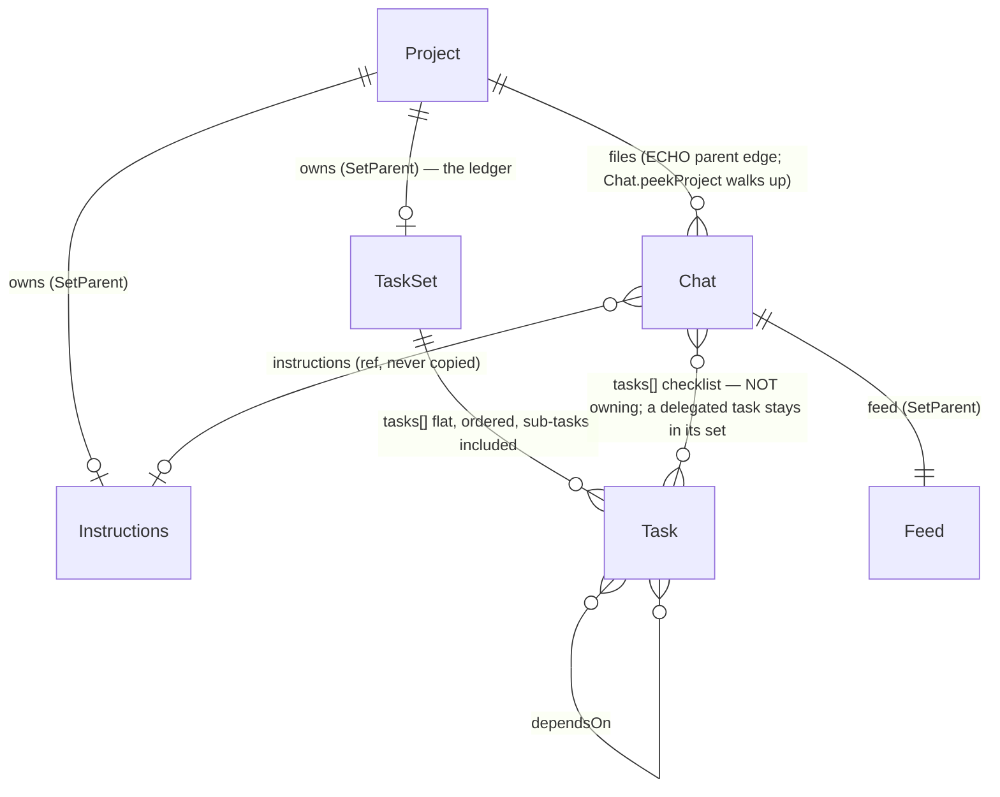
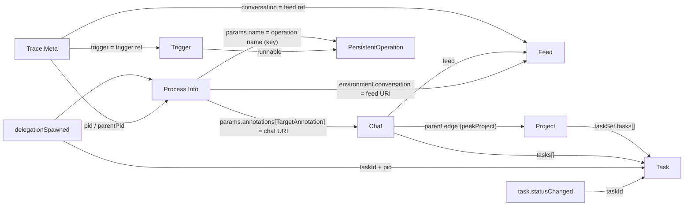
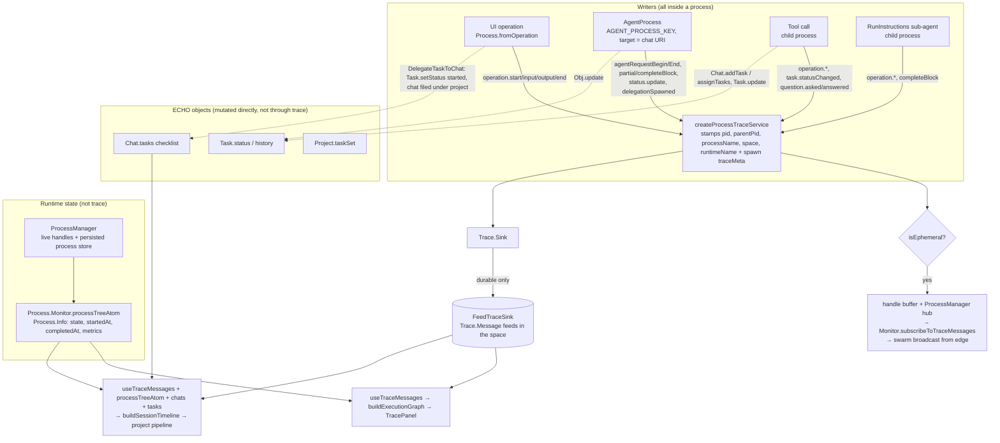
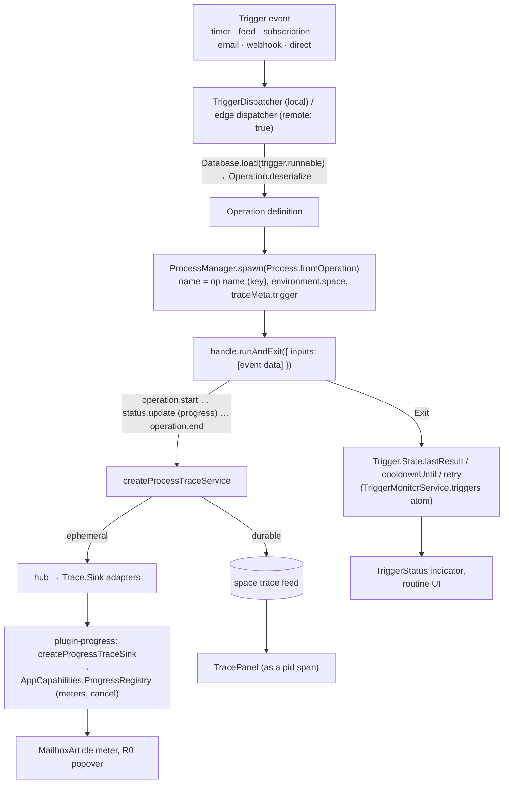
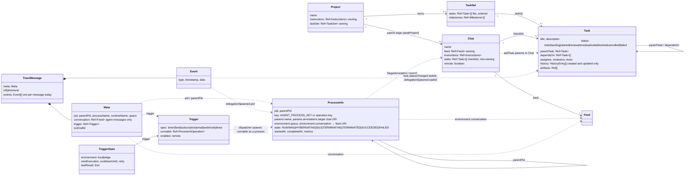
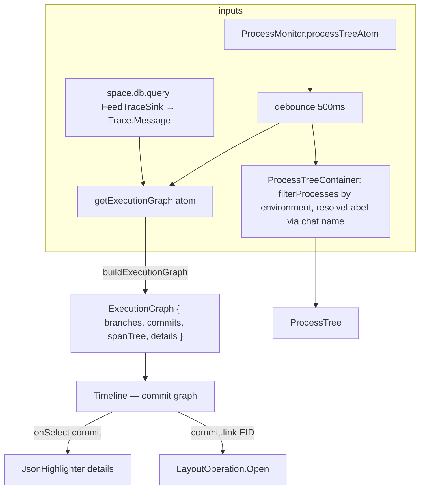
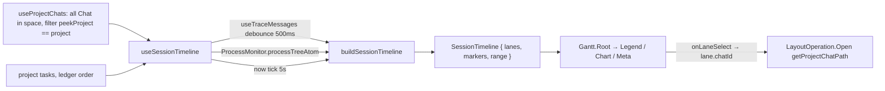
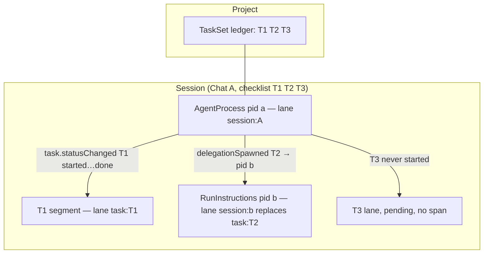
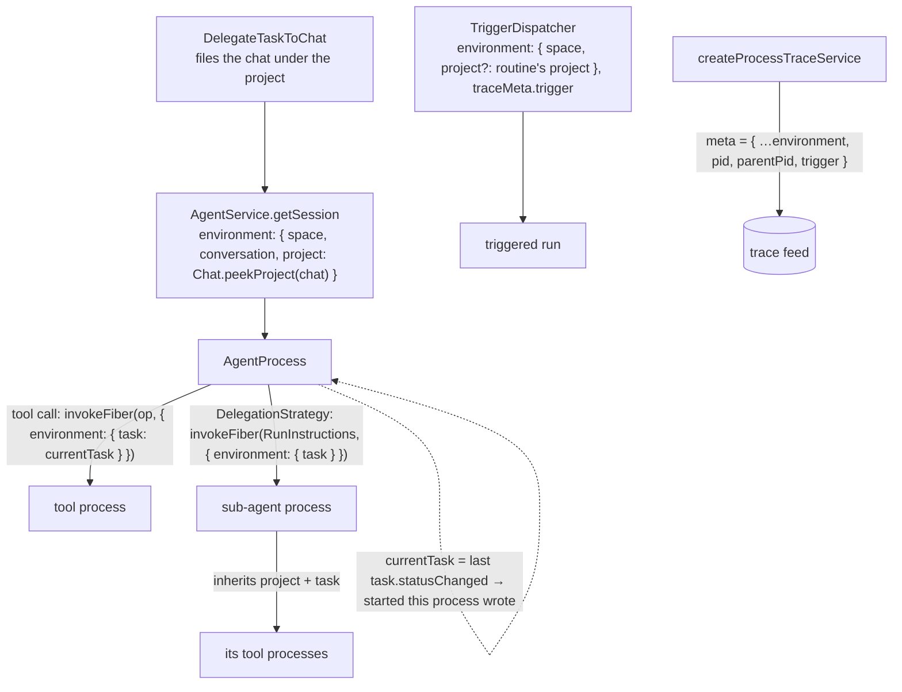

# Runtime activity — data model and unified dashboard design

How the work the process runtime does is recorded — agent sessions and the tasks they work, and
the long-running operations that triggers start (a mailbox sync, a scheduled routine) — how the two
existing views read it (`TracePanel`, the project pipeline chart), and the design of a single
space-wide activity chart surfaced as a devtools page in the debug panel.

The scope is every process the platform runs in a space, not only AI sessions: the same runtime
spawns an agent turn, a tool call, a delegated sub-agent, a UI-invoked operation and a triggered
routine, and the dashboard shows them on one axis.

Source of truth is the code cited as `path`; line numbers are omitted because the files move.
Status: **design** — sections 1–7 describe what exists and what is missing; sections 8–10 are the proposal.

## 1. The six records of runtime activity

Runtime activity is written to six places. None of them is "the" activity log; each records one
aspect, and every view joins two or more.

| Record                              | Where it lives                                                                                            | Lifetime                          | Records                                                                                                                                                                                                                                                |
| ----------------------------------- | --------------------------------------------------------------------------------------------------------- | --------------------------------- | ------------------------------------------------------------------------------------------------------------------------------------------------------------------------------------------------------------------------------------------------------ |
| `Process.Info`                      | In-memory process tree, read through `Capabilities.ProcessMonitor` (`processTreeAtom`)                    | While the runtime is up           | What is running _now_: pid tree, state, `startedAt`/`completedAt`, wall time, input/output counts.                                                                                                                                                     |
| `Trace.Message`                     | ECHO feed(s) in the space (`FeedTraceSink`), queried by `useTraceMessages`                                | Durable                           | What happened: batched `Trace.Event`s with a `Meta` naming the pid, parent pid, conversation, trigger.                                                                                                                                                 |
| `Chat.Chat`                         | ECHO object, `@dxos/assistant/Chat`                                                                       | Durable                           | A **session**: its message `feed`, its `tasks` checklist, its `instructions`; parented under a project.                                                                                                                                                |
| `Task.Task` (in a set)              | ECHO objects, `@dxos/types` `Task`/`TaskSet`; the project's `taskSet` is the ledger                       | Durable                           | The unit of work: `status`, `dependsOn`, `parentTask`, `assignee`, `history` (created/updated only).                                                                                                                                                   |
| `Project.Project`                   | ECHO object, `@dxos/compute/Project`                                                                      | Durable                           | The container: owns `instructions`, `taskSet`; chats are filed under it by the ECHO parent edge.                                                                                                                                                       |
| `Trigger.Trigger` + `Trigger.State` | ECHO object, `@dxos/compute/Trigger`; runtime state via `Trigger.TriggerMonitorService` (`triggers` atom) | Durable / while the runtime is up | What starts non-conversational work: `spec` (timer, feed, subscription, email, webhook, direct), `runnable` → operation, `enabled`, `remote`. `State` adds `nextExecution`, `cooldownUntil`, `retry`, `lastResult` — the current run only, no history. |

### 1.1 `Process` — `packages/core/compute/compute/src/Process.ts`

```ts
interface Info {
  pid: ID; // brand 'ProcessId'
  parentPid: ID | null; // the process tree
  key: string; // e.g. AGENT_PROCESS_KEY; several live processes may share a key
  params: Params; // name, annotations (TargetAnnotation → URI of the object served)
  environment: Environment; // { space?: SpaceId; conversation?: URI }  — inherited by children
  state: State; // RUNNING | HYBERNATING | IDLE | TERMINATING | TERMINATED | SUCCEEDED | FAILED
  error: SerializedError | null;
  startedAt: number;
  completedAt: Option<number>;
  metrics: { wallTime; inputCount; outputCount };
}
```

- `TargetAnnotation` (`org.dxos.process.target`) on an agent process is the **chat's URI** — the
  join from a process to its session. `environment.conversation` is the **feed's URI** — the same
  join, one hop further along.
- `State` is a flat enum; "active" for every view is `RUNNING | HYBERNATING` (a suspended
  process is `IDLE`; a finished one `SUCCEEDED | FAILED | TERMINATED`).
- `Monitor` (`processTreeAtom`, `list(filter)`, `subscribeToTraceMessages(filter)`) aggregates
  local and remote runtimes. `MonitorFilter` narrows by `key`, `target`, `state`, `space`,
  `parentPid` — so "every process in this space" is one call.
- A process disappears from the tree once terminal and reaped; the trace feed is the only durable
  memory of it.

### 1.2 `Trace` — `packages/core/compute/compute/src/Trace.ts`

```ts
Message = { meta: Meta; isEphemeral: boolean; events: Event[] }   // ECHO type org.dxos.type.traceMessage
Meta    = { pid?, parentPid?, processName?, space?, conversation?: Ref, trigger?: Ref, toolCallId?, runtimeName? }
Event   = { type: string; timestamp: number; data: unknown }
FlatEvent = Event & { meta: Meta; isEphemeral }                    // Trace.flatten(message)
```

`Meta` is per message, not per event; every event of a message shares the pid. `conversation` is
stamped on an agent process's messages, `trigger` on a triggered process's; neither is inherited by
children (§2.2). Events that the views consume:

| Event type                                                 | Defined in   | Persisted | Meaning / payload                                                              |
| ---------------------------------------------------------- | ------------ | --------- | ------------------------------------------------------------------------------ |
| `process.spawned` / `.exited`                              | `Process.ts` | yes       | Process lifecycle — **defined but never written** by any runtime (§4).         |
| `operation.start` / `.end`                                 | `Trace.ts`   | yes       | Span begin/end: `{ key, name, icon }` / `+ outcome, error, errorCode`.         |
| `operation.input` / `.output`                              | `Trace.ts`   | no        | Raw payloads for live subscribers (undo, devtools).                            |
| `status.update`                                            | `Trace.ts`   | no        | Human-readable progress `{ message, progress{key,current,total,phase…} }`.     |
| `task.statusChanged`                                       | `Trace.ts`   | yes       | `{ taskId, title, status, previousStatus }` — the only pid ↔ task attribution. |
| `question.asked` / `.answered`                             | `Trace.ts`   | yes       | The stretch a task was blocked on a person.                                    |
| `assistant.agentRequestBegin/End`                          | `Trace.ts`   | yes       | One agent turn; `End` carries `status` of success, error or interrupted.       |
| `assistant.completeBlock`                                  | `Trace.ts`   | yes       | A content block; the `stats` block carries token usage and tool-call counts.   |
| `assistant.delegationSpawned`                              | `Trace.ts`   | yes       | `{ taskId, pid }` — the only durable pairing of a sub-agent pid with its task. |
| `assistant.partialBlock`, `mcpServerError`, request stages | `Trace.ts`   | no        | Streaming/progress detail.                                                     |

Two derived structures sit on top of the flat events:

- **Span tree** — `execution-graph/span-tree.ts`. Begin/end pairs (`operation.*`,
  `agentRequest*`) become `Span { id, meta: SpanMeta, events, children }` keyed by pid, nested by
  `parentPid`. Orphans attach to the root; open spans older than `spanTimeoutMs` (20 min) are
  force-closed when `now` is supplied. Specified in `execution-graph/SPEC.md`.
- **Execution graph** — `execution-graph/execution-graph.ts`. The span tree as a commit graph
  (`branches`, `commits`, `details`) for the `Timeline` component. Only `pid`/`parentPid` shape
  the topology.

### 1.3 `Chat` (session), `Task`, `TaskSet`, `Project`



- **A session is a `Chat`.** There is no separate session object: the chat's feed is the
  conversation, and its `tasks` array is what the agent is working on. A project's chats are found
  by the parent walk (`useProjectChats` filters every chat in the space by `Chat.peekProject`).
- **A task carries no timestamps and no pid.** `history` records `created`/`updated` dates only;
  when a task started and finished is known only from `task.statusChanged` trace events, and which
  sub-agent worked it only from `assistant.delegationSpawned`. This is the reason every time-based
  view is built from the trace and not from the objects.
- Delegation (`ProjectOperation.DelegateTaskToChat`, documented in
  `plugin-projects/docs/FLOW.md`) creates the chat, pushes the tasks, marks them `started`, files
  the chat under the project and submits the opening prompt. The supervisor
  `DelegationStrategy` then spawns one child process per ready task.

### 1.4 The join keys

Every view is a join over these keys, and each key is only available in some records:



Notes on the joins:

- Feed and chat ids are compared by **entity id** (`EID.getEntityId`) because processes carry
  URIs and chats carry refs — `session-timeline.ts` `entityKey` and `TracePanel.tsx` `feedKey` do
  the same normalisation.
- A process → chat join needs a live `Process.Info`; once the process is reaped, only the trace's
  `conversation` meta remains. The timeline therefore collects a session's pids from **both**
  (agent processes targeting the chat, plus `agentRequestBegin` events whose feed matches).
- A sub-agent's trace carries neither the task nor the conversation, so a child span reaches its
  session only through `parentPid` and its task only through the parent's `delegationSpawned`.
- Nothing links a trace event to a **project** directly; the project is reached via chat.
- A triggered process is joined to its trigger only through `meta.trigger`; the `Process.Info`
  carries the operation's name and the space but no trigger annotation, so a live triggered process
  with no trace yet reads as an anonymous operation.

## 2. What is collected, and how it flows today

### 2.1 The assumptions, checked against the code

| Assumption                                                                                             | Holds? | Where it is decided                                                                                                                                                                                                                                                                                                                                                                                                         |
| ------------------------------------------------------------------------------------------------------ | ------ | --------------------------------------------------------------------------------------------------------------------------------------------------------------------------------------------------------------------------------------------------------------------------------------------------------------------------------------------------------------------------------------------------------------------------- |
| Every agentic operation runs in a process managed by a platform process manager (local or edge).       | yes    | The app's `Capabilities.OperationInvoker` _is_ `ProcessOperationInvoker` (`app-framework/…/process-manager-capability.ts`), so a UI-invoked operation is a top-level process; `AgentService.getSession` spawns the agent as a process targeting the chat; tools and delegations are child processes (`invokeFiber` with `parentProcessId`). Edge runs its own manager; `Process.Monitor` aggregates both.                   |
| A chat session (`Chat`) is long-lived and has an attached feed.                                        | yes    | `Chat.feed` is owning (`SetParent`). The chat outlives every process that serves it: each prompt after the agent has completed spawns a **new** agent process against the same chat, so one session accumulates several pids over its life.                                                                                                                                                                                 |
| Some sessions have a directly connected `TaskSet`; others reach `TaskSet`s of other objects via tools. | partly | A chat never holds a `TaskSet`. It holds a **checklist** — `Chat.tasks: Ref<Task>[]`, non-owning. Tasks the chat creates (`Chat.addTask`) are parented to the chat; tasks delegated from a project stay parented in the project's `TaskSet` and are only _referenced_. The planning tools (`update_tasks`, `ask_question`) operate on `Harness.getChat().tasks`, so "the tasks a session can see" is exactly its checklist. |
| Triggered long-running operations (sync, scheduled routines) go through the same runtime.              | yes    | `TriggerDispatcher.invokeTrigger` spawns `Process.fromOperation(runnable)` through `ProcessManager.spawn` with `traceMeta.trigger`; an edge trigger runs the same way on the edge's manager (`EdgeTriggerManager`). Their `operation.start/end` and `status.update` events land in the same feed and hub as an agent's (§2.4).                                                                                              |
| Every trace event is associated with a process.                                                        | yes    | `createProcessTraceService` (`compute-runtime/src/process-trace.ts`) is the only `TraceService`; it stamps `pid`, `parentPid`, `processName`, `runtimeName`, `space` on every message. `Meta.pid` is typed optional only because `Trace` cannot depend on `Process`.                                                                                                                                                        |

### 2.2 Collection



Reading the diagram:

- **One event per message.** `createProcessTraceService` wraps every `Trace.write` in its own
  `Message` (the batching `TODO` is still open), so `Meta` is effectively per event.
- **Two paths out.** Ephemeral events go to the in-memory hub only — the process handle's buffer,
  `Monitor.subscribeToTraceMessages`, and (from edge) the swarm broadcast. Durable events go to
  the sink, which the app binds to `FeedTraceSink`: an ECHO feed in the space. A space may hold
  several trace feeds (writers race on creation), and every reader queries all of them.
- **Trace meta is stamped at spawn, not inherited.** `SpawnOptions.traceMeta` (the agent's
  `conversation` ref) is copied onto the agent's own messages only; a child inherits the parent's
  `environment` (`space`, `conversation` URI) but `createProcessTraceService` never reads
  `environment.conversation`, so a tool's or sub-agent's messages carry `space` and `parentPid`
  and nothing else that names the session.
- **Task state is written directly.** Every path that moves a task writes the ECHO object;
  only some of them also write `task.statusChanged` (see §4).

### 2.3 Inference: process → session, session → tasks

**a) Which session a process belongs to.** Three signals, in order of reliability:

1. **Live agent process**: `params.annotations[TargetAnnotation]` is the chat's URI (set by
   `AgentService.getSession`). Exact, but only while the `Process.Info` exists.
2. **Live process of any kind**: `environment.conversation` is the feed's URI, inherited by every
   descendant of the agent — so a tool or sub-agent process resolves to its session through the
   feed (`Chat.loadForFeed`, or the feed's parent edge). Also live-only.
3. **Trace only** (what survives a restart): `meta.conversation` on the agent's own messages,
   matched to `chat.feed` by entity id; then `parentPid` chains from children to the agent pid.
   This is what `buildSessionTimeline` does (`agentPidsByChat` ∪ `agentRequestBegin` feeds, then
   `laneByPid` lookups by `pid` or `parentPid`). It fails when the parent's messages are outside
   the window or were never written — a sub-agent's trace alone names no session.

A process that is none of these — a UI-invoked operation, a trigger-run function — has no
session, and today no view draws it except the `TracePanel`'s process tree.

**b) Which tasks a session is working.** Two layers:

1. **Membership** is durable and object-side: `chat.tasks` (`Chat.loadTasks`). A project's ledger
   is reachable from there through each task's parent (`TaskSet`) and the chat's own parent walk
   (`Chat.peekProject`), but the session only ever "works" what is on its checklist.
2. **Attribution in time** is trace-side and partial:
   - `task.statusChanged` (from the planning tools, `ask_question`, and the UI's `UpdateTask`
     operation) gives the moments a task entered/left `started` — `buildTaskSegments` cuts the
     session into per-task stretches from these.
   - `assistant.delegationSpawned { taskId, pid }` pairs a sub-agent process with its task; the
     child's own span then gives that task its start and end.
   - Nothing else names a task. A task moved by the supervisor (`reconcile`, `onComplete`, the
     orphan sweep) or by `DelegateTaskToChat` is changed on the object without a trace event.

**c) When a process exits.** `Process.State` reaches a terminal value on one of:

| Process                                    | Ends when                                                                                                                                                                                                                                                                                                                                                             | Terminal state         |
| ------------------------------------------ | --------------------------------------------------------------------------------------------------------------------------------------------------------------------------------------------------------------------------------------------------------------------------------------------------------------------------------------------------------------------- | ---------------------- |
| Operation (`Process.fromOperation`)        | Its single input's handler returns (output emitted) or fails.                                                                                                                                                                                                                                                                                                         | `SUCCEEDED` / `FAILED` |
| Tool call, `RunInstructions` sub-agent     | Same — they are operation processes with `parentProcessId` set; the parent's `onChildEvent(exited)` fires via `onFinished`.                                                                                                                                                                                                                                           | `SUCCEEDED` / `FAILED` |
| Agent (`agent-process.ts` `maybeComplete`) | After a turn, when the feed queue has drained **and** nothing is pending — no tool results, no alarms, no running delegations — and the end-of-request hooks enqueued nothing. Until then it stays resident: `IDLE` waiting for input, or `HYBERNATING` with an alarm / linked children. A fresh spawn that has not yet run a turn never completes on an empty queue. | `SUCCEEDED`            |
| Any                                        | `handle.terminate()` (the `TracePanel`'s terminate button, `ProcessManager` cascading to children).                                                                                                                                                                                                                                                                   | `TERMINATED`           |
| Any                                        | App shutdown: `ProcessManager.shutdown()` suspends every live process (`IDLE`, record persisted); it is rehydrated on the next `getSession` or `list`, never completed.                                                                                                                                                                                               | none — resumes         |

A terminal handle stays in `#handles` (and therefore in `processTreeAtom`) until the runtime
restarts; the persisted store drops terminal records on hydrate and skips them in `list`. So after
a restart the only memory of a finished process is its trace — and the trace has no exit record
(§4).

### 2.4 Triggered work

A trigger is the non-conversational entry point into the same runtime: instead of a prompt on a
feed, an event (a cron tick, a feed append, a subscription change, an email, a webhook, or a direct
call) selects a `Trigger` whose `runnable` is a persisted operation, and the dispatcher runs that
operation as a process.



What is and is not recorded for a triggered run:

- **Start, end, outcome** — durable, as the operation's own `operation.start` / `operation.end`
  (`outcome`, `error`, `errorCode`) with `meta.trigger` naming the trigger and `meta.runtimeName`
  saying where it ran. A run is therefore one span in the span tree, and a trigger's history over a
  window is the set of spans whose `meta.trigger` resolves to it.
- **Progress** — ephemeral only. `mail-sync.ts` and the mailbox analysis operations write
  `status.update { message, progress { key, current, total, estimate, phase } }` through the
  `TraceService`; `plugin-progress` projects those into the `ProgressRegistry` for the live meter
  and its cancel button (which terminates the local process, or cancels the edge run by trigger
  id). Nothing of the progress survives the run.
- **Schedule and retry state** — runtime-only, on `Trigger.State`: the next execution, the cooldown,
  a pending retry and the **last** result. There is no durable run log on the trigger object.
- **Sub-steps** — only if the operation writes them. A sync that calls other operations through the
  invoker gets child spans; one that loops in-process is a single span with progress.

## 3. Type map



Solid arrows are stored references; dotted arrows are joins a reader has to perform.

## 4. What is missing

Ordered by how much each costs the unified view.

1. **Process lifecycle is never traced.** `Process.SpawnedEvent` (`process.spawned`) and
   `Process.ExitedEvent` (`process.exited`) are defined in `Process.ts` and read by a test
   pretty-printer, but no runtime writes them. After a restart nothing durable says when a process
   ended or how (`succeeded | failed | terminated`); the timeline infers an end from
   `agentRequestEnd` / `operation.end` and falls back to the live tree, and a run whose process
   died between events reads as `running` forever once the tree has forgotten it. Fix:
   `ProcessHandle` writes `SpawnedEvent` in `spawn` and `ExitedEvent` in `#handlerCompleted` /
   terminate — two writes, and every open-lane heuristic in `buildSessionTimeline` can go.
2. **Supervisor-side task moves are not traced.** `task.statusChanged` is written by the planning
   tools, `ask_question`, and `UpdateTask`, but not by `DelegateTaskToChat` (`→ started`),
   `DelegationStrategy.reconcile` (`→ started` at spawn), `onComplete` (`→ done | failed`) or
   `sweepOrphanedTasks` (`→ failed`). These use `Obj.update` directly, so they also skip
   `Task.update`'s history entry. The chart covers the sub-agent case through `delegationSpawned`
   plus the child's span, but a delegated task's `done`/`failed` instant and a swept orphan are
   invisible. Fix: route the four through `Task.update` + `Trace.write(TaskStatusChanged)` (the
   supervisor runs inside the agent process, so the events land with the right pid).
3. **Child processes carry no session in their trace meta.** `environment.conversation` is
   inherited but not stamped; only the agent's own messages carry `meta.conversation`. Fix: one
   line in `createProcessTraceService` — default `conversation` from the environment — after which
   any event resolves to its session on its own and the `parentPid` chain becomes a fallback.
4. **Nothing names the project.** Project is reached only via `Chat.peekProject`, i.e. by loading
   every chat in the space and walking parents. Acceptable for a space-scoped view; a
   `Trace.Meta.project` would only be worth adding if the view ever spans spaces.
5. **Task history is not yet a usable timeline.** `Task.history` already exists and `Task.update`
   appends an entry with `date` and `actor` on every status move — but the move itself is only in
   the prose `description` ("Status changed from todo to started."), and the supervisor paths in
   (2) bypass `Task.update` entirely. Two changes make the log the object-side answer to "when did
   this task start/finish", independent of any trace: a structured `status` / `previousStatus` on
   `HistoryEntry` (the prose stays for display), and every status write routed through
   `Task.update`. With that, the project chart can draw a task's bar from the task alone and the
   trace's `task.statusChanged` becomes the attribution to a session, not the source of the times.
6. **Human task edits are unattributable.** A status change from the ledger runs as its own
   top-level process (no `parentPid`, no `conversation`), so `buildSessionTimeline` drops it. The
   event carries `taskId`; the activity builder should attribute such events by task rather than
   by pid so a person's `done` shows on the task's lane.
7. **No retention or windowing.** The trace feed only grows, one message per event, and every
   reader rebuilds from the full history on each change (debounced). The 24 h window in the
   unified view is applied client-side after the query; a feed-side range query is the next step
   if the feed outgrows that.
8. **Sessions with an empty checklist are skipped** by `buildSessionTimeline` when `chats` is
   supplied. For a runtime dashboard every session with an agent turn is activity — an option, not
   a redesign.
9. **Triggered runs have no durable progress and no run log.** `status.update` is ephemeral, so a
   completed sync shows as a bare span with no phases; `Trigger.State` keeps only the last result.
   The span is enough for the chart's bar; a durable per-run summary (items processed, phases) would
   need either a persisted `operation.output` for triggered runs or a final non-ephemeral status
   event — worth adding only if the dashboard is to answer "how much did last night's sync do".
10. **A live triggered process is anonymous.** `Process.Info` carries neither the trigger nor the
    routine; only the trace meta does, so a run that has not yet written `operation.start` cannot
    be placed under its trigger. Stamping `TargetAnnotation` with the trigger's URI at spawn (the
    agent already does this with the chat) closes it.

Items 1–3 and 10 are runtime changes outside `plugin-assistant`; 1–3 are prerequisites for the
chart to be trustworthy after a restart. Item 5 is a `@dxos/types` change. The rest are absorbed
by the builder.

## 5. `TracePanel` — `@dxos/react-ui-trace`

The developer's view of one space's runtime, mounted as a deck companion (`trace`) and driven by
`useActiveSpace`.



What it shows, top to bottom:

1. **Processes** — `ProcessTree` (depth 3) over the live process tree, filtered by process
   environment (local/edge, from settings) and relabelled: an agent process shows its chat's
   name (joined via `TargetAnnotation` ↔ `chat.feed`). Rows carry state glyph and metrics; a
   process can be terminated.
2. **Trace** — the `Timeline` commit graph built by `buildExecutionGraph` from all trace
   messages in the space plus active processes (which add a spinner commit per running agent).
   Branch = pid; commits = events; parents computed by the `CommitSelector` DSL. A debug toggle
   (`tracePanelDebug`) swaps it for the raw span tree JSON.
3. **Details** — the selected commit's `FlatEvent`.

Properties worth keeping in mind for the unified view:

- It is **process-centric**: lanes are pids, not sessions or tasks. Task and project structure is
  invisible except through labels.
- It is **space-scoped** and already reads every trace feed in the space (several may exist:
  writers race on feed creation).
- It is **unbounded in time** except by `eventLimit` (300 in the panel) — the whole feed is rebuilt
  on every change, debounced. This is the cost model the unified view inherits.
- `useExecutionGraph` ticks every 60 s so span timeouts are honoured without new events.

## 6. The project pipeline chart — `plugin-projects/…/ProjectPipeline.tsx`

The reader's view of one project's sessions, drawn under the ledger in `ProjectArticle` (tab
`tasks`, `pipeline` view state; revealed automatically when a `DelegateTaskToChat` invocation for
this project succeeds).



`buildSessionTimeline` (`react-ui-trace/src/session-timeline/session-timeline.ts`) is the join described in §1.4,
producing:

- **Session lanes** (`kind: 'session'`) — one per chat **with a non-empty checklist**; chats with
  no tasks are skipped. Start = first `agentRequestBegin`, end = last `agentRequestEnd` unless a
  request is open on a live process; status `running | done | failed` from process state and the
  last end's status.
- **Task lanes** (`kind: 'task'`, `parentId` = session) — one per task on the chat's checklist,
  spanned by `task.statusChanged` segments (`buildTaskSegments`), `blockedOn` from `dependsOn`
  within the checklist, status from `Task.status` (+ readiness).
- **Sub-session lanes** — a spawned child (`delegationSpawned` or a child span that emits
  content blocks) **replaces** its task lane, inheriting its dependencies and carrying
  `delegatedFrom { laneId, markerId }` for the connector.
- **Markers** — every event attributed to a lane by pid/parentPid, re-homed to the task segment
  active at that time; token totals and tool-call counts from `stats` blocks.
- **Folding** — a session with exactly one in-session task folds the two lanes into one.
- **Range** — min/max over lanes and markers, extended to `now` while a lane is open and was
  active within the last 10 minutes.

`Gantt` (`react-ui-trace/src/components/Gantt/Gantt.tsx`) then orders rows so each session's
own rows are contiguous (one enclosing rectangle per session; spawned sessions follow the block),
draws bars per status, nodes per marker, a thread through them, dependency and delegation
connectors, and exposes `onLaneSelect` / `onMarkerSelect`.

### 6.1 Process ↔ session ↔ task, as the chart sees it



### 6.2 What each existing view lacks

| Question                                              | TracePanel         | Project pipeline                    |
| ----------------------------------------------------- | ------------------ | ----------------------------------- |
| What is running right now, anywhere in the space?     | yes (process tree) | only this project's agent processes |
| Which task is that process working on?                | no                 | yes                                 |
| Which project does that session belong to?            | no (label only)    | implicit — the chart is per project |
| Sessions with no checklist (plain chats, companions)? | as pids            | skipped                             |
| Trigger-driven / non-agent processes?                 | yes                | no                                  |
| Token/tool cost per session?                          | no                 | yes                                 |
| Event detail on click?                                | yes                | no                                  |
| Time axis?                                            | no (commit order)  | yes                                 |

The unified view answers every row.

## 7. Existing extension point: the debug panel

`plugin-debug`'s `DebugPanel` is graph-driven: its sidebar is the tree under the hidden
`root/debug` category, and `DebugPanelMain` renders the selected node's `data` through an
`AppSurface.Article` surface (`DebugPanelMain.tsx`). A plugin adds a page with two contributions
and no dependency on `plugin-debug` (the pattern in `plugin-debug/src/testing/stub-tools-plugin.tsx`
and `plugin-devtools/src/capabilities/app-graph-builder.ts`):

1. An `AppGraphBuilder` extension matching `AppNodeMatcher.whenDebugGroup` that contributes a
   node (or a branch with child nodes) whose `data` is a string discriminator.
2. A `Surface.create` with `filter: AppSurface.literal(AppSurface.Article, <discriminator>)`.

The panel hosts the page docked (deck drawer) or floating (`DebugPanelStatus` mode), keeps the
selection in view state, and — because the host is not space-bound — pages resolve their space
with `useActiveSpace()` as `TracePanelSurface` and the devtools pages do.

## 8. Proposal: the Gantt as the dashboard

One chart is the dashboard. `Gantt` grows from a drawing of lanes into the surface itself — with
its own toolbar, a collapsible hierarchical legend, a details pane and live behaviour — and every
host (the project article, the devtools page) is a thin container that feeds it. What makes that
possible is a change on the data side first: activity is stamped with the project and the task it
serves at the source, so the chart groups by fact rather than by inference.

### 8.1 Correlating activity with a project and a task

Today the correlation is a chain of joins, each with a weakness (§1.4, §2.3):

| From → to              | Today's join                                                                                      | Weakness                                                                                                                                                             |
| ---------------------- | ------------------------------------------------------------------------------------------------- | -------------------------------------------------------------------------------------------------------------------------------------------------------------------- |
| process → session      | `TargetAnnotation` / `environment.conversation` (live) or the agent's `meta.conversation` (trace) | Children carry neither in the trace; needs the parent's pid in the window.                                                                                           |
| session → project      | `Chat.peekProject` — the ECHO parent walk                                                         | Fine for membership; unavailable to a trace reader without loading chats.                                                                                            |
| session → tasks        | `chat.tasks`                                                                                      | Membership only; says nothing about _when_ a task was worked.                                                                                                        |
| event → task           | `task.statusChanged` cutting the session into time segments; `delegationSpawned` for sub-agents   | Temporal inference: every event between two status moves is "that task's". A tool call for another task, or a move written by someone else, lands in the wrong lane. |
| process → project/task | nothing                                                                                           | A triggered sync or a UI operation can never be filed under a project.                                                                                               |

**Proposal: a work context, fixed at spawn, inherited, and mirrored into the trace.**

`Process.Environment` — already "what the process is running on behalf of, fixed at spawn and
inherited by child processes" — gains two fields beside `space` and `conversation`:

```ts
interface Environment {
  space?: SpaceId;
  conversation?: URI; // the feed
  project?: URI; // the Project the work is filed under
  task?: URI; // the Task the work is for
}
```

`createProcessTraceService` stamps the whole environment onto `Trace.Meta` (today it copies only
`space`), so `Meta` gains `project` and `task` refs beside `conversation` and `trigger`. Nothing
about persistence changes: the environment is already persisted with the process record and
already inherited on spawn.

Who sets what — each at the one place that knows:



- **Project**: `AgentService.getSession` resolves it from the chat (`Chat.peekProject`) when it
  spawns the agent; a triggered routine that belongs to a project (a project's sync) gets it from
  the dispatcher; a UI operation invoked from a project's surface can pass it explicitly. Inherited
  by every descendant.
- **Task**: the delegation strategy already knows the task it spawns a sub-agent for and already
  calls `invokeFiber(RunInstructions, …)`, which accepts `environment` — so the sub-agent and
  everything under it carries the task. For work the agent does _in-session_, the agent process
  tracks its **current task** — the task of the last `task.statusChanged → started` it wrote — and
  stamps it on each tool process it spawns. An in-session task thus still has no process of its
  own, but every tool call made while it was current names it, which is exactly what the time
  segments were approximating.
- **Session** and **space**: unchanged (`conversation`, `space`), now also on children.

What the stamp buys:

1. Every process and every event answers "which project, which task" directly. The dashboard's
   grouping is a group-by on `meta.project` / `meta.task`, not a pid-chain walk; a project filter
   or a task filter is exact; sessions without a project are simply those with none.
2. The task row in a ledger can show its own activity — the events with `meta.task = id` — without
   the project chart in between; a task's bar is the hull of those events plus its status history
   (§4 item 5).
3. Attribution errors become visible: a `task.statusChanged` whose `data.taskId` is not the
   process's `meta.task` is an agent moving a task other than the one it was given, which is worth
   a marker of its own.
4. `buildTaskSegments` becomes the fallback for traces recorded before the stamp, not the primary
   rule, and can be retired once old feeds age out of any window.

The object-side edges stay as they are: `Chat` under its `Project`, `chat.tasks`, `TaskSet.tasks`
remain the membership truth and the navigation routes; the stamp records _attribution_, which is
a different question ("what was this process doing") from membership ("what is on the list").

### 8.2 The `Gantt` composite as the dashboard

The chart becomes a Radix-style composite whose parts a host can arrange, and whose `Root` owns
everything the reader touches:

| Part            | Owns                                                                                                                                                                                               |
| --------------- | -------------------------------------------------------------------------------------------------------------------------------------------------------------------------------------------------- |
| `Gantt.Root`    | The timeline data, the time window, `now`, the selection (a lane or marker id, in view state when the host gives it a context id), collapsed groups, the shared axis.                              |
| `Gantt.Toolbar` | Window (1 h / 24 h / all, with the range shown), a project/trigger filter fed from the groups, the "operations" toggle, expand/collapse all, a "follow now" toggle for live runs.                  |
| `Gantt.Legend`  | The rows as a tree: groups collapsible, with the lane kind's glyph and status colour, tokens/tool counts as trailing columns (today's `Meta`), and the selection highlight.                        |
| `Gantt.Chart`   | Bars, nodes, threads, dependency and delegation connectors, the `now` line; hover previews a marker; click selects; the selected lane's descendants and edges are emphasised, the rest dimmed.     |
| `Gantt.Details` | The selection resolved: for a lane its subject (project, chat, task, trigger, process) with an "open" action the host supplies; for a marker its event (`Marker.detail`, the `FlatEvent`) as JSON. |

The lane model gains what the parts need and loses the inference:

```ts
type Lane = {
  id: string;
  kind: 'group' | 'session' | 'task' | 'process';
  label: string;
  status: LaneStatus;
  start?: number;
  end?: number;
  parentId?: string;
  /** What the lane stands for, so selection resolves to an object without a side lookup. */
  subject?: { kind: 'project' | 'trigger' | 'chat' | 'task' | 'process'; uri: string };
  blockedOn?: string[];
  delegatedFrom?: { laneId: string; markerId: string };
  tokens?: TokenUsage;
  toolCalls?: number;
  /** Live progress for a running lane, from the ProgressRegistry. */
  progress?: { current?: number; total?: number };
};
type Marker = { id; laneId; kind; timestamp; label; level?; detail?: unknown };
```

`sessionId` / `taskId` / `pid` fold into `subject`; `ProjectPipeline` reads
`lane.subject.kind === 'chat'` where it read `sessionId`.

Behaviour worth naming:

- **Selection is one thing across the chart.** Clicking a legend row or a bar selects the lane;
  clicking a node selects the marker. Selecting a group emphasises everything under it. The
  details pane follows the selection; the host's open action (a chat's graph path, a task in its
  ledger, a trigger's routine) is a second gesture, never a side effect of selecting.
- **Groups collapse**, and a collapsed group keeps its hull bar so the row still says when it ran.
  Collapsed state is per host context, in view state.
- **Live** means the `now` line advances, running lanes extend to it, their `progress` shows on the
  legend, and with "follow now" on the axis scrolls with it.
- **One component, two hosts.** The project article shows the same `Gantt` with a single project's
  sessions and no group rows; the devtools page shows every group. Nothing in the component knows
  which it is.

### 8.3 Data layer

`buildActivityTimeline` (pure, in `@dxos/react-ui-trace`) becomes mostly a group-by once the
stamp exists, with the joins of §2.3 as its fallback for unstamped traces:

1. Window the trace per event, keeping the begin events of spans and segments still open at the
   window's start.
2. Partition events and processes by `meta.project` (fallback: the session's chat → `peekProject`);
   one `group` lane per project, one "Unfiled" group.
3. Within a partition, session lanes from `meta.conversation` (fallback: pid chain), task lanes from
   `meta.task` (fallback: `buildTaskSegments`), sub-sessions from `delegationSpawned` as today —
   `buildSessionTimeline` keeps doing this, taking the stamped meta into account first.
4. Trigger groups from `meta.trigger`, one lane per run; process lanes for the remaining top-level
   processes, live process and traced span merged by pid.
5. Merge partitions, namespacing ids and rewriting every reference.

`useActivityTimeline` subscribes to the trace (debounced), the process tree, chats, tasks,
projects and triggers, ticks `now`, and applies the window before building.

### 8.4 Host wiring

- `plugin-assistant` contributes the devtools page: a `whenDebugGroup` node and an
  `AppSurface.literal(Article, …)` surface rendering `Gantt.Root` with the activity timeline, the
  selection in view state under the page's id, and open actions that resolve a `subject` to a
  graph path (`LayoutOperation.Open`).
- `plugin-projects`' `ProjectPipeline` renders the same `Gantt` over one project's sessions, open
  action = the chat's project path, as it does now.

### 8.5 What the unified view does not do

- It does not replace the `TracePanel`: the commit graph is the right shape for reading one
  process's event order; the gantt is the right shape for reading concurrency and attribution.
  The details pane links a lane to the trace companion narrowed to its process.
- It does not persist or aggregate: everything is derived per render from the feed, the process
  tree and the objects. A materialised activity index is out of scope until the window filter
  proves insufficient.
- It does not draw anything without a trace or a process: a task never started has a lane and no
  bar.

## 9. Decisions

Taken 2026-09-16:

1. Owner: `@dxos/react-ui-trace` for the components and builders, `plugin-assistant` for the page.
2. Scope is the whole runtime: agent sessions, triggered runs (grouped per trigger) and other
   operations all ship in the first cut; operations are toggled off by default.
3. Live view over a historical window, default 24 h.
4. Marker detail inline under the chart.
5. Group rows drawn as hull bars.
6. Gaps 1–3 in §4 are fixed in the runtime ahead of the panel, so the chart never has to guess a
   process's end or a child's session.

Revised 2026-09-17:

7. The `Gantt` composite is the dashboard (toolbar, collapsible legend, chart, details); hosts
   only feed it. No separate `ActivityPanel` beyond a thin container (§8.2).
8. Attribution is stamped, not inferred: `Process.Environment` gains `project` and `task`,
   inherited by children and mirrored onto `Trace.Meta`; the agent stamps its current task on the
   tool processes it spawns and the delegation strategy stamps the task on each sub-agent (§8.1).
   The time-segment rule stays as the fallback for older traces.

## 10. Plan

The plan runs bottom-up: the runtime is made to record what the chart needs before the chart is
taught to read it, and the chart is built from pure, tested builders before any of it is wired to
a page. Each step lands on its own and leaves the existing views working; nothing waits on the
panel to be useful.

### 10.1 Why this order

Three facts from §4 shape the sequence. First, the trace is the only durable record of a process,
and today it never says when a process ended — so any lane the chart draws for a finished run is a
guess made from the run's last event and from a live tree that forgets it at restart. Second, the
supervisor moves tasks without saying so in the trace, so a delegated task's finish is invisible to
the very view that exists to show delegation. Third, the pieces the chart joins on (session,
trigger) are stamped on some processes' trace meta and inherited by none. Fixing those in the
runtime first (steps 1–2) is cheaper than compensating for them in the builder, and it makes every
later step simpler than it would otherwise be: with `process.exited` in the feed the builder has
no open-lane heuristics, with `TaskStatusChanged` on every move the task bars are exact, and with
`conversation`/`trigger` on every child event the pid chain is a fallback rather than the join.

The chart work (steps 3–6) is ordered from the leaf up. `Gantt` is presentation-only and gets one
new lane kind. `buildSessionTimeline` is extended rather than replaced, because the project chart
already depends on its behaviour and its tests pin the delegation semantics that took several
rounds to get right (§6). `buildActivityTimeline` composes it per partition and adds the two
non-session groups; it is a pure function over the same inputs, so it is testable with fixtures
alone, and the hook that feeds it is a thin subscription. The page (step 7) is the last piece
because it is the least reusable and the most host-bound: it needs the process monitor, the space,
the settings and the debug-panel graph, all of which live in the plugin, and none of which the
package should know about (§8.4, and the split the `TracePanel` container already follows).

### 10.2 Steps

1. **Runtime: record what the chart needs.** `ProcessHandle` writes `process.spawned` on spawn
   and `process.exited { outcome }` from `#handlerCompleted` and `terminate`, so a run's end and
   its outcome are in the feed whether or not the process is still in the tree.
   `createProcessTraceService` defaults `conversation` from `environment.conversation` and
   `trigger` from the spawning dispatcher's meta, so a tool's or a sub-agent's event names its
   session on its own. `DelegateTaskToChat`, `DelegationStrategy.reconcile`/`onComplete` and the
   orphan sweep move tasks through `Task.update` and write `TaskStatusChanged`, so the trace sees
   every status move and the task's history gains an entry for each. `TriggerDispatcher` stamps the
   trigger's URI as `TargetAnnotation` at spawn, the way the agent stamps its chat, so a live
   triggered process is attributable before it has written a single event. **The work context**
   (§8.1): `Environment` gains `project` and `task`; `createProcessTraceService` mirrors the whole
   environment onto `Meta`; `AgentService.getSession` sets `project` from the chat; the
   delegation strategy passes `task` to `invokeFiber(RunInstructions, …)`; `AgentProcess` keeps
   its current task and stamps it on each tool process it spawns. Tests in `compute-runtime`
   (lifecycle events on the three terminal paths, meta mirroring and inheritance for a child) and
   `assistant-toolkit` / `agent-runtime` (a status event per supervisor move; the task on a
   spawned sub-agent and on a tool call made while a task is current).
   _Rationale_: these are the gaps the doc found (§4 items 1–3, 10); each is a few lines at the
   source and removes a heuristic downstream. They are also independently valuable — the
   `TracePanel` and the project chart read the same feed and get more accurate for free.
2. **`@dxos/types`: make task history a timeline.** `Task.HistoryEntry` gains structured
   `status`/`previousStatus`, written by `Task.update` beside the prose, so a task alone answers
   when it started and finished. _Rationale_: §4 item 5 — the log already exists and is already
   stamped with date and actor; the move itself is only in prose. With this the project chart can
   draw a task bar from the object and the trace becomes the attribution to a session rather than
   the source of the times, which also covers views that have no trace at hand.
3. **`Gantt`: the composite.** The lane model of §8.2 (`kind` gains `group` and `process`,
   `subject` replaces the id fields, `progress`, `Marker.detail`); `Root` owns selection, window,
   `now` and collapsed groups (view state when given a context); `Toolbar`, a collapsible `Legend`,
   `Chart` with selection emphasis and the `now` line, `Details`. `ProjectPipeline` moves to the new
   props. Stories per part and one for the whole. _Rationale_: the chart is where the reader already
   looks; giving it the controls and the details pane makes it the dashboard for every host instead
   of a picture inside one, and keeps the project article and the devtools page the same component
   (§8.2).
4. **`buildSessionTimeline`: read the new facts, expose the joins.** Lane ends come from
   `process.exited` when present (falling back to the current end-event rule for old traces);
   task attribution reads `meta.task` first and falls back to `buildTaskSegments`; sessions come
   from `meta.conversation` on any event, not only the agent's; `includeEmptySessions` stops
   skipping chats with no checklist; `laneByPid` is returned so a caller can tell which processes
   are already drawn; events that carry a `taskId` but no session (a person's edit in the ledger)
   attach to the task's lane by id. Tests for each, including one trace stamped and one not.
   _Rationale_: §4 items 6 and 8 are builder concerns, and the builder is where the delegation
   semantics are pinned — extending it keeps one source of truth for what a session lane means.
5. **`buildActivityTimeline`.** Pure: windows the trace per event (keeping the begins of spans
   still open at the window's start), partitions sessions by project through `Chat.peekProject`,
   runs `buildSessionTimeline` per partition under a project `group`, adds one group per trigger
   with a lane per run, adds process lanes for the remaining top-level processes (live process and
   traced span merged by pid), and merges the partitions with every id namespaced and every
   reference rewritten (§8.2). Tests over two projects, an unfiled chat, a human edit, a trigger
   with several runs (one failed, one live) and a bare operation. _Rationale_: composing the
   session builder rather than re-implementing it keeps the project chart and the dashboard in
   agreement about what a session is; keeping the function pure keeps the fixtures the only test
   harness needed.
6. **`useActivityTimeline`.** The subscription: trace messages (debounced), the process tree
   (debounced), chats, tasks, projects and triggers by query, a `now` tick, and the 24 h window
   applied before the build. _Rationale_: mirrors `useSessionTimeline` so the two hooks read the
   same sources the same way; the window is the one new cost control (§4 item 7) and belongs at
   the subscription, before anything is built.
7. **The devtools page.** A thin container in `plugin-assistant`: the debug-root node
   (`whenDebugGroup`), the `AppSurface.literal(Article, …)` surface, `useActivityTimeline` into
   `Gantt.Root` with the page's view-state context, and the open action resolving a `subject` to
   a graph path (§8.4); translations. Story over the fixtures plus a second project's chats.
   _Rationale_: with the composite carrying the UI, the page is wiring only, and adds no
   dependency beyond `@dxos/compute/Project`.
8. **Verify and ship.** Storybook for the panel and the group chart; the running app's debug panel
   with a delegated project, a mailbox sync and a plain operation on one axis; one changeset.

### 10.3 What is deliberately left out

- A materialised activity index or a feed-side range query: the client-side window is expected to
  hold for a space's day of activity; the builder is pure so either can be added behind it later.
- A durable per-run progress summary for triggered runs (§4 item 9): the span is enough for a bar,
  and a persisted summary is a runtime change worth making only once the dashboard is asked "how
  much did that run do".
- Cross-space views: everything here is space-scoped, like both existing views; a space selector is
  a toolbar affordance, not a data change.
