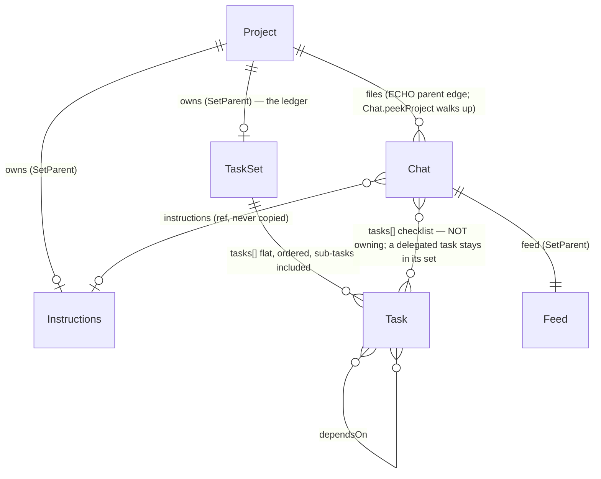
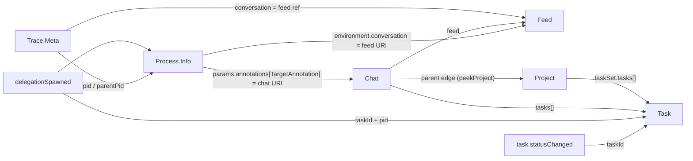
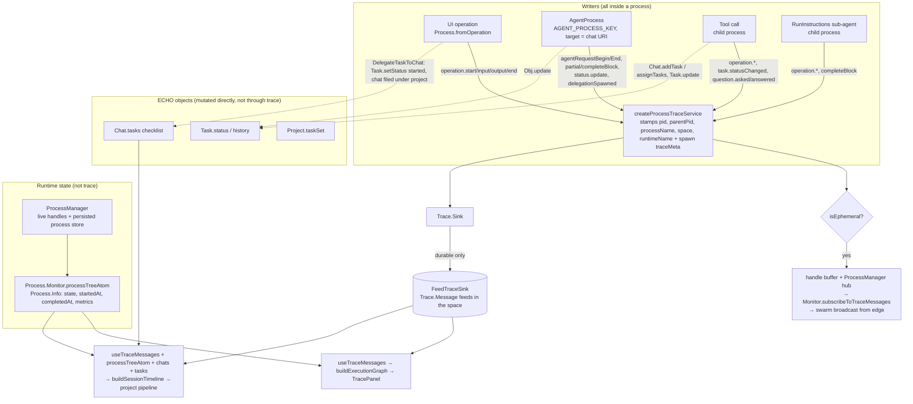
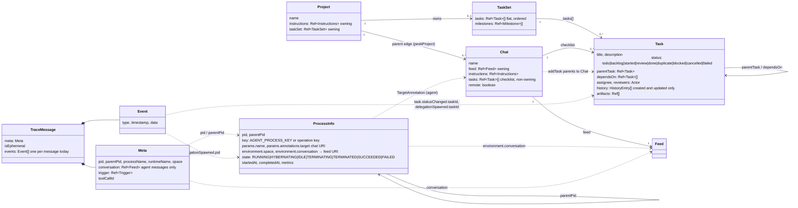
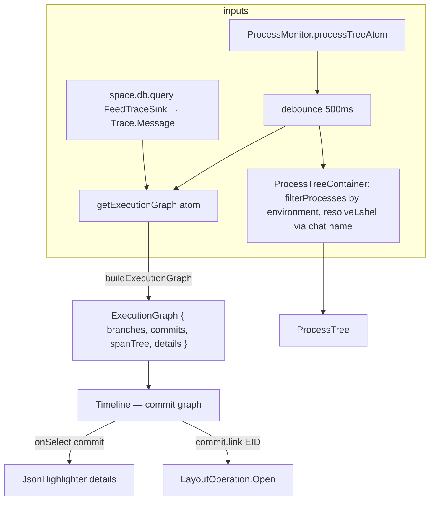
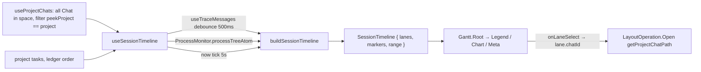
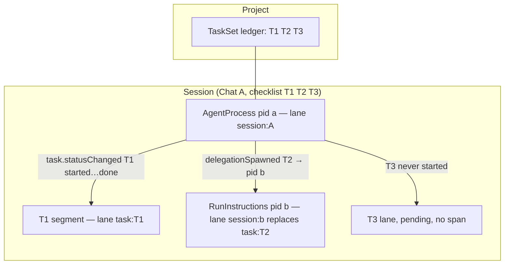

# Agent activity — data model and unified dashboard design

How agent work is recorded (processes, trace events, chats, tasks, projects), how the two
existing views read it (`TracePanel`, the project pipeline chart), and the design of a single
space-wide activity chart surfaced as a devtools page in the debug panel.

Source of truth is the code cited as `path`; line numbers are omitted because the files move.
Status: **design** — sections 1–7 describe what exists and what is missing; sections 8–10 are the proposal.

## 1. The five records of agent activity

Agent activity is written to five places. None of them is "the" activity log; each records one
aspect, and every view joins two or more.

| Record                 | Where it lives                                                                         | Lifetime                | Records                                                                                                 |
| ---------------------- | -------------------------------------------------------------------------------------- | ----------------------- | ------------------------------------------------------------------------------------------------------- |
| `Process.Info`         | In-memory process tree, read through `Capabilities.ProcessMonitor` (`processTreeAtom`) | While the runtime is up | What is running _now_: pid tree, state, `startedAt`/`completedAt`, wall time, input/output counts.      |
| `Trace.Message`        | ECHO feed(s) in the space (`FeedTraceSink`), queried by `useTraceMessages`             | Durable                 | What happened: batched `Trace.Event`s with a `Meta` naming the pid, parent pid, conversation, trigger.  |
| `Chat.Chat`            | ECHO object, `@dxos/assistant/Chat`                                                    | Durable                 | A **session**: its message `feed`, its `tasks` checklist, its `instructions`; parented under a project. |
| `Task.Task` (in a set) | ECHO objects, `@dxos/types` `Task`/`TaskSet`; the project's `taskSet` is the ledger    | Durable                 | The unit of work: `status`, `dependsOn`, `parentTask`, `assignee`, `history` (created/updated only).    |
| `Project.Project`      | ECHO object, `@dxos/compute/Project`                                                   | Durable                 | The container: owns `instructions`, `taskSet`; chats are filed under it by the ECHO parent edge.        |

### 1.1 `Process` — `packages/core/compute/compute/src/Process.ts`

```ts
interface Info {
  pid: ID; // brand 'ProcessId'
  parentPid: ID | null; // the process tree
  key: string; // e.g. AGENT_PROCESS_KEY; several live processes may share a key
  params: Params; // name, annotations (TargetAnnotation → URI of the object served)
  environment: Environment; // { space?: SpaceId; conversation?: URI }  — inherited by children
  state: State; // RUNNING | HYBERNATING | IDLE | TERMINATING | TERMINATED | SUCCEEDED | FAILED
  error: SerializedError | null;
  startedAt: number;
  completedAt: Option<number>;
  metrics: { wallTime; inputCount; outputCount };
}
```

- `TargetAnnotation` (`org.dxos.process.target`) on an agent process is the **chat's URI** — the
  join from a process to its session. `environment.conversation` is the **feed's URI** — the same
  join, one hop further along.
- `State` is a flat enum; "active" for every view is `RUNNING | HYBERNATING` (a suspended
  process is `IDLE`; a finished one `SUCCEEDED | FAILED | TERMINATED`).
- `Monitor` (`processTreeAtom`, `list(filter)`, `subscribeToTraceMessages(filter)`) aggregates
  local and remote runtimes. `MonitorFilter` narrows by `key`, `target`, `state`, `space`,
  `parentPid` — so "every process in this space" is one call.
- A process disappears from the tree once terminal and reaped; the trace feed is the only durable
  memory of it.

### 1.2 `Trace` — `packages/core/compute/compute/src/Trace.ts`

```ts
Message = { meta: Meta; isEphemeral: boolean; events: Event[] }   // ECHO type org.dxos.type.traceMessage
Meta    = { pid?, parentPid?, processName?, space?, conversation?: Ref, trigger?: Ref, toolCallId?, runtimeName? }
Event   = { type: string; timestamp: number; data: unknown }
FlatEvent = Event & { meta: Meta; isEphemeral }                    // Trace.flatten(message)
```

`Meta` is per message, not per event; every event of a message shares the pid. Events that the
views consume:

| Event type                                                 | Defined in                      | Persisted | Meaning / payload                                                              |
| ---------------------------------------------------------- | ------------------------------- | --------- | ------------------------------------------------------------------------------ |
| `process.spawned` / `.exited`                              | `Process.ts`                    | yes       | Process lifecycle — **defined but never written** by any runtime (§4).         |
| `operation.start` / `.end`                                 | `Trace.ts`                      | yes       | Span begin/end: `{ key, name, icon }` / `+ outcome, error, errorCode`.         |
| `operation.input` / `.output`                              | `Trace.ts`                      | no        | Raw payloads for live subscribers (undo, devtools).                            |
| `status.update`                                            | `Trace.ts`                      | no        | Human-readable progress `{ message, progress{key,current,total,phase…} }`.     |
| `task.statusChanged`                                       | `Trace.ts`                      | yes       | `{ taskId, title, status, previousStatus }` — the only pid ↔ task attribution. |
| `question.asked` / `.answered`                             | `Trace.ts`                      | yes       | The stretch a task was blocked on a person.                                    |
| `assistant.agentRequestBegin/End`                          | `assistant/src/util/tracing.ts` | yes       | One agent turn; `End` carries `status` of success, error or interrupted.       |
| `assistant.completeBlock`                                  | `tracing.ts`                    | yes       | A content block; the `stats` block carries token usage and tool-call counts.   |
| `assistant.delegationSpawned`                              | `tracing.ts`                    | yes       | `{ taskId, pid }` — the only durable pairing of a sub-agent pid with its task. |
| `assistant.partialBlock`, `mcpServerError`, request stages | `tracing.ts`                    | no        | Streaming/progress detail.                                                     |

Two derived structures sit on top of the flat events:

- **Span tree** — `execution-graph/span-tree.ts`. Begin/end pairs (`operation.*`,
  `agentRequest*`) become `Span { id, meta: SpanMeta, events, children }` keyed by pid, nested by
  `parentPid`. Orphans attach to the root; open spans older than `spanTimeoutMs` (20 min) are
  force-closed when `now` is supplied. Specified in `execution-graph/SPEC.md`.
- **Execution graph** — `execution-graph/execution-graph.ts`. The span tree as a commit graph
  (`branches`, `commits`, `details`) for the `Timeline` component. Only `pid`/`parentPid` shape
  the topology.

### 1.3 `Chat` (session), `Task`, `TaskSet`, `Project`



- **A session is a `Chat`.** There is no separate session object: the chat's feed is the
  conversation, and its `tasks` array is what the agent is working on. A project's chats are found
  by the parent walk (`useProjectChats` filters every chat in the space by `Chat.peekProject`).
- **A task carries no timestamps and no pid.** `history` records `created`/`updated` dates only;
  when a task started and finished is known only from `task.statusChanged` trace events, and which
  sub-agent worked it only from `assistant.delegationSpawned`. This is the reason every time-based
  view is built from the trace and not from the objects.
- Delegation (`ProjectOperation.DelegateTaskToChat`, documented in
  `plugin-projects/docs/FLOW.md`) creates the chat, pushes the tasks, marks them `started`, files
  the chat under the project and submits the opening prompt. The supervisor
  `DelegationStrategy` then spawns one child process per ready task.

### 1.4 The join keys

Every view is a join over these keys, and each key is only available in some records:



Notes on the joins:

- Feed and chat ids are compared by **entity id** (`EID.getEntityId`) because processes carry
  URIs and chats carry refs — `session-timeline.ts` `entityKey` and `TracePanel.tsx` `feedKey` do
  the same normalisation.
- A process → chat join needs a live `Process.Info`; once the process is reaped, only the trace's
  `conversation` meta remains. The timeline therefore collects a session's pids from **both**
  (agent processes targeting the chat, plus `agentRequestBegin` events whose feed matches).
- A sub-agent's trace carries neither the task nor the conversation, so a child span reaches its
  session only through `parentPid` and its task only through the parent's `delegationSpawned`.
- Nothing links a trace event to a **project** directly; the project is reached via chat.

## 2. What is collected, and how it flows today

### 2.1 The assumptions, checked against the code

| Assumption                                                                                             | Holds? | Where it is decided                                                                                                                                                                                                                                                                                                                                                                                                         |
| ------------------------------------------------------------------------------------------------------ | ------ | --------------------------------------------------------------------------------------------------------------------------------------------------------------------------------------------------------------------------------------------------------------------------------------------------------------------------------------------------------------------------------------------------------------------------- |
| Every agentic operation runs in a process managed by a platform process manager (local or edge).       | yes    | The app's `Capabilities.OperationInvoker` _is_ `ProcessOperationInvoker` (`app-framework/…/process-manager-capability.ts`), so a UI-invoked operation is a top-level process; `AgentService.getSession` spawns the agent as a process targeting the chat; tools and delegations are child processes (`invokeFiber` with `parentProcessId`). Edge runs its own manager; `Process.Monitor` aggregates both.                   |
| A chat session (`Chat`) is long-lived and has an attached feed.                                        | yes    | `Chat.feed` is owning (`SetParent`). The chat outlives every process that serves it: each prompt after the agent has completed spawns a **new** agent process against the same chat, so one session accumulates several pids over its life.                                                                                                                                                                                 |
| Some sessions have a directly connected `TaskSet`; others reach `TaskSet`s of other objects via tools. | partly | A chat never holds a `TaskSet`. It holds a **checklist** — `Chat.tasks: Ref<Task>[]`, non-owning. Tasks the chat creates (`Chat.addTask`) are parented to the chat; tasks delegated from a project stay parented in the project's `TaskSet` and are only _referenced_. The planning tools (`update_tasks`, `ask_question`) operate on `Harness.getChat().tasks`, so "the tasks a session can see" is exactly its checklist. |
| Every trace event is associated with a process.                                                        | yes    | `createProcessTraceService` (`compute-runtime/src/process-trace.ts`) is the only `TraceService`; it stamps `pid`, `parentPid`, `processName`, `runtimeName`, `space` on every message. `Meta.pid` is typed optional only because `Trace` cannot depend on `Process`.                                                                                                                                                        |

### 2.2 Collection



Reading the diagram:

- **One event per message.** `createProcessTraceService` wraps every `Trace.write` in its own
  `Message` (the batching `TODO` is still open), so `Meta` is effectively per event.
- **Two paths out.** Ephemeral events go to the in-memory hub only — the process handle's buffer,
  `Monitor.subscribeToTraceMessages`, and (from edge) the swarm broadcast. Durable events go to
  the sink, which the app binds to `FeedTraceSink`: an ECHO feed in the space. A space may hold
  several trace feeds (writers race on creation), and every reader queries all of them.
- **Trace meta is stamped at spawn, not inherited.** `SpawnOptions.traceMeta` (the agent's
  `conversation` ref) is copied onto the agent's own messages only; a child inherits the parent's
  `environment` (`space`, `conversation` URI) but `createProcessTraceService` never reads
  `environment.conversation`, so a tool's or sub-agent's messages carry `space` and `parentPid`
  and nothing else that names the session.
- **Task state is written directly.** Every path that moves a task writes the ECHO object;
  only some of them also write `task.statusChanged` (see §4).

### 2.3 Inference: process → session, session → tasks

**a) Which session a process belongs to.** Three signals, in order of reliability:

1. **Live agent process**: `params.annotations[TargetAnnotation]` is the chat's URI (set by
   `AgentService.getSession`). Exact, but only while the `Process.Info` exists.
2. **Live process of any kind**: `environment.conversation` is the feed's URI, inherited by every
   descendant of the agent — so a tool or sub-agent process resolves to its session through the
   feed (`Chat.loadForFeed`, or the feed's parent edge). Also live-only.
3. **Trace only** (what survives a restart): `meta.conversation` on the agent's own messages,
   matched to `chat.feed` by entity id; then `parentPid` chains from children to the agent pid.
   This is what `buildSessionTimeline` does (`agentPidsByChat` ∪ `agentRequestBegin` feeds, then
   `laneByPid` lookups by `pid` or `parentPid`). It fails when the parent's messages are outside
   the window or were never written — a sub-agent's trace alone names no session.

A process that is none of these — a UI-invoked operation, a trigger-run function — has no
session, and today no view draws it except the `TracePanel`'s process tree.

**b) Which tasks a session is working.** Two layers:

1. **Membership** is durable and object-side: `chat.tasks` (`Chat.loadTasks`). A project's ledger
   is reachable from there through each task's parent (`TaskSet`) and the chat's own parent walk
   (`Chat.peekProject`), but the session only ever "works" what is on its checklist.
2. **Attribution in time** is trace-side and partial:
   - `task.statusChanged` (from the planning tools, `ask_question`, and the UI's `UpdateTask`
     operation) gives the moments a task entered/left `started` — `buildTaskSegments` cuts the
     session into per-task stretches from these.
   - `assistant.delegationSpawned { taskId, pid }` pairs a sub-agent process with its task; the
     child's own span then gives that task its start and end.
   - Nothing else names a task. A task moved by the supervisor (`reconcile`, `onComplete`, the
     orphan sweep) or by `DelegateTaskToChat` is changed on the object without a trace event.

**c) When a process exits.** `Process.State` reaches a terminal value on one of:

| Process                                    | Ends when                                                                                                                                                                                                                                                                                                                                                             | Terminal state         |
| ------------------------------------------ | --------------------------------------------------------------------------------------------------------------------------------------------------------------------------------------------------------------------------------------------------------------------------------------------------------------------------------------------------------------------- | ---------------------- |
| Operation (`Process.fromOperation`)        | Its single input's handler returns (output emitted) or fails.                                                                                                                                                                                                                                                                                                         | `SUCCEEDED` / `FAILED` |
| Tool call, `RunInstructions` sub-agent     | Same — they are operation processes with `parentProcessId` set; the parent's `onChildEvent(exited)` fires via `onFinished`.                                                                                                                                                                                                                                           | `SUCCEEDED` / `FAILED` |
| Agent (`agent-process.ts` `maybeComplete`) | After a turn, when the feed queue has drained **and** nothing is pending — no tool results, no alarms, no running delegations — and the end-of-request hooks enqueued nothing. Until then it stays resident: `IDLE` waiting for input, or `HYBERNATING` with an alarm / linked children. A fresh spawn that has not yet run a turn never completes on an empty queue. | `SUCCEEDED`            |
| Any                                        | `handle.terminate()` (the `TracePanel`'s terminate button, `ProcessManager` cascading to children).                                                                                                                                                                                                                                                                   | `TERMINATED`           |
| Any                                        | App shutdown: `ProcessManager.shutdown()` suspends every live process (`IDLE`, record persisted); it is rehydrated on the next `getSession` or `list`, never completed.                                                                                                                                                                                               | none — resumes         |

A terminal handle stays in `#handles` (and therefore in `processTreeAtom`) until the runtime
restarts; the persisted store drops terminal records on hydrate and skips them in `list`. So after
a restart the only memory of a finished process is its trace — and the trace has no exit record
(§4).

## 3. Type map



Solid arrows are stored references; dotted arrows are joins a reader has to perform.

## 4. What is missing

Ordered by how much each costs the unified view.

1. **Process lifecycle is never traced.** `Process.SpawnedEvent` (`process.spawned`) and
   `Process.ExitedEvent` (`process.exited`) are defined in `Process.ts` and read by a test
   pretty-printer, but no runtime writes them. After a restart nothing durable says when a process
   ended or how (`succeeded | failed | terminated`); the timeline infers an end from
   `agentRequestEnd` / `operation.end` and falls back to the live tree, and a run whose process
   died between events reads as `running` forever once the tree has forgotten it. Fix:
   `ProcessHandle` writes `SpawnedEvent` in `spawn` and `ExitedEvent` in `#handlerCompleted` /
   terminate — two writes, and every open-lane heuristic in `buildSessionTimeline` can go.
2. **Supervisor-side task moves are not traced.** `task.statusChanged` is written by the planning
   tools, `ask_question`, and `UpdateTask`, but not by `DelegateTaskToChat` (`→ started`),
   `DelegationStrategy.reconcile` (`→ started` at spawn), `onComplete` (`→ done | failed`) or
   `sweepOrphanedTasks` (`→ failed`). These use `Obj.update` directly, so they also skip
   `Task.update`'s history entry. The chart covers the sub-agent case through `delegationSpawned`
   plus the child's span, but a delegated task's `done`/`failed` instant and a swept orphan are
   invisible. Fix: route the four through `Task.update` + `Trace.write(TaskStatusChanged)` (the
   supervisor runs inside the agent process, so the events land with the right pid).
3. **Child processes carry no session in their trace meta.** `environment.conversation` is
   inherited but not stamped; only the agent's own messages carry `meta.conversation`. Fix: one
   line in `createProcessTraceService` — default `conversation` from the environment — after which
   any event resolves to its session on its own and the `parentPid` chain becomes a fallback.
4. **Nothing names the project.** Project is reached only via `Chat.peekProject`, i.e. by loading
   every chat in the space and walking parents. Acceptable for a space-scoped view; a
   `Trace.Meta.project` would only be worth adding if the view ever spans spaces.
5. **Tasks have no timestamps.** `Task.history` records `created`/`updated` dates with no status,
   so "when did this task start/finish" is unanswerable from the object. This is the ledger
   backlog item (terminal-status dates on `Task`); with (2) in place the trace answers it, and the
   object field becomes a denormalisation for views that have no trace.
6. **Human task edits are unattributable.** A status change from the ledger runs as its own
   top-level process (no `parentPid`, no `conversation`), so `buildSessionTimeline` drops it. The
   event carries `taskId`; the activity builder should attribute such events by task rather than
   by pid so a person's `done` shows on the task's lane.
7. **No retention or windowing.** The trace feed only grows, one message per event, and every
   reader rebuilds from the full history on each change (debounced). The 24 h window in the
   unified view is applied client-side after the query; a feed-side range query is the next step
   if the feed outgrows that.
8. **Sessions with an empty checklist are skipped** by `buildSessionTimeline` when `chats` is
   supplied. For a runtime dashboard every session with an agent turn is activity — an option, not
   a redesign.

Items 1–3 are runtime changes outside `plugin-assistant` and are prerequisites for the chart to be
trustworthy after a restart; the rest are absorbed by the builder.

## 5. `TracePanel` — `containers/TracePanel/TracePanel.tsx`

The developer's view of one space's runtime, mounted as a deck companion (`trace`) and driven by
`useActiveSpace`.



What it shows, top to bottom:

1. **Processes** — `ProcessTree` (depth 3) over the live process tree, filtered by process
   environment (local/edge, from settings) and relabelled: an agent process shows its chat's
   name (joined via `TargetAnnotation` ↔ `chat.feed`). Rows carry state glyph and metrics; a
   process can be terminated.
2. **Trace** — the `Timeline` commit graph built by `buildExecutionGraph` from all trace
   messages in the space plus active processes (which add a spinner commit per running agent).
   Branch = pid; commits = events; parents computed by the `CommitSelector` DSL. A debug toggle
   (`tracePanelDebug`) swaps it for the raw span tree JSON.
3. **Details** — the selected commit's `FlatEvent`.

Properties worth keeping in mind for the unified view:

- It is **process-centric**: lanes are pids, not sessions or tasks. Task and project structure is
  invisible except through labels.
- It is **space-scoped** and already reads every trace feed in the space (several may exist:
  writers race on feed creation).
- It is **unbounded in time** except by `eventLimit` (300 in the panel) — the whole feed is rebuilt
  on every change, debounced. This is the cost model the unified view inherits.
- `useExecutionGraph` ticks every 60 s so span timeouts are honoured without new events.

## 6. The project pipeline chart — `plugin-projects/…/ProjectPipeline.tsx`

The reader's view of one project's sessions, drawn under the ledger in `ProjectArticle` (tab
`tasks`, `pipeline` view state; revealed automatically when a `DelegateTaskToChat` invocation for
this project succeeds).



`buildSessionTimeline` (`session-timeline/session-timeline.ts`) is the join described in §1.4,
producing:

- **Session lanes** (`kind: 'session'`) — one per chat **with a non-empty checklist**; chats with
  no tasks are skipped. Start = first `agentRequestBegin`, end = last `agentRequestEnd` unless a
  request is open on a live process; status `running | done | failed` from process state and the
  last end's status.
- **Task lanes** (`kind: 'task'`, `parentId` = session) — one per task on the chat's checklist,
  spanned by `task.statusChanged` segments (`buildTaskSegments`), `blockedOn` from `dependsOn`
  within the checklist, status from `Task.status` (+ readiness).
- **Sub-session lanes** — a spawned child (`delegationSpawned` or a child span that emits
  content blocks) **replaces** its task lane, inheriting its dependencies and carrying
  `delegatedFrom { laneId, markerId }` for the connector.
- **Markers** — every event attributed to a lane by pid/parentPid, re-homed to the task segment
  active at that time; token totals and tool-call counts from `stats` blocks.
- **Folding** — a session with exactly one in-session task folds the two lanes into one.
- **Range** — min/max over lanes and markers, extended to `now` while a lane is open and was
  active within the last 10 minutes.

`Gantt` (`react-ui-components/src/components/Gantt/Gantt.tsx`) then orders rows so each session's
own rows are contiguous (one enclosing rectangle per session; spawned sessions follow the block),
draws bars per status, nodes per marker, a thread through them, dependency and delegation
connectors, and exposes `onLaneSelect` / `onMarkerSelect`.

### 6.1 Process ↔ session ↔ task, as the chart sees it



### 6.2 What each existing view lacks

| Question                                              | TracePanel         | Project pipeline                    |
| ----------------------------------------------------- | ------------------ | ----------------------------------- |
| What is running right now, anywhere in the space?     | yes (process tree) | only this project's agent processes |
| Which task is that process working on?                | no                 | yes                                 |
| Which project does that session belong to?            | no (label only)    | implicit — the chart is per project |
| Sessions with no checklist (plain chats, companions)? | as pids            | skipped                             |
| Trigger-driven / non-agent processes?                 | yes                | no                                  |
| Token/tool cost per session?                          | no                 | yes                                 |
| Event detail on click?                                | yes                | no                                  |
| Time axis?                                            | no (commit order)  | yes                                 |

The unified view answers every row.

## 7. Existing extension point: the debug panel

`plugin-debug`'s `DebugPanel` is graph-driven: its sidebar is the tree under the hidden
`root/debug` category, and `DebugPanelMain` renders the selected node's `data` through an
`AppSurface.Article` surface (`DebugPanelMain.tsx`). A plugin adds a page with two contributions
and no dependency on `plugin-debug` (the pattern in `plugin-debug/src/testing/stub-tools-plugin.tsx`
and `plugin-devtools/src/capabilities/app-graph-builder.ts`):

1. An `AppGraphBuilder` extension matching `AppNodeMatcher.whenDebugGroup` that contributes a
   node (or a branch with child nodes) whose `data` is a string discriminator.
2. A `Surface.create` with `filter: AppSurface.literal(AppSurface.Article, <discriminator>)`.

The panel hosts the page docked (deck drawer) or floating (`DebugPanelStatus` mode), keeps the
selection in view state, and — because the host is not space-bound — pages resolve their space
with `useActiveSpace()` as `TracePanelSurface` and the devtools pages do.

## 8. Proposal: the activity timeline

One space-wide gantt of everything the agent runtime did and is doing, grouped by project, then
session, then task — with the trace detail of the `TracePanel` one click away.

### 8.1 Scope

- **Space-scoped**, like both existing views; the active space, with a space selector left for
  later.
- **Time-windowed**: the trace feed only grows, so the view takes a window (last hour / day / all)
  and the builder drops messages outside it before building spans. This is the one new cost
  control the existing views lack.
- Rows, top to bottom:
  1. **Project groups** — one per project that has at least one chat with activity in the window.
  2. **Session lanes** under their project, including sessions **without** a checklist (a plain
     chat that ran an agent turn is activity).
  3. **Task lanes and sub-sessions** exactly as `buildSessionTimeline` produces them today.
  4. An **"Unfiled"** group for sessions not under any project.
  5. A **"Processes"** group for non-agent processes (trigger-driven functions, operations spawned
     outside a chat): one lane per top-level process spanning `startedAt`..`completedAt`, status
     from `State`, children as task-kind lanes. This is what makes it a runtime dashboard rather
     than a second project chart.

### 8.2 Data layer

Reuse, do not fork. `buildSessionTimeline` already does the hard join; it gains one option and is
composed, per project, by a new builder:

```ts
// session-timeline/activity-timeline.ts
interface BuildActivityTimelineInput {
  traceMessages: readonly Trace.Message[];
  processes?: readonly Process.Info[];
  chats: readonly Chat.Chat[];        // every chat in the space
  tasks: readonly Task.Task[];        // every task in the space (the ledgers' union)
  projects: readonly Project.Project[];
  window?: { start: number; end?: number };
  now?: number;
}
buildActivityTimeline(input): SessionTimeline   // same output type; lanes gain a 'group' kind
```

Steps:

1. Filter `traceMessages` to the window (by the message's last event timestamp).
2. Partition chats by `Chat.peekProject(chat)?.id` → project groups + unfiled.
3. For each partition call `buildSessionTimeline({ traceMessages, processes, chats, tasks, now,
includeEmptySessions: true })` and re-parent its root lanes under a **group lane**
   `{ id: 'project:<id>', kind: 'group', label, status: worst-of-children, start/end: hull }`.
4. Add the processes group: top-level `Process.Info` whose pid is not already a session pid (via
   `laneByPid` — exposed by the builder rather than recomputed) become session-kind lanes labelled
   by `params.name ?? key`, spanning `startedAt`..`completedAt`, status from `State`; their children
   become task-kind lanes.
5. Merge lanes and markers, prefixing lane ids by group so ids stay unique across partitions;
   compute the range over the union.

One change to `buildSessionTimeline`: an `includeEmptySessions` option that stops skipping chats
with an empty checklist (default `false`, so the project chart is unchanged). One addition: the
return value carries `laneByPid` so callers can tell which processes are already drawn.

Hook: `useActivityTimeline(space, { window })` — `useTraceMessages` (debounced), the process
tree atom (debounced), `useQuery` for chats, tasks and projects, and the 5 s `now` tick, mirroring
`useSessionTimeline`.

### 8.3 Gantt changes

The component is presentation-only and gets exactly what the group rows need:

- `GanttLaneKind` gains `'group'`. `orderRows` visits a group as a header row and recurses into its
  children with `depth + 1`; a group draws a full-width hull bar in a subdued style and no nodes.
  Sessions inside keep their rectangles.
- `Gantt.Legend` indents by depth (already does) and renders group labels as headers.
- Nothing else: dependency and delegation connectors already work across the ordered rows.

### 8.4 The devtools page

Owner: **`plugin-assistant`** — it already owns the trace hooks, `session-timeline`, and the
`TracePanel`, so the page adds no cross-plugin dependency beyond the `@dxos/compute/Project` type.

- `containers/ActivityPanel/ActivityPanel.tsx` — `Panel.Root` with a toolbar (time window select,
  group filter, "show processes" toggle, a link to the trace companion) and `Gantt` in a
  `ScrollArea`. `onLaneSelect` opens the chat (`LayoutOperation.Open` on the chat's graph path);
  `onMarkerSelect` shows the marker's `detail` (the `FlatEvent`) in a `JsonHighlighter` below the
  chart — the `TracePanel`'s details pane, reused.
- `capabilities/app-graph-builder.ts` — a `whenDebugGroup` extension contributing an `Agents`
  branch with one `Activity` page (`data: 'org.dxos.plugin.assistant.activity'`), positioned after
  Devtools (10).
- `capabilities/react-surface.ts` — `Surface.create` on `AppSurface.literal(AppSurface.Article,
ACTIVITY)` rendering `ActivityPanel` with `useActiveSpace()`.
- Story: `ActivityPanel.stories.tsx` over the `sub-agent-delegation.json` fixture plus a second
  project's chats, and one with the simulated agent (`TracePanel/testing/simulated-agent.ts`).

### 8.5 What the unified view does not do

- It does not replace the `TracePanel`: the commit graph is the right shape for reading one
  process's event order; the gantt is the right shape for reading concurrency and attribution.
  The page links to the companion for the former.
- It does not persist or aggregate: everything is derived per render from the feed, the process
  tree and the objects, as today. A materialised activity index is out of scope until the window
  filter proves insufficient.
- It does not draw anything without a trace: a task that was never started has a lane but no bar,
  exactly as in the project chart.

## 9. Decisions

Taken 2026-09-16:

1. Owner: `plugin-assistant`.
2. The non-agent "Processes" group ships in the first cut.
3. Live view over a historical window, default 24 h.
4. Marker detail inline under the chart.
5. Group rows drawn as hull bars.
6. Gaps 1–3 in §4 are fixed in the runtime ahead of the panel, so the chart never has to guess a
   process's end or a child's session.

## 10. Plan

1. Runtime: write `process.spawned` / `process.exited` from `ProcessHandle`; stamp
   `conversation` from the environment in `createProcessTraceService`; route the supervisor's and
   `DelegateTaskToChat`'s task moves through `Task.update` + `TaskStatusChanged`. Tests in
   `compute-runtime` and `assistant-toolkit`.
2. `Gantt`: `'group'` lane kind + story.
3. `buildSessionTimeline`: consume `process.exited` for lane ends, `includeEmptySessions`,
   `laneByPid`, attribution by `taskId` for events with no session; tests.
4. `buildActivityTimeline` + tests over two projects, an unfiled chat, a human edit and a trigger
   process.
5. `useActivityTimeline` (24 h window).
6. `ActivityPanel` + story; graph node + surface; translations.
7. Verify in storybook and in the running app's debug panel; changeset.
