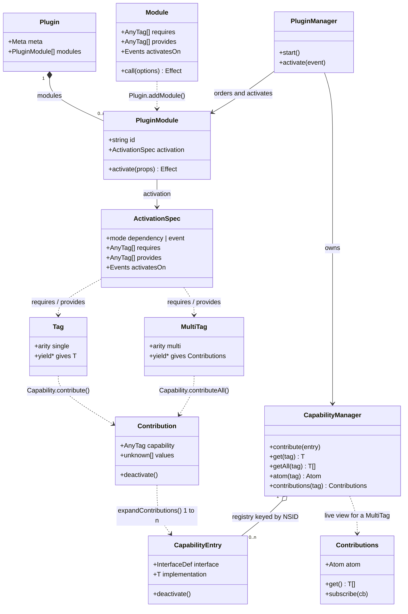
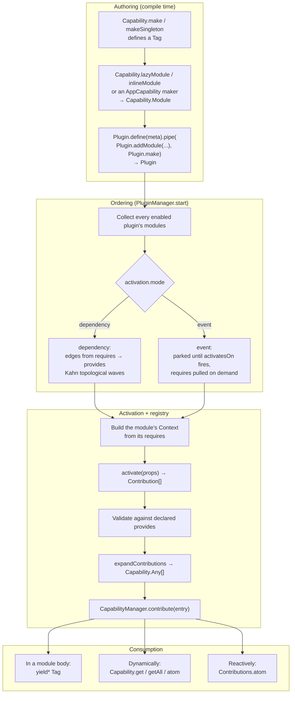

# Architecture

How plugins, modules, capabilities and contributions relate.

The short version: a **plugin** is a bag of **modules**; a module declares which **capabilities** it
`requires` and `provides`, and its body returns **contributions**; the manager topologically orders
activation from those declarations and expands each contribution into the flat entries the
**capability registry** stores.

## Domain model

### The two-layer split

`Contribution` and `CapabilityEntry` (exported as `Capability.Any`) sit on either side of the
registry boundary — the authoring layer and the storage layer:

|              | `Contribution` (authoring)                                                                     | `Capability.Any` (registry)             |
| ------------ | ---------------------------------------------------------------------------------------------- | --------------------------------------- |
| Produced by  | `Capability.contribute` / `contributeAll`                                                      | `CapabilityManager.expandContributions` |
| Holds        | **n** values for one capability                                                                | exactly **one** implementation          |
| Identity     | branded by capability identity (NSID + arity) — powers the `EnsureProvides` completeness check | the `InterfaceDef` only                 |
| Service type | erased to `AnyTag`, so a body's service type never leaks into `.d.ts` emit                     | names `T` directly                      |

`expandContributions` is the one-way bridge: a `contributeAll(tag, [a, b, c])` is one `Contribution`
that becomes three registry entries, with the `deactivate` hook pinned to the first so it runs
exactly once.

## Activation

Failure modes are structural rather than fatal: a dependency cycle, a duplicate singleton provider,
or an unsatisfiable `requires` puts the owning plugin into an error state and excludes it from
further rounds, while everything else proceeds. A consumer whose provider is event-gated **waits**
rather than erroring, and activates in a later round once the provider contributes.

### Singleton vs multi

Arity is a property of the tag and decides what `yield*` gives you:

- `Capability.makeSingleton<T>()(nsid)` → `Tag`. `yield* tag` gives `T`. Requiring one gates
  activation on its single provider; two providers is a `DuplicateProviderError`.
- `Capability.make<T>()(nsid)` → `MultiTag` (the default). `yield* tag` gives a live
  `Contributions<T>` collection. Providers never gate consumers, so consume it reactively — a
  one-shot snapshot silently misses late contributions.

Both forms are curried so the NSID string literal is captured and brands the identifier; the NSID
must be camelCase (`DXN.Name`).

## Where things live

| Concept                                                              | File                                                     |
| -------------------------------------------------------------------- | -------------------------------------------------------- |
| Tags, arity, `Contribution`, `contribute`, module makers             | `src/core/capability.ts`                                 |
| `Plugin`, `PluginModule`, `ActivationSpec`, the builder              | `src/core/plugin.ts`                                     |
| Public manager API, state, lifecycle (start/shutdown)                | `src/core/plugin-manager.ts`                             |
| Catalog: add/enable/disable, lazy resolution, dependency closure     | `src/core/plugin-catalog.ts`                             |
| Rounds, waves, event bridging, on-demand pulls                       | `src/core/activation-scheduler.ts`                       |
| Ordering logic (runnable selection, waves, cycles), on `@dxos/graph` | `src/core/activation-graph.ts`                           |
| Memoized module loads, provides validation, deactivation             | `src/core/module-loader.ts`                              |
| The NSID-keyed registry and its reactive views                       | `src/core/capability-manager.ts`                         |
| Tagged errors (cycle, missing/duplicate provider, mismatch)          | `src/core/errors.ts`                                     |
| Per-capability module makers (`surface`, `settings`, …)              | `@dxos/app-toolkit` `src/app-framework/AppCapability.ts` |

Worked examples: `@dxos/plugin-client` and `@dxos/plugin-markdown`.
