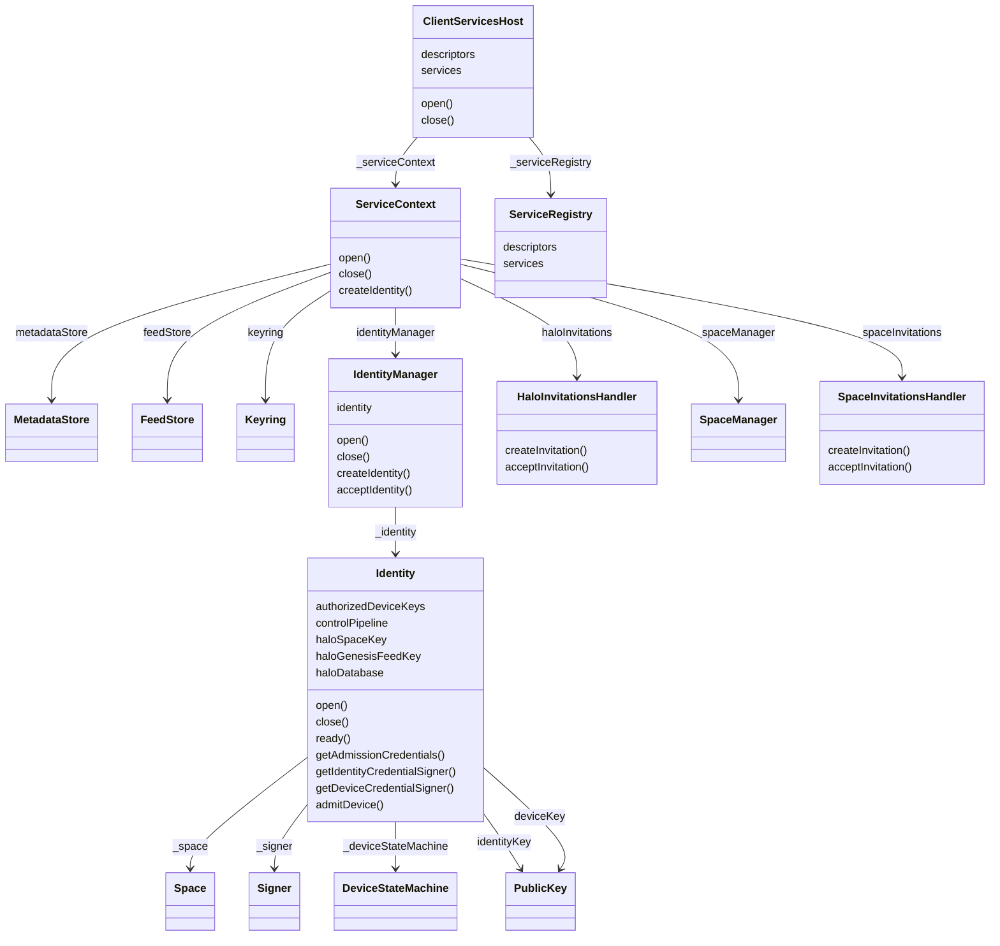
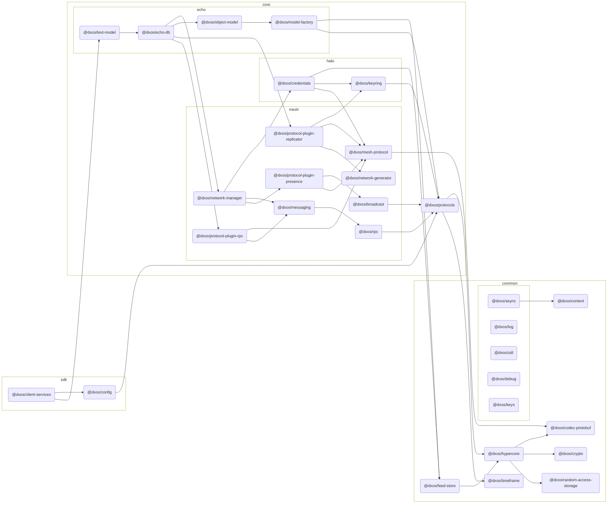

# @dxos/client-services

DXOS client services implementation

## Class Diagram

## Dependency Graph

## Dependencies

| Module | Direct |
|---|---|
| [`@dxos/async`](../../../common/async/docs/README.md) | &check; |
| [`@dxos/broadcast`](../../../core/mesh/broadcast/docs/README.md) |  |
| [`@dxos/codec-protobuf`](../../../common/codec-protobuf/docs/README.md) | &check; |
| [`@dxos/config`](../../config/docs/README.md) | &check; |
| [`@dxos/context`](../../../common/context/docs/README.md) |  |
| [`@dxos/credentials`](../../../core/halo/credentials/docs/README.md) | &check; |
| [`@dxos/crypto`](../../../common/crypto/docs/README.md) | &check; |
| [`@dxos/debug`](../../../common/debug/docs/README.md) | &check; |
| [`@dxos/echo-db`](../../../core/echo/echo-db/docs/README.md) | &check; |
| [`@dxos/feed-store`](../../../common/feed-store/docs/README.md) | &check; |
| [`@dxos/hypercore`](../../../common/hypercore/docs/README.md) |  |
| [`@dxos/keyring`](../../../core/halo/keyring/docs/README.md) | &check; |
| [`@dxos/keys`](../../../common/keys/docs/README.md) | &check; |
| [`@dxos/log`](../../../common/log/docs/README.md) | &check; |
| [`@dxos/mesh-protocol`](../../../core/mesh/mesh-protocol/docs/README.md) |  |
| [`@dxos/messaging`](../../../core/mesh/messaging/docs/README.md) | &check; |
| [`@dxos/model-factory`](../../../core/echo/model-factory/docs/README.md) | &check; |
| [`@dxos/network-generator`](../../../core/mesh/network-generator/docs/README.md) |  |
| [`@dxos/network-manager`](../../../core/mesh/network-manager/docs/README.md) | &check; |
| [`@dxos/object-model`](../../../core/echo/object-model/docs/README.md) | &check; |
| [`@dxos/protocol-plugin-presence`](../../../core/mesh/protocol-plugin-presence/docs/README.md) |  |
| [`@dxos/protocol-plugin-replicator`](../../../core/mesh/protocol-plugin-replicator/docs/README.md) |  |
| [`@dxos/protocol-plugin-rpc`](../../../core/mesh/protocol-plugin-rpc/docs/README.md) | &check; |
| [`@dxos/protocols`](../../../core/protocols/docs/README.md) | &check; |
| [`@dxos/random-access-storage`](../../../common/random-access-storage/docs/README.md) | &check; |
| [`@dxos/rpc`](../../../core/mesh/rpc/docs/README.md) | &check; |
| [`@dxos/text-model`](../../../core/echo/text-model/docs/README.md) | &check; |
| [`@dxos/timeframe`](../../../common/timeframe/docs/README.md) | &check; |
| [`@dxos/util`](../../../common/util/docs/README.md) | &check; |
