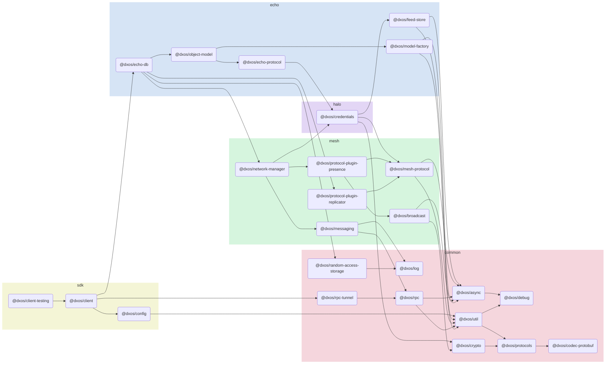

# @dxos/client-testing

## Dependency Graph

## Dependencies
| Module | Direct |
|---|---|
| [`@dxos/async`](../../../common/async/docs/README.md) | &check; |
| [`@dxos/client`](../../client/docs/README.md) | &check; |
| [`@dxos/codec-protobuf`](../../../common/codec-protobuf/docs/README.md) | &check; |
| [`@dxos/config`](../../config/docs/README.md) | &check; |
| [`@dxos/debug`](../../../common/debug/docs/README.md) | &check; |
| [`@dxos/echo-db`](../../../echo/echo-db/docs/README.md) |  |
| [`@dxos/messaging`](../../../mesh/messaging/docs/README.md) |  |
| [`@dxos/model-factory`](../../../echo/model-factory/docs/README.md) |  |
| [`@dxos/protocols`](../../../common/protocols/docs/README.md) | &check; |
| [`@dxos/rpc`](../../../common/rpc/docs/README.md) |  |
| [`@dxos/rpc-tunnel`](../../../common/rpc-tunnel/docs/README.md) |  |
| [`@dxos/util`](../../../common/util/docs/README.md) | &check; |
