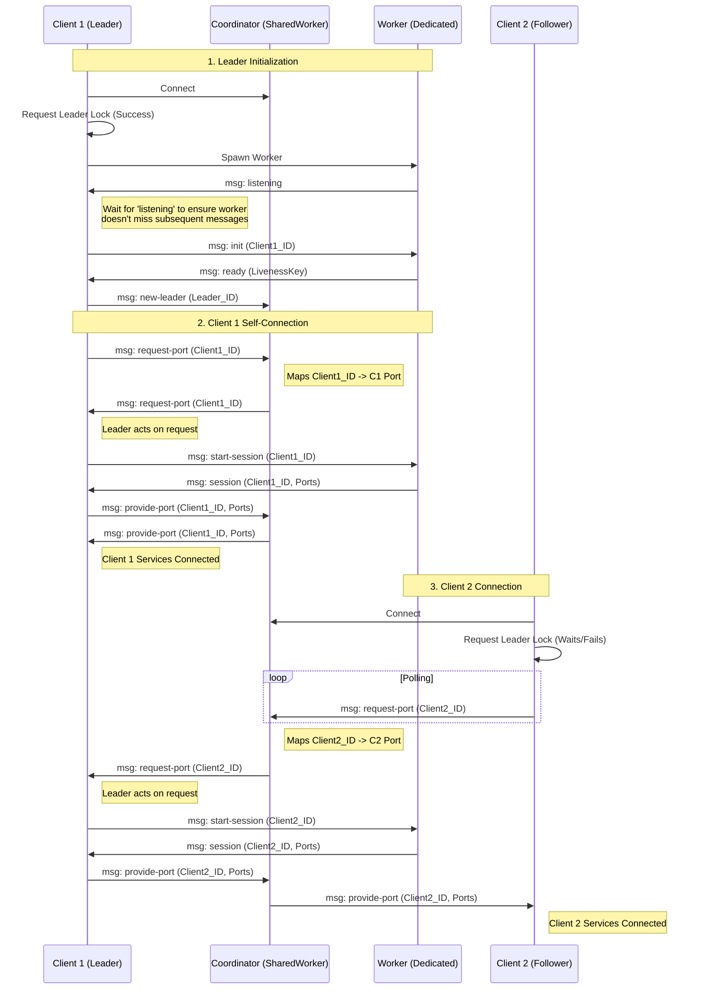

# @dxos/client

Core DXOS Client API.

## Installation

```bash
pnpm i @dxos/client
```

## Usage

Create a client object like this:

```ts
import { Client } from '@dxos/client';
const client = new Client();
```

## Documentation

- [⚡️ Quick Start](https://docs.dxos.org/guide/quick-start)
- [📖 Developer Guide](https://docs.dxos.org/guide/echo/)
- [📚 API Reference](https://docs.dxos.org/api/@dxos/client)

## DXOS Resources

- [Website](https://dxos.org)
- [Developer Documentation](https://docs.dxos.org)
- Talk to us on [Discord](https://dxos.org/discord)

## Contributions

Your ideas, issues, and code are most welcome. Please take a look at our [community code of conduct](https://github.com/dxos/dxos/blob/main/CODE_OF_CONDUCT.md), the [issue guide](https://github.com/dxos/dxos/blob/main/CONTRIBUTING.md#submitting-issues), and the [PR contribution guide](https://github.com/dxos/dxos/blob/main/CONTRIBUTING.md#submitting-prs).

License: [MIT](./LICENSE) Copyright 2022 © DXOS

## Worker architecture


