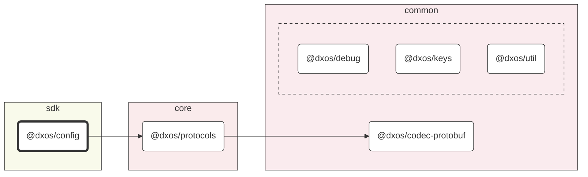

# @dxos/config

Config utilities

## Dependency Graph

## Dependencies

| Module | Direct |
|---|---|
| [`@dxos/codec-protobuf`](../../../common/codec-protobuf/docs/README.md) | &check; |
| [`@dxos/debug`](../../../common/debug/docs/README.md) | &check; |
| [`@dxos/keys`](../../../common/keys/docs/README.md) |  |
| [`@dxos/protocols`](../../../core/protocols/docs/README.md) | &check; |
| [`@dxos/util`](../../../common/util/docs/README.md) | &check; |
