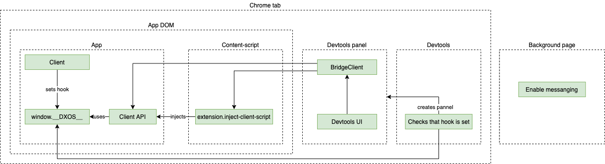

# DevTools Extension

## Installation

1. Grab a build from the [latest build](https://github.com/dxos/protocols).


2. Unzip the downloaded file.
3. Go to `chrome://extensions/` and enable developer mode.


4. Select `Load unpacked` and select the unzipped Devtools folder.

## Extension startup sequence



1. SDK sets `window.__DXOS__` hook.
1. Content script is injected into the page automatically by chrome.
    1. Allows messaging with the page
    1. Sets up a RPC handler to inject the client API.
1. Devtools background page is created
    1. Waits for `window.__DXOS__` hook to appear.
    1. Creates devtools panel.
1. Devtools panel is loaded.
    1. Calls content script to inject client API into the page.
    1. Client API connects to the `window.__DXOS__` hook.
    1. Client API sends "ready" message.
1. Devtools pannel is ready.

## Development

1. Clone this repo then install dependencies and build:

```
rushx build
```

2. (Optional) Run the `rushx build:watch` for both `extension` and `devtools` and open the devtools in your browser.

3. Open the __extensions__ manager in your browser: 

- [brave://extensions](brave://extensions)
- [chrome://extensions](chrome://extensions)
- Firefox (Not Supported Yet)
- Edge (Not Supported Yet)
- Safari (Not Supported Yet)

4. Make sure you have the `developer` toggle __on__ and click on `Load Unpacked Extension` button.
5. Search for the extension __dist__ folder (`<repo-root>/packages/extension/dist`) and select it.

## Design

The content script attempts to detect the an object exposed by the SDK's client (window.__DXOS__).
It then sets-up a bridge that enables the devtools (and other components) to access the client via `crx-bridge` module.

## References

- Anatomy of an extension: https://developer.mozilla.org/en-US/docs/Mozilla/Add-ons/WebExtensions/Anatomy_of_a_WebExtension#Background_pages
- This package is loosely based on the [Apollo DevTools](https://github.com/apollographql/apollo-client-devtools).
