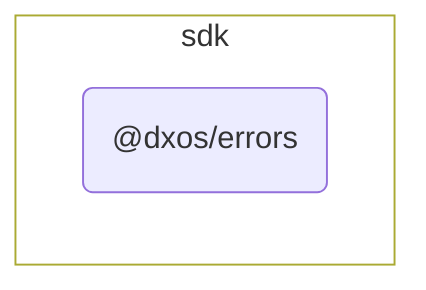

# @dxos/errors

Error definitions and utilities.

## Dependency Graph

```mermaid
%%{ init: {'flowchart':{'curve':'basis'}} }%%

flowchart LR

%% Classes


%% Nodes

subgraph sdk [sdk]
  style sdk fill:transparent
  dxos/errors("@dxos/errors"):::root
  click dxos/errors "dxos/dxos/tree/main/packages/sdk/errors/docs"
end
```

## Dependencies

| Module | Direct |
|---|---|
