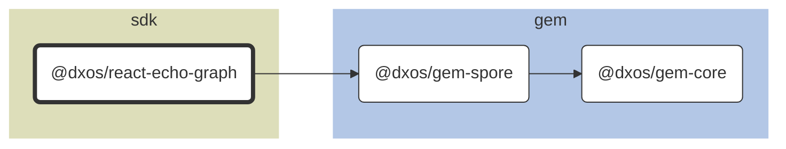

# @dxos/react-echo-graph

Low level components using gem library.

## Dependency Graph

## Dependencies

| Module | Direct |
|---|---|
| [`@dxos/gem-core`](../../../gem/gem-core/docs/README.md) | &check; |
| [`@dxos/gem-spore`](../../../gem/gem-spore/docs/README.md) | &check; |
