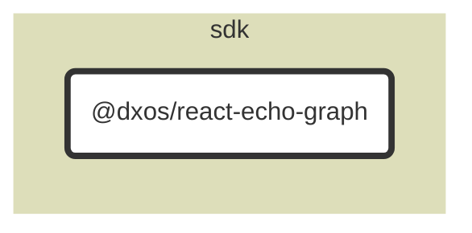

# @dxos/react-echo-graph

Low level components using gem library.

## Dependency Graph

```mermaid
%%{ init: {'flowchart':{'curve':'basis'}} }%%

flowchart LR

%% Links

%% Sections
subgraph sdk
  style sdk fill:#dddeba,stroke:#fff;

  dxos/react-echo-graph("@dxos/react-echo-graph")
end


%% Hyperlinks

%% Styles
classDef rootNode fill:#fff,stroke:#333,stroke-width:4px
classDef defaultNode fill:#fff,stroke:#333,stroke-width:1px
linkStyle default stroke:#333,stroke-width:1px

dxos/react-echo-graph:::rootNode

```

## Dependencies

| Module | Direct |
|---|---|
