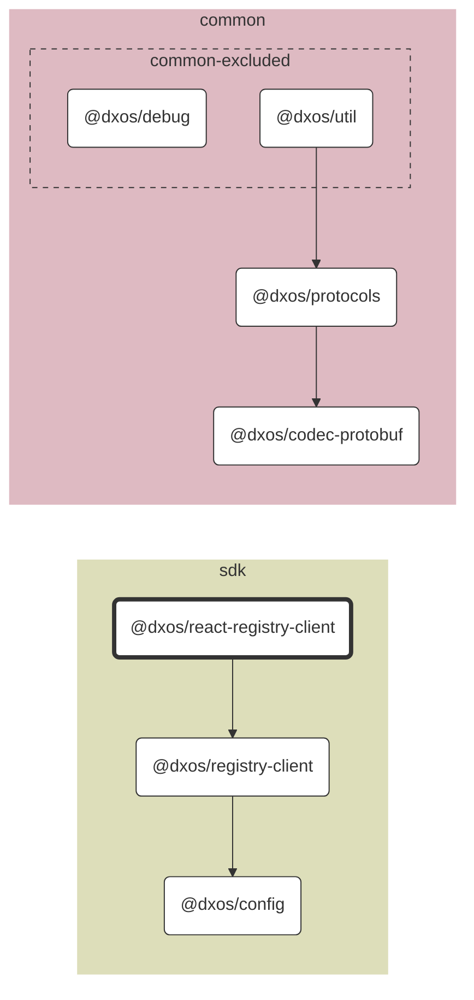

# @dxos/react-registry-client

React registry client API

## Dependency Graph

## Dependencies

| Module | Direct |
|---|---|
| [`@dxos/codec-protobuf`](../../../common/codec-protobuf/docs/README.md) |  |
| [`@dxos/config`](../../config/docs/README.md) | &check; |
| [`@dxos/debug`](../../../common/debug/docs/README.md) | &check; |
| [`@dxos/protocols`](../../../common/protocols/docs/README.md) |  |
| [`@dxos/registry-client`](../../registry-client/docs/README.md) | &check; |
| [`@dxos/util`](../../../common/util/docs/README.md) | &check; |
