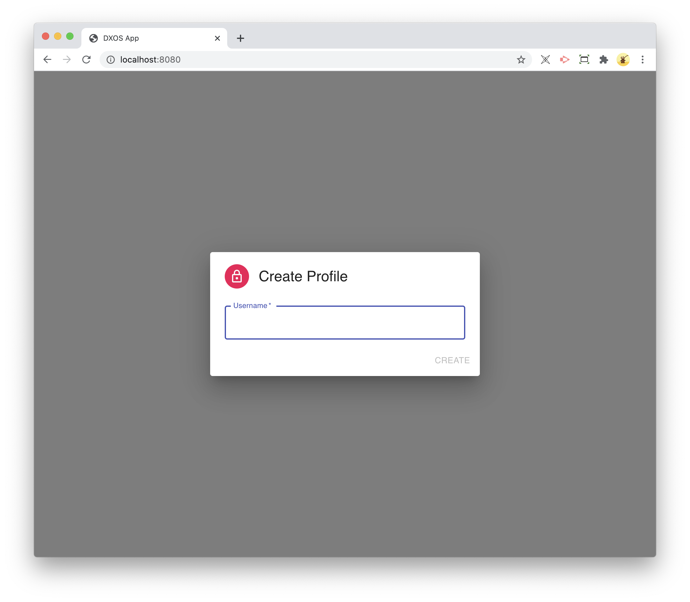
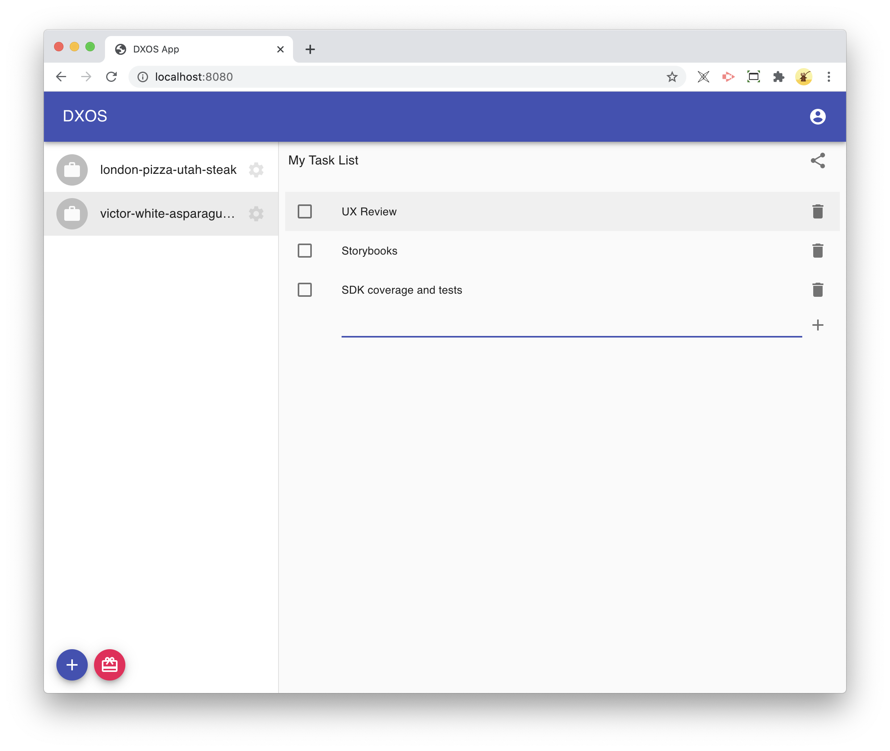
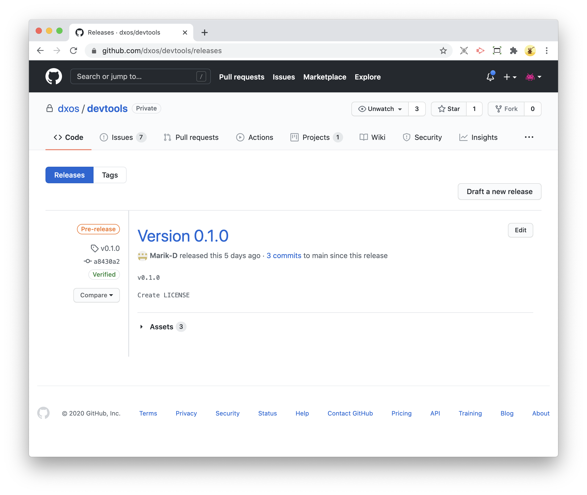
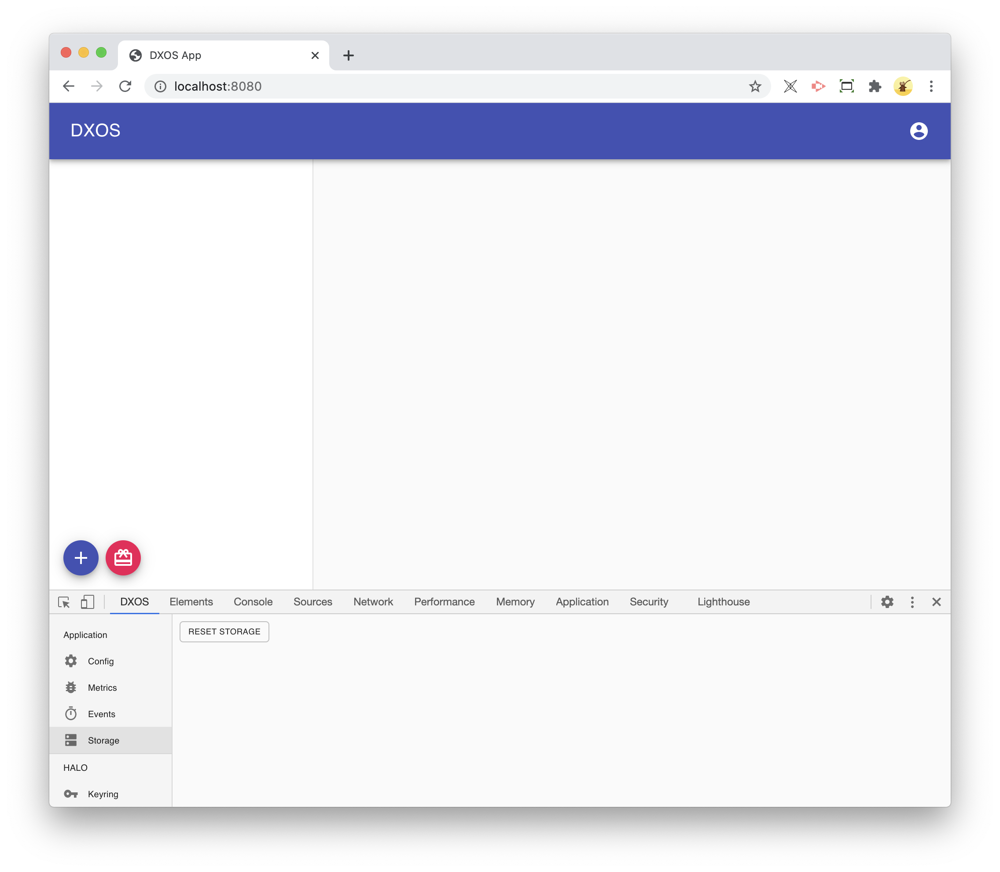

# Tasks App

The Tasks App is a demo of the capabilities of the DXOS platform.
It implements a simple collaborative task tracking applications.
This tutorial is a step-by-step guide to building, debugging, and deploying the application.

## Getting started

First clone the tutorials repo and install the npm dependencies.

```bash
git clone git@github.com:dxos/tutorials.git
yarn
```

Next start the Tasks App Webpack development server.

```bash
cd apps/tasks-apps
yarn start
```

Now open the browser at http://localhost:8080/ and you should see the page below.



Enter a username and click the Create button.

Next create a List and enter some tasks.



## Development and debugging

Next install the DXOS Devtools. 
Download the Chrome extension https://github.com/dxos/devtools/releases (select `dxos-devtools.zip`).



To reset the application open the Developer Tools and select the DXOS tab, then select the Storage item in the sidebar.



Click the Reset Storage button to completely erase the current application's state.

After refreshing the page you should see the Create Profile dialog again.

## Deploying the application

To deploy the application, install the DXOS [command line tools](https://github.com/dxos/cli) (CLI).

```bash
yarn global add @dxos/cli@beta
```

TODO(burdon): CLI/deploy.
