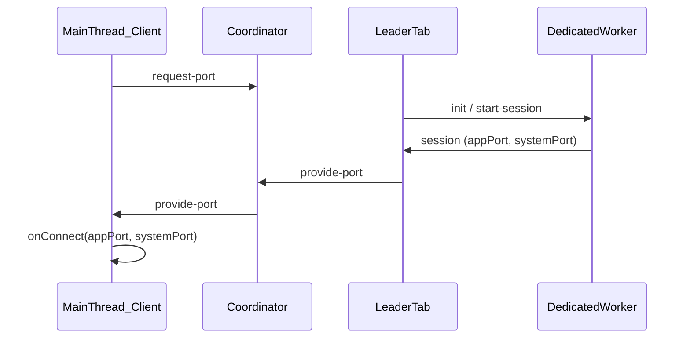

# @dxos/worker-framework — specification

> **Maintenance:** Update this file whenever the public API, message protocols, or integration seams in `@dxos/client` / `@dxos/client-protocol` change. It is the post-factum design record for the dedicated-worker management layer extracted from `@dxos/client` (2026-03).

## Purpose

`@dxos/worker-framework` provides **generic worker-management plumbing** for running a single long-lived worker process shared across browser tabs:

- Leader election and failover
- Cross-tab coordinator (port exchange)
- Dedicated-worker message loop (init / session multiplexing)
- Generic effect-rpc server/client helpers over `@dxos/rpc` `RpcPort`

It deliberately does **not** implement DXOS client services, WebRTC, storage backends, or `WorkerRuntime`. Those are injected by consumers (`@dxos/client`, `@dxos/client-services`) via callbacks.

## Non-goals

| Concern | Owner |
|---|---|
| Concrete service RPC definitions (`ClientServicesRpcs`, IdentityService, …) | `@dxos/client-protocol`, `@dxos/protocols/rpc` |
| Service host implementations (`WorkerRuntime`, `ClientServicesHost`) | `@dxos/client-services` |
| System-port WebRTC bridge (`SharedWorkerConnection`) | `@dxos/client` |
| App-port service proxy (`ClientServicesProxy`) | `@dxos/client` |
| Low-level msgpack framing over `RpcPort` | `@dxos/rpc` (`effect-rpc.ts`) |
| SharedWorker-based client services (non-dedicated path) | `@dxos/client` (`WorkerClientServices`) |

## Package layout

```
packages/sdk/worker-framework/
  spec.md                 ← this file
  src/
    index.ts              → `.` entrypoint
    worker-connection.ts  → client-side leader/coordinator/connect
    worker/
      index.ts            → `./worker` entrypoint
      run-worker.ts       → worker-side message loop
    coordinator/
      index.ts            → `./coordinator` entrypoint
      *.ts                → coordinator implementations
    internal/
      messages.ts         → shared message types
      locks.ts            → Web Lock helpers + timeouts
      rpc.ts              → makeRpcClient / serveRpcGroup
```

## Entrypoints

| Import | Exports |
|---|---|
| `@dxos/worker-framework` | `WorkerConnection`, `LeaderTimeoutOptions`, `WorkerConnectionHandle`, `WorkerConnectionOptions`, `makeRpcClient`, `serveRpcGroup`, message types |
| `@dxos/worker-framework/worker` | `runWorker`, `RunWorkerOptions`, `WorkerRuntimeHandle`, `WorkerEndpoint`, `DedicatedWorkerMessage` |
| `@dxos/worker-framework/coordinator` | `WorkerCoordinator`, coordinators, `createCoordinatorOnConnect`, coordinator + worker message types |

## Roles



Three cooperating roles:

1. **Follower / any tab** — runs `WorkerConnection`; requests ports from the leader via the coordinator; wires `appPort` + `systemPort` in `onConnect`.
2. **Leader tab** — holds an exclusive Web Lock; spawns the worker; relays session ports through the coordinator.
3. **Coordinator** — control-plane message bus between tabs. Does not carry service RPC — only leadership announcements and `MessagePort` handoff.

## Client side: `WorkerConnection`

`WorkerConnection extends Resource` from `@dxos/context`.

### Options

```ts
type WorkerConnectionOptions = {
  createWorker: () => WorkerOrPort;
  createCoordinator: () => MaybePromise<WorkerCoordinator>;
  leaderLockKey: string;               // injected by consumer
  config?: Record<string, any>;        // opaque; forwarded to worker init
  leaderTimeouts?: LeaderTimeoutOptions;
  onConnect: (args: {
    appPort: MessagePort;
    systemPort: MessagePort;
    leaderId: string;
    livenessLockKey: string;
  }) => Promise<WorkerConnectionHandle>;
};
```

### Responsibilities

- **Leader election** — exclusive Web Lock on `leaderLockKey`; lock held for entire leader lifetime.
- **Heartbeat** — leader broadcasts `leader-heartbeat` on an interval while holding the lock (starts before worker is ready).
- **Port exchange** — follower sends `request-port`; leader responds via coordinator `provide-port` with transferred `MessagePort`s.
- **Stale leader detection** — on port-wait timeout, follower may steal the lock if heartbeats are stale (`navigator.locks.request({ steal: true })`), with cooldown to prevent thrashing.
- **Liveness** — follower holds the worker's `livenessLockKey`; lock release signals worker death and triggers reconnect.
- **Reconnect** — self-rescheduling `AsyncTask`; fires `reconnected` and `onReconnect` callbacks after failover.

### Events

- `closed` — connection lost or resource closed
- `reconnected` — successful reconnect after leader change

### Default timeouts

| Option | Default | Purpose |
|---|---|---|
| `heartbeatInterval` | 1000 ms | Leader liveness broadcast |
| `staleTimeout` | 5000 ms | Window before lock steal is considered |
| `portTimeout` | 15000 ms | Follower wait for `provide-port` |
| lock/RPC acquisition | 15000 ms | `LOCK_OR_RPC_WAIT_TIMEOUT` in `internal/locks.ts` |

## Worker side: `runWorker`

```ts
type RunWorkerOptions = {
  endpoint?: WorkerEndpoint;   // default: DedicatedWorker `self`
  storageLockKey: string;      // injected by consumer
  createRuntime: (args: {
    config: Record<string, any> | undefined;
    requestShutdown: () => void;
  }) => Promise<WorkerRuntimeHandle>;
};
```

### Message protocol (`DedicatedWorkerMessage`)

| Message | Direction | Purpose |
|---|---|---|
| `listening` | Worker → Leader | Worker loop ready for `init` |
| `init` | Leader → Worker | Start runtime with config; includes `ownerClientId` |
| `ready` | Worker → Leader | Runtime up; returns `livenessLockKey` |
| `start-session` | Leader → Worker | Open session for a tab `clientId` |
| `session` | Worker → Leader | Transfers `appPort` + `systemPort` for the tab |

### Worker loop responsibilities

- Acquire `storageLockKey` for single-worker ownership
- Deduplicate sessions per `clientId` (`tabsProcessed`)
- Detect owner tab via `ownerClientId` from `init`; pass `isOwner: true` to `createSession`
- Delegate session creation to injected `WorkerRuntimeHandle.createSession`

## Coordinator

### Message protocol (`WorkerCoordinatorMessage`)

| Message | Purpose |
|---|---|
| `new-leader` | Announce current leader id |
| `leader-heartbeat` | Leader liveness while holding lock |
| `request-port` | Tab asks leader for worker session ports |
| `provide-port` | Leader delivers `appPort`, `systemPort`, `livenessLockKey` to requesting tab |

### Implementations

| Class | Use case |
|---|---|
| `SharedWorkerCoordinator` | Production multi-tab; requires `createWorker` factory (see `@dxos/client` wrapper for default URL) |
| `SingleClientCoordinator` | Tauri / single-window; echoes messages locally |
| `MemoryWorkerCoordiantor` | Tests; in-process async echo |
| `createCoordinatorOnConnect` | SharedWorker entrypoint handler; routes `provide-port` to the correct tab by `clientId` |

## RPC helpers

Generic wrappers over `@dxos/rpc` effect-rpc transport (msgpack-framed binary on `RpcPort`):

```ts
makeRpcClient(port, group, options?) → Effect<unknown, never, Scope>
serveRpcGroup(port, group, handlersLayer, options?) → { open(); close() }
```

- **Transport** stays in `@dxos/rpc` (`makeProtocolRpcPortClient`, `layerProtocolRpcPortServer`).
- **Service binding** is the caller's responsibility (e.g. `@dxos/client-protocol` passes `ClientServicesRpcs` + `makeClientServicesHandlers`).
- Merged rpc groups do not structurally satisfy `@effect/rpc`'s `RpcGroup<Rpc.Any>` parameter; the framework uses an internal boundary cast (`asRpcGroup`) documented in `internal/rpc.ts`.

## Dependencies

```
@dxos/worker-framework
  → @dxos/rpc, @dxos/async, @dxos/context, @dxos/invariant, @dxos/log, @dxos/util
  → @effect/rpc, effect

@dxos/client-protocol → @dxos/worker-framework  (ClientRpcServer, makeClientServicesRpc)
@dxos/client          → @dxos/worker-framework  (DedicatedWorkerClientServices, runDedicatedWorker, coordinators)
```

No dependency on `@dxos/client-services`, `@dxos/config`, `@dxos/network-manager`, or service protocols.

## Consumer integration (@dxos/client)

| Consumer file | Framework usage |
|---|---|
| `dedicated-worker-client-services.ts` | `WorkerConnection` with `onConnect` → `SharedWorkerConnection` + `ClientServicesProxy` |
| `dedicated-worker.ts` | `runWorker` with `createRuntime` → `WorkerRuntime` |
| `test-worker-factory.ts` | `runWorker` with `MessagePort` endpoint (in-thread tests) |
| `shared-worker-coordinator.ts` | Thin wrapper supplying default `#coordinator-worker` URL |
| `coordinator-worker-entrypoint.ts` | Re-exports `createCoordinatorOnConnect` |

Lock keys remain in `@dxos/client`:

- `LEADER_LOCK_KEY` — `@dxos/client/DedicatedWorkerClientServices/LeaderLock`
- `STORAGE_LOCK_KEY` — `dxos-client-worker` (`lock-key.ts`)

## Consumer integration (@dxos/client-protocol)

| Before | After |
|---|---|
| `RpcServer.layer` + `layerProtocolRpcPortServer` inline in `ClientRpcServer` | `serveRpcGroup` |
| `makeProtocolRpcPortClient` + `RpcClient.make` inline in `makeClientServicesRpc` | `makeRpcClient` |

Public signatures of `ClientRpcServer`, `makeClientServicesRpc`, and service-specific types are unchanged.

## Testing

| Suite | Location | Covers |
|---|---|---|
| Coordinator unit tests | `src/coordinator/single-client-coordinator.test.ts` | Echo semantics, async delivery |
| Dedicated worker integration | `@dxos/client` `dedicated-worker-client-services.test.ts` | Leader election, steal, multi-tab, reconnect |
| Effect-rpc services | `@dxos/client-services` `effect-rpc.test.ts` | `ClientRpcServer` over linked ports |

Run:

```bash
moon run worker-framework:test
moon run client:test -- src/services/dedicated/dedicated-worker-client-services.test.ts
moon run client-services:test -- src/packlets/services/effect-rpc.test.ts
```

## Changelog

### 2026-03 — Initial extraction

- Created `@dxos/worker-framework` from `@dxos/client/src/services/dedicated/*`.
- Split into `.`, `./worker`, `./coordinator` entrypoints.
- Introduced callback seams: `WorkerConnectionOptions.onConnect`, `RunWorkerOptions.createRuntime`.
- Rewired `@dxos/client-protocol` RPC server/client onto `serveRpcGroup` / `makeRpcClient`.
- Removed duplicated worker loop from `TestWorkerFactory` (now uses `runWorker`).
