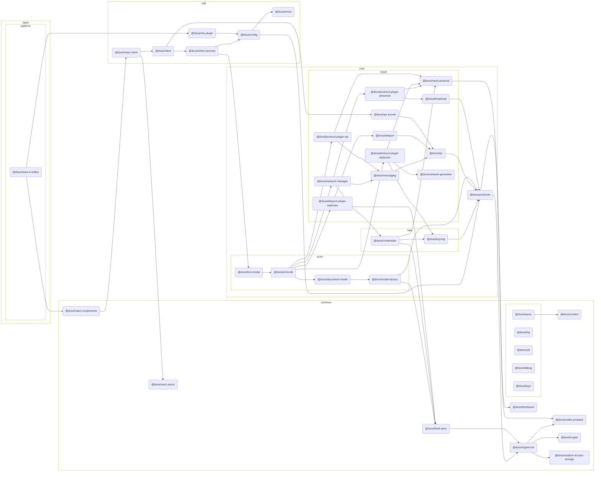

# @dxos/react-ui-editor

Document editing experience within a DXOS shell.

## Dependency Graph

## Dependencies

| Module | Direct |
|---|---|
| [`@dxos/async`](../../../../common/async/docs/README.md) |  |
| [`@dxos/broadcast`](../../../../core/mesh/broadcast/docs/README.md) |  |
| [`@dxos/client`](../../../../sdk/client/docs/README.md) | &check; |
| [`@dxos/client-services`](../../../../sdk/client-services/docs/README.md) |  |
| [`@dxos/codec-protobuf`](../../../../common/codec-protobuf/docs/README.md) |  |
| [`@dxos/config`](../../../../sdk/config/docs/README.md) | &check; |
| [`@dxos/context`](../../../../common/context/docs/README.md) |  |
| [`@dxos/credentials`](../../../../core/halo/credentials/docs/README.md) |  |
| [`@dxos/crypto`](../../../../common/crypto/docs/README.md) |  |
| [`@dxos/debug`](../../../../common/debug/docs/README.md) | &check; |
| [`@dxos/echo-db`](../../../../core/echo/echo-db/docs/README.md) |  |
| [`@dxos/errors`](../../../../sdk/errors/docs/README.md) |  |
| [`@dxos/feed-store`](../../../../common/feed-store/docs/README.md) |  |
| [`@dxos/hypercore`](../../../../common/hypercore/docs/README.md) |  |
| [`@dxos/keyring`](../../../../core/halo/keyring/docs/README.md) |  |
| [`@dxos/keys`](../../../../common/keys/docs/README.md) |  |
| [`@dxos/log`](../../../../common/log/docs/README.md) |  |
| [`@dxos/mesh-protocol`](../../../../core/mesh/mesh-protocol/docs/README.md) |  |
| [`@dxos/messaging`](../../../../core/mesh/messaging/docs/README.md) |  |
| [`@dxos/model-factory`](../../../../core/echo/model-factory/docs/README.md) |  |
| [`@dxos/network-generator`](../../../../core/mesh/network-generator/docs/README.md) |  |
| [`@dxos/network-manager`](../../../../core/mesh/network-manager/docs/README.md) |  |
| [`@dxos/document-model`](../../../../core/echo/document-model/docs/README.md) |  |
| [`@dxos/protocol-plugin-presence`](../../../../core/mesh/protocol-plugin-presence/docs/README.md) |  |
| [`@dxos/protocol-plugin-replicator`](../../../../core/mesh/protocol-plugin-replicator/docs/README.md) |  |
| [`@dxos/protocol-plugin-rpc`](../../../../core/mesh/protocol-plugin-rpc/docs/README.md) |  |
| [`@dxos/protocols`](../../../../core/protocols/docs/README.md) |  |
| [`@dxos/random-access-storage`](../../../../common/random-access-storage/docs/README.md) |  |
| [`@dxos/react-async`](../../../../common/react-async/docs/README.md) | &check; |
| [`@dxos/react-client`](../../../../sdk/react-client/docs/README.md) | &check; |
| [`@dxos/react-components`](../../../../common/react-components/docs/README.md) | &check; |
| [`@dxos/rpc`](../../../../core/mesh/rpc/docs/README.md) |  |
| [`@dxos/rpc-tunnel`](../../../../core/mesh/rpc-tunnel/docs/README.md) |  |
| [`@dxos/teleport`](../../../../core/mesh/teleport/docs/README.md) |  |
| [`@dxos/teleport-plugin-replicator`](../../../../core/mesh/teleport-plugin-replicator/docs/README.md) |  |
| [`@dxos/text-model`](../../../../core/echo/text-model/docs/README.md) | &check; |
| [`@dxos/timeframe`](../../../../common/timeframe/docs/README.md) |  |
| [`@dxos/util`](../../../../common/util/docs/README.md) |  |
| [`@dxos/vite-plugin`](../../../../sdk/vite-plugin/docs/README.md) | &check; |
