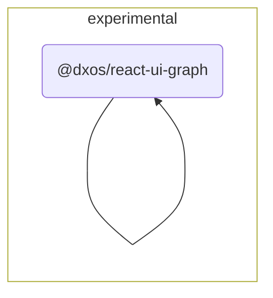

# @dxos/react-ui-graph

Gem spore.

## Dependency Graph

```mermaid
%%{ init: {'flowchart':{'curve':'basis'}} }%%

flowchart LR

%% Classes


%% Nodes

subgraph experimental [experimental]
  style experimental fill:transparent
  dxos/react-ui-graph("@dxos/react-ui-graph"):::root
  click dxos/react-ui-graph "dxos/dxos/tree/main/packages/ui/react-ui-graph/docs"
  dxos/react-ui-graph("@dxos/react-ui-graph"):::def
  click dxos/react-ui-graph "dxos/dxos/tree/main/packages/ui/react-ui-graph/docs"
end

%% Links
dxos/react-ui-graph --> dxos/react-ui-graph
```

## Dependencies

| Module | Direct |
|---|---|
| [`@dxos/react-ui-graph`](../../gem-core/docs/README.md) | &check; |
