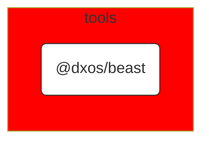

# @dxos/beast

Code analyzer.

## Dependency Graph

```mermaid
%%{ init: {'flowchart':{'curve':'basis'}} }%%

flowchart LR

%% Classes
classDef default fill:#fff,stroke:#333,stroke-width:1px
classDef root2 fill:#fff,stroke:#333,stroke-width:4px

%% Nodes

subgraph tools1 [tools]
  style tools1 fill:red
  dxos/beast("@dxos/beast"):::root
  click dxos/beast "dxos/dxos/tree/main/tools/beast/docs"
end

%% Links
linkStyle default stroke:#333,stroke-width:1px
```

## Dependencies

| Module | Direct |
|---|---|
| [`@dxos/log`](../../../packages/common/log/docs/README.md) | &check; |
