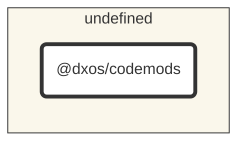

# @dxos/codemods

Code analyzer.

## Dependency Graph

```mermaid
%%{ init: {'flowchart':{'curve':'basis'}} }%%

flowchart LR

%% Classes
classDef def fill:#fff,stroke:#333,stroke-width:1px
classDef root fill:#fff,stroke:#333,stroke-width:4px

%% Nodes

subgraph undefined [undefined]
  style undefined fill:#faf7eb,stroke:#333
  dxos/codemods("@dxos/codemods"):::root
  click dxos/codemods "dxos/dxos/tree/main/tools/codemods/docs"
end

%% Links
linkStyle default stroke:#333,stroke-width:1px
```

## Dependencies

| Module | Direct |
|---|---|
