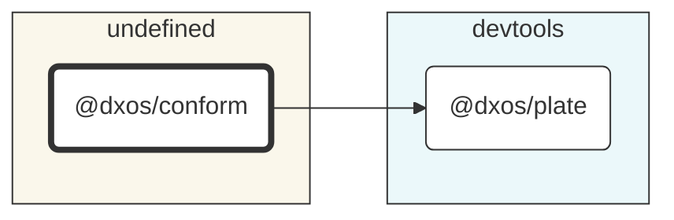

# @dxos/conform

A utility for conforming files across packages in a monorepo

## Dependency Graph

## Dependencies

| Module | Direct |
|---|---|
| [`@dxos/plate`](../../../packages/devtools/plate/docs/README.md) | &check; |
