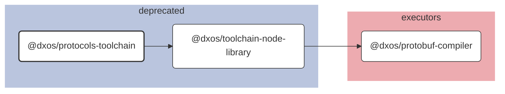

# @dxos/protocols-toolchain

## Dependency Graph

## Dependencies

| Module | Direct |
|---|---|
| [`@dxos/protobuf-compiler`](../../../executors/protobuf-compiler/docs/README.md) |  |
| [`@dxos/toolchain-node-library`](../../toolchain-node-library/docs/README.md) | &check; |
