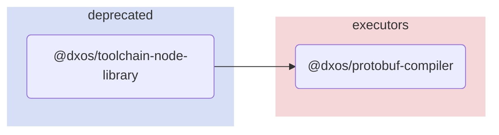

# @dxos/toolchain-node-library

## Dependency Graph

```mermaid
flowchart LR;

subgraph deprecated
  style deprecated fill:#d6dff5,stroke:#fff;
  dxos/toolchain-node-library("@dxos/toolchain-node-library");
end

subgraph executors
  style executors fill:#f5d6d9,stroke:#fff;
  dxos/protobuf-compiler("@dxos/protobuf-compiler");
end

dxos/toolchain-node-library --> dxos/protobuf-compiler;
```
## Dependencies
| Module | Direct |
|---|---|
| [`@dxos/protobuf-compiler`](../../../executors/protobuf-compiler/docs/README.md) | &check; |
