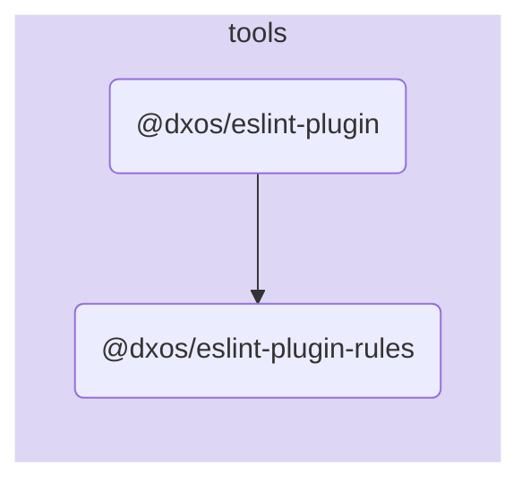

# @dxos/eslint-plugin

## Dependency Graph

```mermaid
flowchart LR;

subgraph tools
  style tools fill:#ded6f5,stroke:#fff;
  dxos/eslint-plugin("@dxos/eslint-plugin");
  dxos/eslint-plugin-rules("@dxos/eslint-plugin-rules");
end

dxos/eslint-plugin --> dxos/eslint-plugin-rules;
```
## Dependencies
| Module | Direct |
|---|---|
| [`@dxos/eslint-plugin-rules`](../../eslint-rules/docs/README.md) | &check; |
