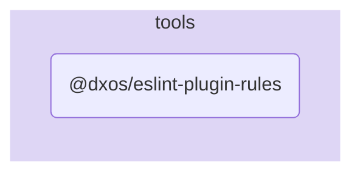

# @dxos/eslint-plugin-rules

## Dependency Graph

```mermaid
flowchart LR;

subgraph tools
  style tools fill:#ded6f5,stroke:#fff;
  dxos/eslint-plugin-rules("@dxos/eslint-plugin-rules");
end

```
## Dependencies
| Module | Direct |
|---|---|
