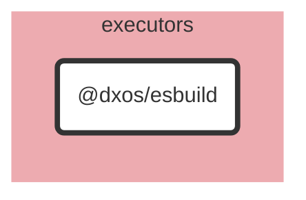

# @dxos/esbuild

## Dependency Graph

```mermaid
%%{ init: {'flowchart':{'curve':'basis'}} }%%

flowchart LR

%% Classes
classDef def fill:#fff,stroke:#333,stroke-width:1px
classDef root fill:#fff,stroke:#333,stroke-width:4px

%% Nodes

subgraph executors [executors]
  style executors fill:#edabb0,stroke:#fff
  dxos/esbuild("@dxos/esbuild"):::root
  click dxos/esbuild "dxos/dxos/tree/main/tools/executors/esbuild/docs"
end

%% Links
linkStyle default stroke:#333,stroke-width:1px
```

## Dependencies

| Module | Direct |
|---|---|
