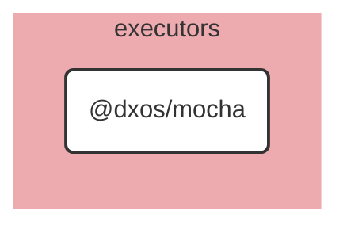

# @dxos/mocha

## Dependency Graph

```mermaid
%%{ init: {'flowchart':{'curve':'basis'}} }%%

flowchart LR

%% Links

%% Sections
subgraph executors
  style executors fill:#edabb0,stroke:#fff;

  dxos/mocha("@dxos/mocha")
end


%% Hyperlinks

%% Styles
classDef rootNode fill:#fff,stroke:#333,stroke-width:2px
classDef defaultNode fill:#fff,stroke:#333,stroke-width:1px
linkStyle default stroke:#333,stroke-width:1px

dxos/mocha:::rootNode

```

## Dependencies

| Module | Direct |
|---|---|
